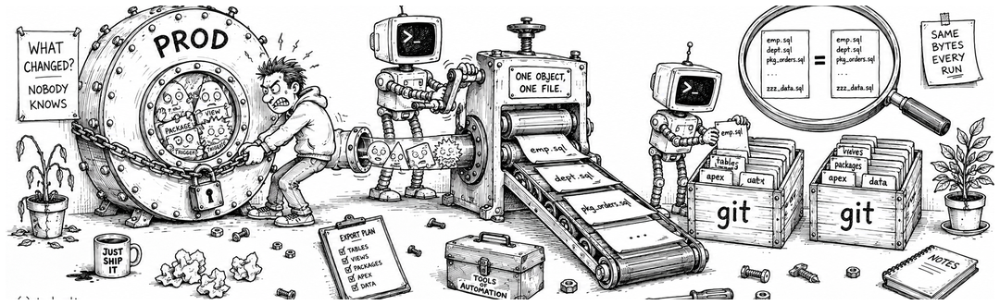
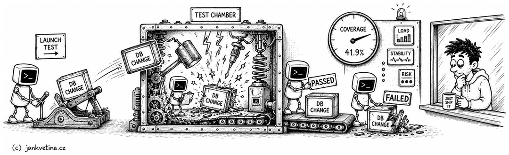
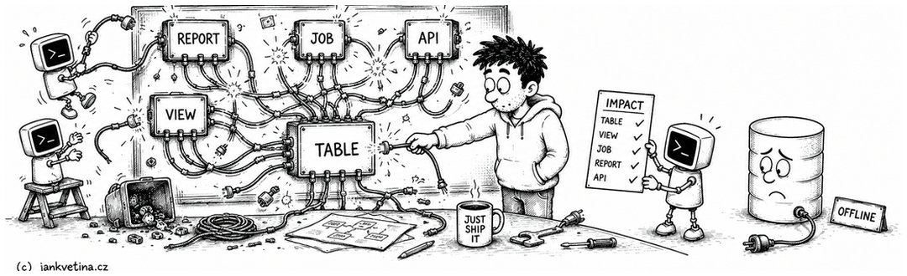
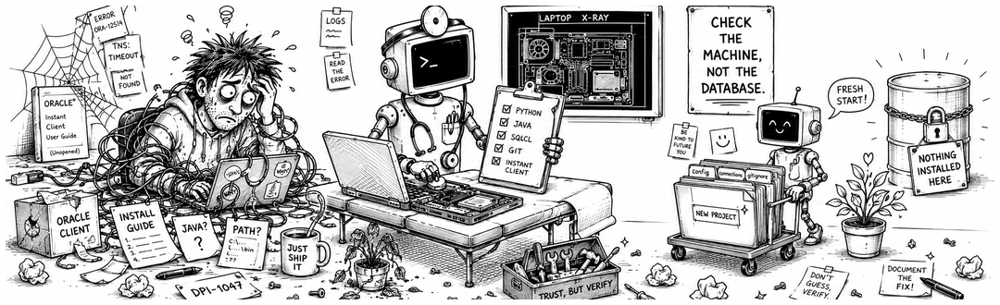
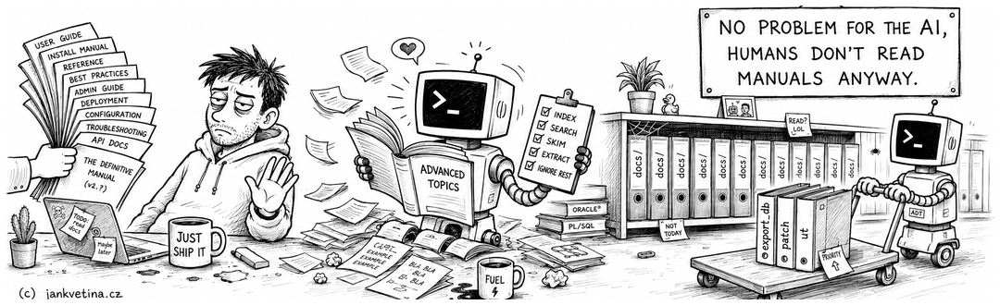
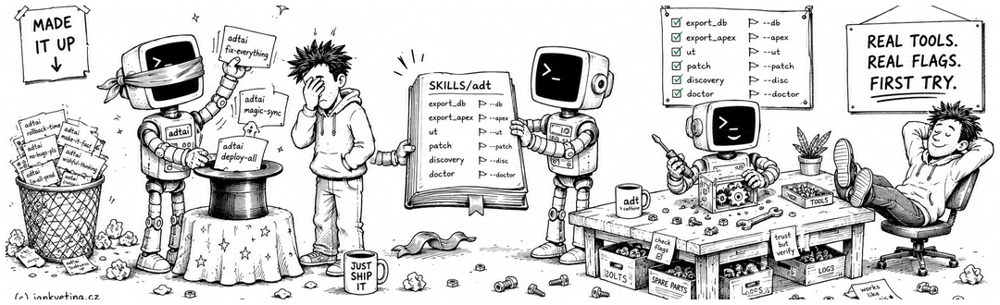
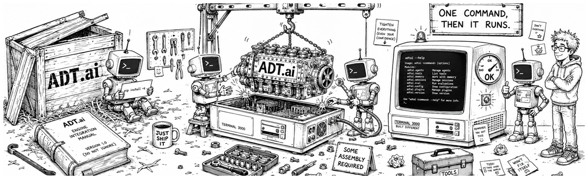
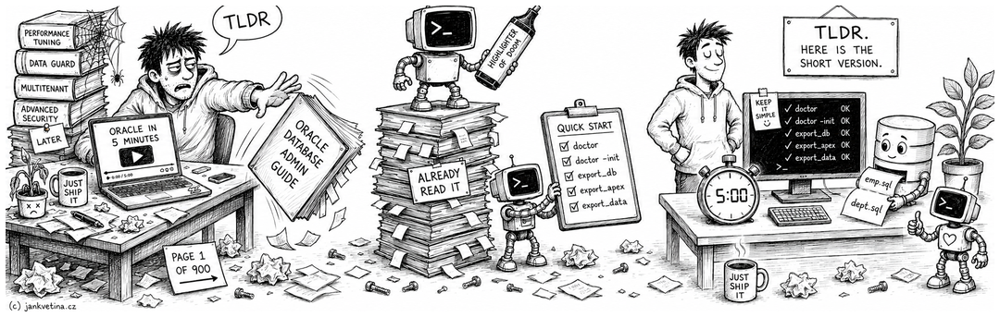
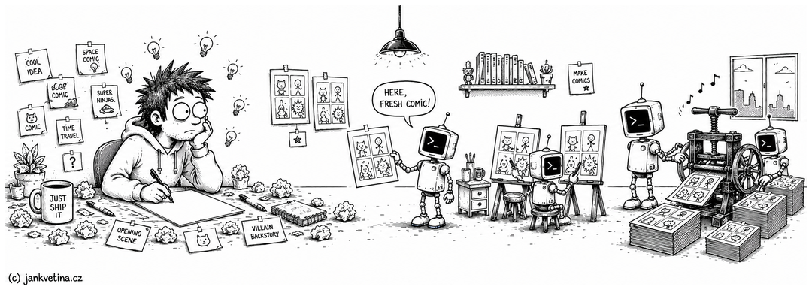

# ADT.ai

   [](https://github.com/jkvetina/ADT.ai/actions/workflows/ci.yml)

Get your Oracle database and APEX applications into Git, and get your changes back out to the next environment.


Your Oracle code does not live in files. A package body is a row in a dictionary view and an APEX application comes out as one enormous export, so there is nothing for Git to hold and not much anyone can review. The honest answer to what is running in UAT is usually a shrug, and the deployment is a folder of scripts somebody ordered by hand.

ADT.ai is a Python command-line tool for Oracle developers, and it closes that gap from both ends. Everything the database owns comes out as ordinary files a repository can hold.

Nothing is installed in the database. It is a command you run from your project folder, against a connection you configure, so there is no schema to create and nothing to uninstall when you are done with it.

Build verified by 5347 private unit tests.

<br>

## Commands

Every command below links to its own page in [docs/](docs/README.md), and each description is the same text its help screen opens with.

<br>

### Export



The analysis is done and the change is made, so get it out of the database. Point ADT.ai at a schema and it writes the objects out as ordinary files, one per object, in a layout you configure. Same input, same bytes, every run, so what shows up in version control is a real change and not the export moving things around. APEX applications and table data come out the same way.

- [`export_db`](docs/export_db.md): Brings database objects out of the database and into your repository. Use it to keep the repository the authoritative copy of the schema, so a change made anywhere shows up in a review and can be deployed again rather than reconstructed from memory. You can take a whole schema or only what has moved recently, and what comes out is written to be read by a person, not just replayed by a tool.
- [`export_data`](docs/export_data.md): Brings the contents of tables out of the database and into your repository. Use it for the rows an application needs in order to work at all (lookup values, defaults, configuration held as data), which belong under review beside the code that reads them. Each table comes back both as something you can read in version control and as something that can put the same rows into another environment.
- [`export_apex`](docs/export_apex.md): Brings APEX applications out of the builder and into your repository. Use it so that what was built by clicking has a history, can be reviewed like any other change, and can be deployed again somewhere else, with the application living beside the database code it runs on. It can show you what is there before you commit to exporting it, and write the result in whichever form your reviewers and your deployment need.

<br>

### Check



Before it ships, prove it. Run the schema's utPLSQL suites and read the coverage per package, validate exported APEXlang without a database at all, and recompile what went invalid. The exit code is the deliverable, so CI can gate on it.

- [`recompile`](docs/recompile.md): Gets a schema back to a working state after something has broken it. Use it when a deployment or a change has left objects that no longer compile, which is the normal aftermath of touching anything that others depend on. Most of them come back on their own once the thing beneath them does. What cannot be fixed is reported with the reason and, more usefully, with which failures are the real cause and which are only consequences of it, so you start at the one object that matters instead of the twenty it took down.
- [`ut`](docs/ut.md): Runs the unit tests installed in a database schema and reports how they went. Use it to find out whether the code in a schema still does what it is meant to, before a deployment rather than after one, and on evidence rather than on the fact that it compiled. The report says which tests passed, what they cost in time, and how much of the code they actually exercised, grouped so you can see which part of the application is thin on tests rather than only which test failed. It can stand in the way of a deployment: a run that finds problems fails, so it works as a gate without anyone having to read it.
- [`validate`](docs/validate.md): Checks that exported APEX source is still sound before it goes back into APEX. Use it after editing an exported application outside the builder, to find the mistakes while they are cheap: an import that fails halfway has already left the application in a state someone has to undo. It needs no database, no credentials and no environment, so it can run anywhere: on your machine, or automatically on every change before anyone sees it.

<br>

### Explore



A task starts with questions. What breaks if I change this table? Which pages link to that one? ADT.ai mirrors the dependency and navigation data into local SQLite, so you can ask with the database disconnected and get the answer straight away. The same read-only mirror is what makes it safe to hand to an AI agent: it answers its own questions without touching the database, for a fraction of the tokens a live schema crawl would cost.

- [`discovery`](docs/discovery.md): Answers questions about a database, writes down what it found, and only ever reads. Use it as the safe way to let an AI agent explore your schema: the agent gathers the facts it needs on its own, and there is no way for a question to change anything, so it can work unsupervised. The questions live with the project rather than in someone's scratch file, so the same one asked next month gives an answer you can compare with this one.
- [`dependencies`](docs/dependencies.md): Answers what a database object uses, and what would break if you changed it. Use it before a change, to find the callers nobody remembers, and after one, to see how far the effect actually reached, including into APEX applications, which is where the surprising callers usually are. The answers come from a local picture of the database you refresh when it moves on, so asking is fast, needs no connection, and costs an AI agent a fraction of the tokens that digging through a live schema would.
- [`flow`](docs/flow.md): Shows how the pages of an APEX application lead to one another. Use it to answer which pages a page can be reached from and where it can take a user next, the questions that otherwise mean clicking through the whole application and hoping you did not miss a link. It answers them from a picture of the application held locally, so asking is cheap, and it can draw that picture as a diagram to read or share.
- [`search_repo`](docs/search_repo.md): Finds where something happened in your repository's history. Use it to track down the change behind a file, a database object or a release (who made it, when, and what moved along with it) when you know what you are looking for but not where it is. It can also bring an older version of a file back so you can look at what it used to say, without disturbing the one you are working on.
- [`rebuild`](docs/rebuild.md): Refreshes ADT.ai's picture of your repository's history. Use it after new commits or a change of branch, so that everything built on that history (releases, activity reports, searches) is working from what is there now rather than from what was there yesterday. It is the one step those commands cannot do for you, because only you know when the history has moved.
- [`calendar`](docs/calendar.md): Shows when you worked, drawn from the history of your repository. Use it to see the shape of a month at a glance (the busy stretches, the quiet ones, the day you have forgotten about) and which tickets the work went to. It reports on work already recorded and changes nothing, so it is safe to run whenever the question comes up, including for someone else's month.

<br>

### Set up



None of the above runs until the tool knows how to reach your database, so this is where a project starts. ADT.ai checks the machine it is sitting on and tells you which piece is missing or too old, then scaffolds a project folder with the config and the ignore rules already written. Connections live in files you keep out of the repository.

- [`doctor`](docs/doctor.md): Checks whether this machine is set up to run ADT.ai, and fixes it when not. Use it first when something does not work: it tells a local setup problem apart from a database or repository one, which is usually the whole question. It also installs and updates what ADT.ai depends on, and sets up a new project so you are not assembling one by hand.
- [`connection`](docs/connection.md): Manages the environments, schemas and passwords ADT.ai connects with. Use it instead of editing the connection file by hand: it knows the shape that file has to keep, so a change to one environment cannot quietly break another, and it shows you what it is about to do before it does it. Passwords are asked for when they are needed rather than typed on the command line, so they stay out of your shell history and off your screen.

<br>

## Documentation



- SETUP.md covers install and environment setup.
- [docs/README.md](docs/README.md) is the command index; every command in the Commands section above links straight to its own page.
- [docs/arguments.md](docs/arguments.md) documents the flags every command shares, once, so no command page repeats them.

<br>

### Skills



If you work with an AI agent (Claude Code, Codex, Cursor and friends), install SKILLS/adt/SKILL.md: it teaches the agent the whole command surface, so it drives the exports, checks and patches for you and gets the flags right on the first try. SKILLS/adt-setup/SKILL.md does the same for setting the machine up, and [SKILLS/README.md](SKILLS/README.md) says which of the two to install when.

<br>

### Install



Open a terminal, clone the production repository, and install the tool:

```bash
git clone https://github.com/jkvetina/ADT.ai.git
cd ADT.ai
python3 -m pip install -e .
```

Check the install and your machine in one pass:

```bash
adtai doctor
```

Scaffold a project folder and step into it:

```bash
adtai doctor -init -root /path/to/project
cd /path/to/project
```

Set up your first connection:

```bash
adtai connection -create -env DEV -schema APP -user APP \
  -host db.example.com -service DEVDB -default -go
```

Export your first objects:

```bash
adtai export_db
```

If an AI agent runs your machine setup, point it at SKILLS/adt-setup/SKILL.md and let it walk through the whole thing itself.

<br>

### Quick Start



<br>

#### Export

Export configured table data:

```bash
adtai export_data
```

Reveal configured APEX applications, then export them split per component:

```bash
adtai export_apex -reveal
adtai export_apex -split
```

<br>

#### Check

Recompile what a deployment left invalid:

```bash
adtai recompile -env DEV
```

Run the schema's utPLSQL suites:

```bash
adtai ut
```

Validate exported APEX source, no database needed:

```bash
adtai validate
```

<br>

#### Explore

See what breaks if an object changes:

```bash
adtai dependencies -impact "TABLE.CORE_LOGS"
```

Ask the database a question, read-only:

```bash
adtai discovery -env DEV -sql "SELECT table_name FROM user_tables ORDER BY table_name"
```

<br>

## Articles



Longer write-ups on what ADT.ai does and how it is used in real Oracle and APEX projects are published on One Oracle Developer:

- [Rewriting APEX Deployment Tool with Codex and Claude](https://www.oneoracledeveloper.com/2026/06/rewriting-apex-deployment-tool-with.html)
- [Letting AI safely explore your schema with ADT.ai Discovery](https://www.oneoracledeveloper.com/2026/06/letting-ai-safely-explore-your-schema.html)
- [Mapping APEX page navigation with ADT.ai flow](https://www.oneoracledeveloper.com/2026/06/mapping-apex-page-navigation-with-adtai.html)
- [AI Skills for APEX Deployment Tool](https://www.oneoracledeveloper.com/2026/04/ai-skills-for-apex-deployment-tool.html)
- [Every ADT article on oneoracledeveloper.com](https://www.oneoracledeveloper.com/search/label/project_adt)

<br>

## Public Scope

This public checkout intentionally includes only the runtime code, configuration defaults, and documentation needed for the commands listed above. Private tests, connection files, wallets, and unrelated internal modules are not part of this checkout.

What you may do with all of it is in [LICENSE](LICENSE).
