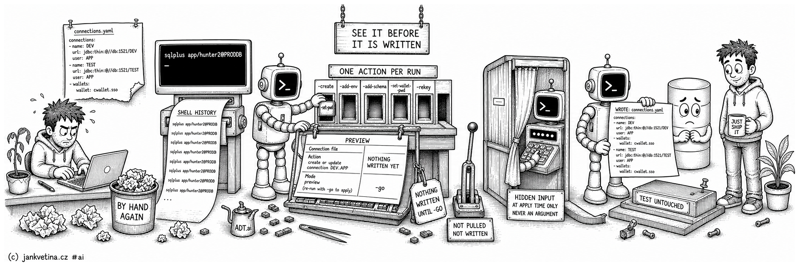

# Edit the Connection File (adtai connection)



`connection` manages a project's connection file from the command line instead of by hand-editing YAML. Reach for it to bootstrap a project's first connection, to add an environment or a schema, and to set or rotate a password without ever typing one into a shell.

It resolves the same connection file every other command uses, through `-root` and `-config-dir`, and applies one structural change to it. `-create` can create that file when it is missing; the other actions edit an existing one.

## Examples

Create the first connection, or fill in a missing field on an existing one:

```bash
adtai connection -create -env DEV -schema APP -user APP \
  -host db.example.com -service DEVDB -default -go
```

Add a schema to an environment that already exists, and add an environment cloned from another:

```bash
adtai connection -add-schema -env DEV -schema CORE -user CORE -go
adtai connection -add-env -env QA -like DEV -go
```

Set a schema password, or a wallet password, encrypted:

```bash
adtai connection -set-pwd -env DEV -schema APP -encrypt -key /secure/adt.key -go
adtai connection -set-wallet-pwd -env DEV -encrypt -key /secure/adt.key -go
```

Move the whole file to a new encryption key:

```bash
adtai connection -rekey -old-key /secure/adt.key -new-key /secure/adt-2027.key -go
```

Exactly one action is required per run: `-create`, `-add-env`, `-add-schema`, `-set-pwd`, `-set-wallet-pwd` or `-rekey`.

## Output

Without `-go` the command previews. It names the resolved connection file, says what it would do, and prints the block it would insert. Nothing is written:

```text
APEX DEPLOYMENT TOOL - CONNECTION
---------------------------------

  Connection file   /path/to/connections.yaml
  Action            create or update connection DEV.APP
  Mode              preview (re-run with -go to apply)

DEV:
  db:
    hostname: db.example.com
    port: 1521
    service: DEVDB
  defaults:
    schema_db: APP
  schemas:
    APP:
      db:
        user: APP

TIMER: 0s
```

- Re-run with `-go` to apply. The `Mode` row disappears and the run ends on `WROTE:` and the file it wrote.
- A preview never prompts and never renders a secret, so a password action shows the change without the password.
- The edit is rewritten with a round-trip YAML parser, so comments and key order in the file survive, and only the targeted block is added or changed.
- `-rekey` is the one action not aimed at a single block. It rewrites every encrypted secret in the file at once, and its preview names each one and renders none.

## Database passwords are never on the command line

A password is collected interactively, with hidden input, at apply time only. An argument would land in shell history and in the process list, where any local user can read it.

- `-create -go` prompts once for the schema password, and once more for the wallet password when `-wallet` was given. Leave either blank to skip writing it.
- `-add-schema -go` prompts once. Leave it blank to add the schema with no password.
- `-set-pwd` and `-set-wallet-pwd` prompt twice and require a match.

Passwords are written as cleartext by default, and a cleartext write removes the matching encryption marker so the runtime does not try to decrypt plaintext.

`-encrypt` writes an encrypted value. Its key comes from `-key`, `ADT_KEY`, or `ADT_KEY_CMD`; values and key-file paths are accepted. Prefer a file or secret-manager command. Unlike the prompted database password, literal `-key VALUE` is exposed in shell history and the process list. The formats are on [connection_passwords.md](connection_passwords.md).

## Creating a file or an entry

`-create` is the bootstrap path. It creates the resolved connection YAML when no candidate exists yet, and otherwise fills in the fields the existing file is missing. Existing values are preserved, so it only ever adds.

For the export filters `-prefix` and `-ignore`, a **blank** entry counts as missing rather than as a value. A connection file conventionally seeds those keys empty, so treating a pre-seeded placeholder as already set would make both flags a permanent no-op on exactly the files that need them.

A filter genuinely holding a value is never overwritten; change one by editing the YAML.

Both filters take several patterns, and the two spellings mean the same thing: `ignore: 'TMP_%, BAK_%'` and `ignore: ['TMP_%', 'BAK_%']` read identically, a comma being a separator inside a list item as well as inside a string. A key left blank, or holding only blanks, is no filter at all rather than a filter nothing matches.

Each pattern is SQL LIKE, so a literal `_` or `%` in a name is escaped with `\`. `ignore: 'LEGACY\_%'` skips only names starting `LEGACY_`; unescaped, `LEGACY_%` would skip every name `LEGACY` plus one character plus anything.

There is no shipped connection template, and there never will be: `connections/*` is gitignored because a connection file holds credentials, and `doctor -init` writes only the folder placeholders. Bootstrap your first file with `-create`, which writes the whole structure for you.

For a wallet or APEX project the same action carries the rest:

```bash
adtai connection -create -env DEV -schema APP -user APP \
  -host db.example.com -service DEVDB \
  -wallet Wallet_DEV -workspace DEV_WS -app 100 \
  -prefix APP_% -ignore TMP_% \
  -default -encrypt -key /secure/adt.key -go
```

With `-default`, ADT.ai writes the APEX default schema when an APEX workspace is configured, and the database default schema otherwise.

## Adding a schema or an environment

For `-add-schema` the environment must already exist and the schema must not. The new schema is added as a `db` block naming its user, which defaults to the schema name unless `-user` says otherwise. Host, port and service are inherited from the environment's own `db` block at resolve time, so they are not restated per schema:

```text
  Action            add schema DEV.CORE
  Mode              preview (re-run with -go to apply)

CORE:
  db:
    user: CORE
```

For `-add-env` the environment must not already exist. From scratch it builds a `db` block from `-host`, `-port` (default `1521`) and `-service`, plus empty defaults and schemas blocks ready for `-add-schema`.

With `-like`, the new environment clones the source environment's `db` and `wallet` blocks, with any passwords stripped, then applies whatever `-host`, `-port` or `-service` overrides you passed. A cloned environment starts with no schemas.

## Named SQLcl connections

Every SQLcl script ADT generates, REST export included, connects through a **named SQLcl connection** rather than embedding a username, password and wallet path in the script. The password lives in SQLcl's own store, in the operating system's secure storage, so a per-call script carries `connect -name ADT_…` and nothing else.

- **Naming.** `ADT_` plus the connection file's basename. Where the file defines more than one environment the name gains the environment, and where that environment defines more than one schema it gains the schema, so every environment and schema pair maps to its own name. A project using the generic filename is named after its project folder instead.
- **Transparency.** The first SQLcl call registers the connection and records the assigned name on that schema's `db:` block as `sqlcl:`, with a credential fingerprint beside it as `sqlcl_sync:`. Edit `sqlcl:` by hand to pin a different name; a recorded name always wins over a generated one.
- **A failed connect is an error, not an empty result.** Every generated `connect` runs under `WHENEVER SQLERROR EXIT FAILURE`, so a connection that could not be opened fails the command with the SQLcl message rather than running on to its `exit;` and returning `0`.
- That guard is also what makes the two recorded keys trustworthy: they are written **only after the run that carried the registration actually succeeded**. If an export fails and the keys stay absent, that is the intended behaviour. Deleting them by hand and re-running fixes no credential or network problem, it only re-attempts the registration.
- **Credential changes.** Every SQLcl call recomputes the fingerprint over the username, password, host and service, wallet path and wallet password. Any change re-registers the named connection on the next call.
- **Machine moves.** The YAML travels with the project and SQLcl's store does not. Where the store has no such name, on a new machine or a cleared one, the call fails fast and ADT re-registers and retries by itself.
- **Wallets.** Registration passes an absolute wallet path, so a wallet project needs nothing extra.
- **Opt-out.** Set `sqlcl_named_connections: false` in project `config.yaml` to restore the older inline connect scripts.
- **Driver.** SQLcl is always launched on the JDBC thin driver, with `ORACLE_HOME` withheld from its environment, because its launcher otherwise reads that variable as a request for the thick driver and builds a URL the JVM cannot satisfy. Nothing else changes: `PATH` still finds the launcher, `TNS_ADMIN` still resolves aliases, wallet connects are unaffected, and ADT's own Python connection keeps thick mode, since only the SQLcl child is started without the variable.

## Arguments

Exactly one action flag is required, and each names the further arguments it needs.

| Argument | Repeatable | Default | Description |
| -------- | ---------- | ------- | ----------- |
| `-create` | No | off | Action. Create or update a connection entry. Requires `-env` and `-schema`, and can create the resolved file when it is missing. |
| `-add-env` | No | off | Action. Add a new environment. Requires `-env`; use `-like` to clone another. |
| `-add-schema` | No | off | Action. Add a new schema to an environment. Requires `-env` and `-schema`. |
| `-set-pwd` | No | off | Action. Set a schema password. Requires `-env` and `-schema`, and prompts interactively with `-go`. |
| `-set-wallet-pwd` | No | off | Action. Set an environment's wallet password. Requires `-env`, and prompts interactively with `-go`. |
| `-rekey` | No | off | Action. Re-encrypt every encrypted secret in the file under a new key. Requires `-old-key` and `-new-key`, takes no `-env` or `-schema`, and rejects `-encrypt`. |
| `-old-key`, `--old-key` | No | none | With `-rekey`, the key the file's secrets are encrypted with today. A value or a path to a key file. |
| `-new-key`, `--new-key` | No | none | With `-rekey`, the key to re-encrypt them with. A value or a path to a key file. |
| `-user`, `--user` | No | schema name | Database user for `-create` and `-add-schema`. |
| `-like`, `--like` | No | none | With `-add-env`, clone this environment's `db` and `wallet` blocks, secrets stripped. |
| `-host`, `--host` | No | none | With `-create` or `-add-env`, set the hostname. |
| `-port`, `--port` | No | `1521` | With `-create` or `-add-env`, set the port. |
| `-service`, `--service` | No | none | With `-create` or `-add-env`, set the service. |
| `-sid`, `--sid` | No | none | With `-create`, set the SID when no service is used. |
| `-wallet`, `--wallet` | No | none | With `-create`, set the environment's wallet name or path. |
| `-workspace`, `--workspace` | No | none | With `-create`, set the schema's APEX workspace. |
| `-app`, `--app` | No | none | With `-create`, set the schema's APEX application scope. |
| `-prefix`, `--prefix` | No | none | With `-create`, set the export prefix filter, which exports only matching names. |
| `-ignore`, `--ignore` | No | none | With `-create`, set the export ignore filter, the SQL LIKE patterns `export_db` and `export_data` skip. Fills a blank or missing entry and never overwrites one already holding a value. |
| `-default`, `--default` | No | off | With `-create`, mark the schema as the default database or APEX schema. |
| `-encrypt`, `--encrypt` | No | off | With a password-writing action, encrypt the stored value using `-key` or `ADT_KEY`. |
| `-go`, `--go` | No | off | Apply the change. Without it the command previews and writes nothing. |

Shared options (-root, -env, -schema, -config-dir, -key, -debug, -beep, -nobeep) are on [console.md](console.md#shared-arguments).
