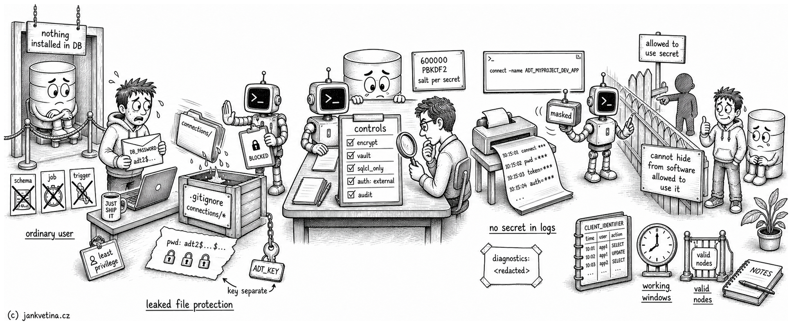

# Credential Handling (how ADT.ai treats your database passwords)

This page is written for the person who has to approve ADT.ai, not for the developer using it. It says where a credential lives, what protects it, and what to change if storing the password at all is unacceptable to you.

It also states plainly the two things ADT.ai does not protect against, because a tool that overclaims on credentials is not one you should trust with them. Nothing here is aspirational: every control below is shipped.

 

## Start here: nothing is installed in your database

ADT.ai is a command line tool that runs on a developer's machine. It creates no schema, no package, no job and no trigger in your database.

It connects as an ordinary Oracle user, reads the data dictionary, writes files to a git repository, and where you ask it to deploy, it runs SQL you can read first. Withdraw the credential and ADT.ai stops working, leaving nothing behind.

That matters for this conversation because it sets the size of the question. The primary sensitive assets ADT.ai handles are database credentials, encryption keys and wallet paths, and the only database privileges it can use are the ones you grant its user.

 

## Where a credential lives

A project has a connection file, a YAML file that lists environments, schemas, hostnames, services, and optionally passwords.

- By default it sits in `connections/` inside the project, which ADT.ai keeps in `.gitignore`, so it is not committed by accident. `doctor -init` writes only the placeholder that keeps the folder in Git, never a connection file.
- It does not have to live in the project at all. `connections.path` and `connections.file` in the project config point ADT.ai at any folder or file on the machine, so the connection file can sit outside the repository entirely, in a location your policy chooses.
- A wallet is treated the same way, under `connections/wallets/` or an explicit `wallet_path`.
- A file created or rewritten by `adtai connection` is owner-only (`0600`) on POSIX systems. A manually created file keeps the permissions your editor gave it until ADT.ai rewrites it, so check those permissions independently.

There is no shipped template and no sample credentials. A first connection file is created by `adtai connection -create`, which prompts for the password interactively.

 

## The two questions a reviewer is actually asking

These get conflated, and only one of them is answered by encrypting the file.

**1. What happens if the file leaks?** Committed to Git by mistake, synced to a cloud folder, included in a laptop backup, visible in a screen share. This is the question encryption answers, and it is the reason ADT.ai supports it.

**2. What happens on a machine where software can read the file?** Any process running as that developer can read what that developer can read. If the reading process can also run `adtai`, encryption changes nothing, because the tool must be able to decrypt in order to connect.

The honest consequence of the second question is worth stating in one sentence, because it is the sentence most tools avoid: **no credential store can hide a secret from a program that is allowed to use that secret.** Anything claiming otherwise is describing question 1 and calling it question 2.

What follows is therefore split the way the questions split.

 

## What ADT.ai does today

 

### Against a leaked file

- **Passwords can be encrypted in the connection file.** `adtai connection -set-pwd -env DEV -schema APP -encrypt -key /secure/adt.key -go` writes the encrypted value and marks it, and the runtime decrypts it before connecting. The same applies to a wallet password.
- **The key does not live with the file.** It comes from `-key`, `ADT_KEY`, or the standard output of `ADT_KEY_CMD`. `-key` and `ADT_KEY` may be a value or **a path to a key file of any length, stored anywhere on the machine**. Prefer an owner-only key file or a secret-manager command: a literal `-key VALUE` is visible in shell history and process listings, and a literal key in an environment variable can be read by other software running as the same user. The encrypted connection file and the key that opens it need never travel together, which is what makes a leak of one of them survivable.
- **Every stored secret has its own random salt.** An encrypted value is written as `adt2$<salt>$<ciphertext>`, and the 16 byte salt is generated fresh per secret. Two projects using the same key produce different ciphertext, so an attacker who precomputes a table against one of them gains nothing against any other, and encrypting one password twice gives two unrelated values. Key derivation is PBKDF2-HMAC-SHA256 at 600000 iterations, the count OWASP currently recommends. The format version at the front is what lets that cost be raised again later without invalidating anything already stored.
- **A wrong key reports itself as a wrong key.** A short digest identifying the encryption key is recorded beside each encrypted value, so a failure to decrypt says which key the value is under and which key was supplied, rather than reporting a corrupt file. The digest is derived from the value's own salted material, so guessing against it costs exactly as much as guessing against the ciphertext. It does not weaken the encrypted value, but neither the digest nor the ciphertext belongs in Git.
- **The encryption key can be rotated across a whole file in one command.** `adtai connection -rekey -old-key OLD -new-key NEW -go` re-encrypts every stored secret in every environment and schema at once. It previews first, and it writes nothing at all unless it can rewrite everything, so a file is never left half converted under two keys. The recorded key fingerprints are what let it tell a wrong key from a file that is already partly rotated, and report the second case instead of failing obscurely. Worth stating plainly: re-encrypting is not the same as rotating the database password. Those are two separate acts, and after a suspected leak only the second one matters.
- **The file need not hold the secret at all.** `pwd_cmd: op read op://Engineering/DEV_APP/password` on a schema tells ADT.ai to run that command and take its output as the password, so the connection file carries no password and no ciphertext. `wallet_pwd_cmd:` does the same for a wallet password, and the `ADT_KEY_CMD` environment variable does it for the encryption key itself, which is how a project ends up with nothing secret at rest anywhere ADT.ai can see. Any secret manager that prints a value works: 1Password, HashiCorp Vault, `pass`, Azure Key Vault. Custody moves to you, along with rotation, revocation, and your own access log. Being exact about the boundary, it does not hide the value from a process already allowed to run the tool, which is the same limit the next section states for everything else here. The command runs as an argument list and never through a shell, a block that names both a command and a stored password is refused rather than silently ranked, and a failure reports only the executable and exit status. Arguments, stdout and stderr are never copied into the diagnostic.
- **A mode where no database password enters our process at all.** `sqlcl_only: True` in the project config routes every database call through SQLcl rather than the Python driver, so the credential stays in SQLcl's own secure store and ADT.ai never holds one. With it on the connection file needs no password of any kind, since the named connection resolves out of that store. It is slower, which is why it is off by default and offered as a tradeoff rather than a recommendation, and the cost is stated rather than hidden: about 3 seconds to open the session, then tens of milliseconds per query. Nothing else about a run changes, the same commands produce the same output and the same files. On Windows it runs one SQLcl script per statement rather than holding one process open, because SQLcl draws no prompt inside a Windows console; the security property is identical, and two commands refuse there because they need two statements in one database session. [connection_passwords.md](connection_passwords.md) carries the detail.
- **A mode where no password is passed at all.** `auth: external` on a schema has the Oracle client library read the credential out of a Secure External Password Store (`cwallet.sso`) itself, so it never exists as a value ADT.ai holds and no password appears in any call the tool makes. This is the only option on this page where that is true: every other one moves where the secret rests, this one removes it from the conversation. It skips password resolution completely, so such a project needs no `pwd`, no encryption key and no vault command. Two requirements come with it, both the driver's: it is thick-mode only, so the Oracle client libraries have to be on the machine, and the wallet is a separate file from the mTLS wallet an Autonomous Database issues. Being exact, SEPS is still password authentication and the database records it as such; what changes is that the password lives in your wallet rather than in our process.
- **Passwords are never accepted as a command line argument.** They are collected interactively with hidden input, at apply time only. This is deliberate: an argument would appear in shell history and in the process list, where any local user can read it.
- **Preview never renders a secret.** Every `connection` action previews by default and only writes with `-go`, and the preview prints the change without the password.

 

### Against a credential reaching somewhere it should not

- **A loaded credential is masked in the tool's own memory.** Once a connection file is read, the schema password and the wallet password are held in a wrapper that renders as `***`. Exactly three places in the code unwrap it, and each hands it straight to something outside the program that cannot accept a mask: the Oracle driver's connect call, the connect line of a generated SQLcl script, and a credential fingerprint that emits only a 12 character digest. A test walks the whole source tree and fails the build if a fourth place is added. The practical effect is that a credential cannot reach a log line, an error message, a debug dump, or a test failure report by accident, which matters increasingly because those outputs are what a developer's AI assistant reads.
- **Generated SQL scripts carry no credentials.** ADT.ai registers a named connection in SQLcl's own connection store once, and every script it generates afterwards connects with `connect -name ADT_...` and nothing else. No username, no password, no wallet path in the file on disk.
- **Temporary scripts are locked down and removed.** The one script that does carry a connect line, the registration run, is written with `0600` permissions, readable only by the owner, and deleted after the run. Any password in captured SQLcl output is replaced with `***` before that output reaches a log or the screen.
- **Diagnostics redact.** `adtai doctor` reports whether `ADT_KEY` is set by printing `<redacted>`, never its value.
- **Child processes do not inherit ADT.ai's encryption keys.** Git, pip, Java, SQLcl and configured secret-provider commands receive an environment with `ADT_KEY` and `ADT_KEY_CMD` removed. The one deliberate exception is the login-shell bootstrap whose purpose is to discover the user's configured ADT variables. Variables owned by the child tool are not stripped.
- **Debug output is operationally sensitive.** `-debug` prints SQL with bind values and preserves tracebacks. Password wrappers remain masked, but application data and paths are not secrets ADT.ai can identify generically. Treat debug transcripts as local diagnostic artifacts and inspect them before sharing.

 

### For your audit trail

- **ADT.ai sessions can be attributed to a named developer.** When a project carries a `config/IDENTITY.yaml` with a `db_schema` value, every connection ADT.ai opens calls `DBMS_SESSION.SET_IDENTIFIER` with it before running anything. That identifier is visible in `V$SESSION.CLIENT_IDENTIFIER` and in unified auditing, so ADT.ai activity is distinguishable from other use of the same database user, per developer. The file is optional and gitignored; without it the identifier is simply not set.

 

## What ADT.ai does not claim

Two limits, stated rather than buried.

**It is not a defence against software running as that developer.** If a process on the machine may run `adtai`, it may also open a database session, whatever the credential is protected with. Encryption, a key file, a vault, and an operating system keychain all change *where the secret rests*; none of them change *who may use it*. The guarantee ADT.ai does make is the narrower and checkable one: the tool itself never puts a plaintext credential where something else reads it back.

**Encryption in the connection file is not permission to commit it.** It raises the cost of an accidental leak, but metadata, endpoints and ciphertext still leave your control, and keys can be mishandled later. Connection files, key files, wallets, generated logs and debug transcripts remain untracked local artifacts. Encryption also does not limit what the credential can do once someone has it. That limit is set by the privileges you grant, and it is the subject of the next section.

 

## The controls that actually close a review, and they are yours

These are the ones we recommend you insist on, because they bound the damage rather than the discovery. None of them depend on trusting our code.

- **Give ADT.ai its own least privilege user.** It needs to read the data dictionary and the objects it exports, plus whatever a deployment genuinely touches. It does not need `DBA`. Where you use proxy authentication, a connect-through user (`ADT_AGENT[APP_OWNER]`) means a leaked credential cannot be reused outside the proxy grant.
- **Restrict where it may connect from.** Oracle valid node checking, or a network rule limiting the developer's host to the development listener.
- **Lock the account outside working windows** if the work is bounded in time.
- **Audit it.** With `IDENTITY.yaml` configured, unified auditing on the client identifier gives you a per developer record of every statement ADT.ai ran.
- **Keep it out of production.** ADT.ai is a development and test tool. Promotion into production should run through your existing release process, with the artifacts ADT.ai produced reviewed like any other change.

A credential that can only read a development schema, only from one host, only during the working day, and whose every use is logged against a named person, is a credential whose storage format stops being the interesting question. That is the outcome worth aiming at.

 

## Questions

If your reviewer needs something not covered here, ask. A requirement we can implement is more useful to us than a workaround you have to maintain, and every control on this page got here because a customer asked for exactly that.

Related: [connection.md](connection.md) for the `connection` command, [connection_passwords.md](connection_passwords.md) for the stored formats and the vault options, and [SETUP.md](../SETUP.md) for installation.
