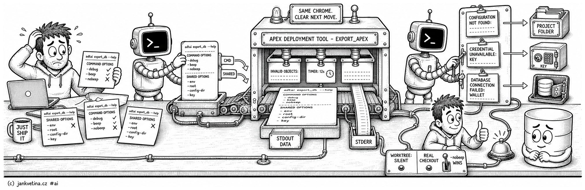

# Console Output (adtai)



Every ADT.ai command prints the same chrome, and a refusal is written to tell you where to go and fix it. This page is what those screens mean: how to read `--help`, what the banner, sections and timer are, which failure header you are looking at, and how the completion sound is decided.

The eight flags every command shares are documented at the end of it, so a command page can list only the flags that are its own.

<br>

## Help

Bare `adtai` and `adtai --help` both print the module overview, A to Z, one row per module with a short description. Every module is invoked by its single canonical name.

```bash
adtai --help
adtai export_db --help
```

Command help opens with the `APEX DEPLOYMENT TOOL - <CMD>` banner, then the usage line, a one-paragraph summary with no hard wrapping, a separated pointer to this folder's page for that command, and the grouped option sections.

- Help is static reference output, so it prints no `TIMER`.
- `-h` and `--help` are accepted and are not listed as rows.
- Option rows show the single-dash alias and hide the redundant `--` form. Both are still accepted by the parser.
- Shared options are always listed last, in the order `-debug`, `-beep`, `-nobeep`, `-env`, `-root`, `-config-dir`, `-key`. They are documented under [Shared arguments](#shared-arguments), at the end of this page.
- Sections wrap to a default 80-column terminal.

<br>

## The shape of a run

Every command that reaches a handler prints the same chrome: the module banner, dashed section headers, and the shared `TIMER: Ns` footer. Early validation errors, successful no-ops and ordinary failures all keep that shape, so automation and a human read the same screen.

Top-level help and a bare `adtai` print the generic banner and the `MODULES:` overview with no timer. An unknown command prints the generic banner, then `ERROR - UNKNOWN COMMAND:`, any targeted replacement command, and the same overview, the whole screen on stderr. Neither prints a raw `usage:` or `choose from` block.

A command that connects also prints the shared connection block:

```text
CONNECTING TO SCHEMA SANDBOX, DEV:
----------------------------------
              APEX | 26.1.0
          DATABASE | 23.26.1.0.0 | FREEPDB1
```

A machine-output mode keeps stdout pure data and sends the chrome and the timer to stderr.

<br>

### Header shape

Two kinds of header, told apart by their last character:

- The **module banner** is the command's H1 and uses a `-` separator, `APEX DEPLOYMENT TOOL - EXPORT_APEX`, underlined across its full width. It is the only header that does not end with a colon.
- **Every section header ends with `:`**, so `INVALID OBJECTS:` and `EXPORTING 61 OBJECTS:`. A value or a count belongs inside the phrase rather than trailing the colon, so the dashed rule underlines the whole line rather than stopping one word short.

A header may carry a separate appended value, excluded from the underline on purpose, which is how a label plus a context value gets a rule covering only the label. Use it for context, never to park a count.

**Every section header opens on exactly two blank lines**, whatever printed above it, and the renderer guarantees it rather than each call site. The gap is normalized rather than added to whatever the last section left behind, so a section that closed itself gets nothing added and one that ended on a bare row gets what it is missing.

**Two headers open on one instead**, and it is the same rule rather than an exception to it: one blank belongs to the header and one to the section above it. The module banner has nothing above it at all, and the first section on a screen has only the banner, which is the command's title rather than a section. Everything below the first section is separated from a section and carries the pair. Never print a blank line before a header to widen the gap, and never pass a per-call spacing argument.

**A schema name renders uppercase in every header**, whatever casing it was spelled with, so a connection file keyed `app` and `-schema app` both print `CONNECTING TO SCHEMA APP, DEV:`. That is display only: the file's own casing still owns lookups and export paths.

Table rows carry no trailing whitespace. Every cell is padded to its column width, so an unstripped row would run past its visible content and wrap on an 80-column terminal, printing a blank line under every row.

<br>

### Listing database objects

Every section that lists database objects prints one shape, whichever command prints it: a 20-character right-aligned type column, ` | `, and the object name. The type is named once per group and blank on the rows under it, and a bare `                     |` row closes each group.

```text
EXPORTING 6 OBJECTS:
--------------------

           PROCEDURE | ADT_FIXTURE_OWNED_PRC
                     | ADT_FIXTURE_RECENT_PRC
                     | ADT_FIXTURE_SHARED_PRC
                     |
               TABLE | ADT_FIXTURE_DDL_LOG
                     |
```

It is one renderer, not a convention. Seven sections call it: `EXPORTING <n> OBJECTS:`, `DELETED OBJECTS:` and `WARNING - JOB ARGUMENTS NOT EXPORTED:` in `export_db`, `UPDATED OBJECTS:` in `recompile`, and `DELETED OBJECTS:`, `WARNING - OBJECTS CHANGED:` plus `INVALID OBJECTS:` in `patch`. A second hand-rolled version of the row fails the suite.

**The unit is the object, never the file that holds it.** A file moved between folders is the same object, so a listing keyed on paths reports a move as a deletion.

A listing built in one go sorts by type and then by name. One printed as the work happens keeps the order its source returned, and closes its last group when the caller knows there is no next object; the bytes are the same either way.

<br>

### Warnings

**A warning is a section of its own**, never a bare line: `WARNING - <SUBJECT>:`, its dashed rule, and the files, objects or applications it is about. The run carries on past it.

A corrupt `IDENTITY.yaml` or cache under `config/internal/` is named under `WARNING - UNREADABLE FILES:`, with the parser's reason and position under the file, and the run reads on as if it were absent.

Warnings print on stdout with the rest of the report. The one on stderr is `connection`'s `WARNING - PASSWORD MAY BE ECHOED:`, because the prompt it warns about is written there.

<br>

### Failure screens

**Every refusal takes one shape.** The header is `ERROR - <CODE>:` under its dashed rule, the description is indented two columns, and anything further sits one blank line below it on the same indent:

```text
APEX DEPLOYMENT TOOL - EXPORT_DB
--------------------------------


ERROR - CONFIGURATION NOT FOUND:
--------------------------------
  CONNECTION FILE NOT FOUND

  Searched:
    - ./connections.yaml
    - ./connections/app.yaml

  1) run ADT.ai from a project folder that has a connection file
  2) or pass -config-dir / -root to point at one


TIMER: 0s
```

**The description opens on a short uppercase headline.** It names the problem in a few words, with no closing period, and the detail follows below it in sentence case. What you typed keeps its case inside the headline: a flag, a path, a quoted name, an id. Text ADT.ai relays from Oracle, SQLcl or Git stays as that tool wrote it.

The code is chosen by what your next move is rather than by which layer raised the error:

| Code | What happened | What follows the description |
| --- | --- | --- |
| `ARGUMENT INVALID` | What you typed cannot be parsed or cannot be combined: an unknown flag, two actions that are exclusive, a required value that is missing, a prompt that produced no password. | The `-h` pointer for that command, or the flag to use instead. |
| `UNKNOWN COMMAND` | The first word is not a command. | The `MODULES:` overview, plus the `adtai doctor` line for `init`, `update` and `upgrade`. |
| `INPUT NOT FOUND` | The thing to work on is not there yet: a branch that is not in the repo, a commit store no `rebuild` has built. | What to run first. |
| `CONFIGURATION NOT FOUND` | No connection or config file could be located, or the file names no such environment or schema. | Run from a project folder that has a connection file, or pass `-config-dir` or `-root`. |
| `CONFIGURATION INVALID` | A file was found and read and cannot be used as written: unparsable YAML, a document that is not a mapping, a value ADT cannot use, external auth naming no TNS alias. | None. The message names the key. |
| `CREDENTIAL UNAVAILABLE` | The connection is described and its secret could not be obtained: a vault command that failed or timed out, a missing or wrong key, two sources configured for one secret. | None. The message names the key. |
| `DATABASE CONNECTION FAILED` | A connect attempt was made and refused: SQLcl reported no session, or Oracle returned a known connection ORA, DPY, DPI or TNS code. Ordinary application text that merely says connection, listener or wallet does not select this screen. | Check the connection file and the wallet folder. |
| `DATABASE QUERY FAILED` | A statement failed after a successful connect. The error leads and the offending SQL follows it under `Query:`. | The `-debug` hint. |
| `SQLCL SCRIPT FAILED` | SQLcl exited non-zero. The description is the captured transcript. | The `-debug` hint. |
| `GIT COMMIT FAILED` | `diff -restore` or `search -restore` could not save your uncommitted work as a local `WIP` commit, so nothing was written. | Git's own message. |
| `PATCH FAILED` | `patch` started and stopped on its own work: no commit matched, a baseline or dependency graph is missing or stale, a sandbox is not yours to drop. | None. The message names the cause and the flag or command that clears it. |
| `DIFF FAILED` | `diff` started and the comparison, the read or the restore failed. | None. The message is the failure, SQLcl's own output where there is one. |
| `STARTUP FAILED` | ADT.ai could not import itself. The banner carries no command, because none resolved. | The `-debug` hint. |
| `VALUE ERROR` | A `ValueError` ADT.ai raised with its own message, the message printed without the type name. | The `-debug` hint. |
| `RUNTIME ERROR` | A `RuntimeError`, printed the same way. | The `-debug` hint. |
| `UNEXPECTED ERROR` | Anything else ADT.ai could not classify, printed as `<Type>: <message>`. | The `-debug` hint. |

The set is closed: a code outside it is refused, and all fourteen headers are held in the checked-in console inventory, so adding one is a reviewed console change like any other section header.

**Every refusal goes to stderr**, and the `TIMER` footer follows it there. **The exit code is a property of the code**: `2` for `ARGUMENT INVALID` and `UNKNOWN COMMAND`, which are about what you typed, `1` for every other, which happened during the work.

**The `-debug` hint prints on four codes only**, the ones where a Python traceback is the next thing worth reading. A screen that names its own cause and its own remedy does not carry it: the hint above a located config file or a refused connect is advice that leads nowhere. `-debug` itself re-raises for the traceback on any command whose parser declares it, and `calendar`, `doctor`, `rebuild` and `search` never did, so the hint never prints there either.

**A run that carries on past a failure is not a refusal.** `export_db` records an object the database refuses, writes the rest, and lists the refused objects under `WARNING - OBJECT EXPORT FAILED:` straight after the export, as `TYPE | NAME` rows with no query and no hint; `-debug` adds each error under its row ([export_db](export_db.md#when-the-database-refuses-an-object)). The run exits `1` all the same.

The description is indented plain text, not a bullet list, and a nested list stays a nested list where the content genuinely is one: the searched-paths rows above are the case that shape is for.

**Every section that says something failed opens on `ERROR - `**, the same way every warning opens on `WARNING - `, and its body sits two columns in. `patch` and `diff` stopping on their own work take the shared screen above (`PATCH FAILED`, `DIFF FAILED`). A failure reported per item keeps its own section under the same prefix: `ERROR - DEPLOYMENT FAILED:` puts each failed script on a `FILE:` row with what SQLcl refused two columns further in, `ERROR - VALIDATION FAILED:` puts each APEXlang tree `patch` refused on an `APP:` row with the compiler's records under it, and `ERROR - RECOMPILATION FAILED:` lists each object's compiler messages. `INVALID OBJECTS:` is a list of what the database holds, not a failure of the run, so it carries no prefix.

The project-folder remedy belongs to `CONFIGURATION NOT FOUND` alone. When every connection failure took that screen, a hand-edited YAML typo, an unauthenticated vault CLI and a failed SQLcl connect all reported it and advised running from a folder holding the file that had just been read.

A refusal that leaves you a **choice** prints the ways forward as numbered lines, never stacked into a sentence: two leading spaces, `1)`, `2)`, the flag or key, then a column of short descriptions.

Below them an optional `NOTE:` names the habit that keeps the failure from happening again, and it prints only where that habit would actually have applied. One way forward stays one sentence; the numbered shape is for a fork.

```text
  1) -search PATTERN            select them by a different term
  2) -commit N [-ignore N]      select them by number, hash or range

NOTE: put the patch name in the commit message and -name finds them
      by itself.
```

That is `patch -create` refusing because `-name` matched no commit subject. Written as prose it read as a paragraph to parse before the operator could act, and the two remedies were the only part of it he needed.

<br>

### Multi-schema runs

`export_db`, `export_data`, `export_apex`, `recompile` and `rebuild` all take a list of schemas. Such a run reads as N single-schema invocations concatenated: the banner prints once, then each schema is its own segment, connect, do that schema's entire work, print its own `TIMER`, before the next connection block appears.

There is no grand-total timer after the last segment. That segment's own `TIMER` is the run's final line, exactly as if the command had been invoked once per schema.

```text
APEX DEPLOYMENT TOOL - EXPORT_DB
--------------------------------

CONNECTING TO SCHEMA APP, DEV:
------------------------------
              APEX | 26.1.0
          DATABASE | 23.26.1.0.0 | FREEPDB1

...that schema's own output...

TIMER: 12s

CONNECTING TO SCHEMA CORE, DEV:
-------------------------------
              APEX | 26.1.0
          DATABASE | 23.26.1.0.0 | FREEPDB1

...that schema's own output...

TIMER: 8s
```

<br>

## Completion sounds

ADT.ai plays a success sound on exit code `0` and an error sound on anything else, using the theme in the `chime_theme` config key. Set it empty or false in project config to switch sounds off. Help, version and the static module overview never play one.

Sounds are also gated by checkout, so background, parallel and agent runs stay silent even where a theme is set. ADT.ai plays only from a real checkout, one whose repository root has `.git` as a directory.

A linked git worktree marks its root with a `.git` *file*, so any command launched from a worktree is silent. That needs no setup: interactive runs from your own checkout beep and parallel agent worktrees do not.

- `-beep` forces a non-blocking sound from the shared `TIMER` footer on any executable path, argument errors and connection failures included.
- `-beep THEME` overrides the theme for that run, case-insensitively. Bare `-beep` uses the configured theme, or the default one when project config omits or disables it.
- `-nobeep` silences a run explicitly, and wins over both `chime_theme` and `-beep`.

<br>

## Shared arguments

Eight flags mean the same thing wherever they are accepted, so they are documented here once instead of in every command's own table. A command page lists only the flags that are its own and points back to this section. Not every command takes all eight: the second table below says which takes which.

| Argument | Repeatable | Default | Description |
| -------- | ---------- | ------- | ----------- |
| `-root`, `--root` | No | `.` | Project root folder. Config and connection files resolve from here, and so does the Git history the history commands read. |
| `-config-dir`, `--config-dir` | Yes | none | Folder holding project config YAML. ADT.ai loads the shipped defaults first, then overlays these instead of `<root>/config/` and `<root>/`. |
| `-env`, `--env` | No | connection default environment | Connection environment to use, for example `DEV`. |
| `-schema`, `--schema` | Yes (one per run on `connection`, `diff`, `discovery` and `patch -upload`) | environment default schema | Schema to work on. On `diff` it names the source schema and supplies the target's too. Where it repeats, pass it several times, space-separate it (`-schema APP CORE`), use comma lists, or use `%` patterns such as `CORE%`. A literal `_` or `%` is escaped with `\`, quoted so the shell leaves it alone: `-schema 'APP\_%'`. |
| `-key`, `--key` | No | `ADT_KEY` or `ADT_KEY_CMD` | Encryption key value or path to a key file. Prefer a file path; a literal value is visible in shell history and the process list. |
| `-debug`, `--debug` | No | off | Show the input parameters and the SQL behind the run, and keep Python tracebacks for troubleshooting. |
| `-beep [THEME]`, `--beep [THEME]` | No | off | Force the completion chime on for this run, optionally using a theme override such as `-beep zelda`. |
| `-nobeep`, `--nobeep` | No | off | Suppress completion sounds for this run; this wins over `chime_theme` and `-beep`. |

<br>

### Which command takes which

A flag a command does not take is a parser error, not a flag it ignores.

| Argument | Commands that take it |
| -------- | --------------------- |
| `-root` | every command |
| `-config-dir` | `connection`, `diff`, `discovery`, `export_apex`, `export_data`, `export_db`, `patch`, `rebuild`, `recompile`, `ut`, `validate` |
| `-env` | `connection`, `discovery`, `export_apex`, `export_data`, `export_db`, `rebuild`, `recompile`, `ut`, `validate` (only with `-scan`) |
| `-schema` | `connection`, `diff`, `discovery`, `export_apex`, `export_data`, `export_db`, `patch` (with `-install`, default every exported schema; one value with `-upload`), `rebuild`, `recompile`, `search` (only beside an object's `-from`, `-to` or `-impact`, as an owner filter), `ut` |
| `-key` | `connection`, `diff`, `discovery`, `export_apex`, `export_data`, `export_db`, `patch`, `rebuild`, `recompile`, `ut` |
| `-debug` | `connection`, `diff`, `discovery`, `export_apex`, `export_data`, `export_db`, `patch`, `recompile`, `ut`, `validate` |
| `-beep` | every command |
| `-nobeep` | every command |

<br>

### How the files are found

`-root` is where a project starts. ADT.ai reads the shipped `ADT.ai/config/` defaults first and overlays the project's own config on top, so a project-local value wins over a shipped one. The project's config is `<root>/config/` and then `<root>/`, and `STARTUP.sql` resolves the same way.

**`-config-dir` replaces both of those folders** with the ones it names rather than adding to them. That is what lets one project's command run against another project's config with nothing from the current folder leaking in.

Connection files work the other way round. It is **first match wins**, with no merging, and the candidates are tried in this order, where `<FOLDER>` is the `-root` directory's own name:

1. paths set through `connections.path`, `connections_path` or `connections_dir`, then any explicit `-config-dir` folder
2. `<root>/connections.yaml`
3. `<root>/connections/<FOLDER>.yaml`
4. `<ADT.ai checkout>/connections/<FOLDER>.yaml`

Because the third and fourth candidates are named after the folder, any directory holding a `connections.yaml` works as a project root. Setting `connections.file` replaces the derived filename in every location above, which is how a connection file is kept outside the repository while the project keeps its config.

`-env` selects an environment inside whichever file was matched. Naming one that is not configured prints the loaded file to edit and the environments that are configured, as a sorted indented list, and the same holds for `-schema`.

The full picture, including wallets, identity, timeouts and the session startup script, is on [config.md](config.md).
