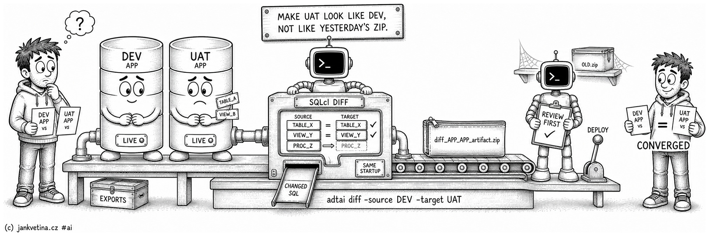

# Compare Two Schemas (adtai diff)



`diff` compares two live schemas, usually the same one across two environments, and reports what differs: which objects, REST services, table rows or APEX applications changed, and whether the two match at all.

Run it before a release to see what the deployment would really change, or after one to confirm the environments converged. It connects to both sides itself and reads nothing from exported files.

What it compares is picked by one flag, and each mode has a page of its own:

| Mode | Compares |
| --- | --- |
| objects | The database objects and grants, and leaves a SQLcl DIFF artifact behind. The default, with no mode flag. |
| `-rest` | The REST modules, privileges and roles the two schemas publish. |
| `-data` | The rows of the tables `export_data` exports, matched on their keys. |
| `-apex` | The APEX applications, their static files and the workspace's static files. |

<br>

## Examples

Compare the default schemas of two environments, from your project folder:

```bash
adtai diff -source DEV -target UAT
```

Bring UAT into line with DEV, so UAT is the side that changes and therefore the source:

```bash
adtai diff -source UAT -target DEV
```

Name the schema when the environment defaults are not what you mean. The target side uses the same schema unless you say otherwise, because one schema across two environments is the usual comparison:

```bash
adtai diff -source DEV -target UAT -schema APP
```

Name both when the two sides are spelled differently:

```bash
adtai diff -source DEV -schema APP -target UAT -target-schema APP_UAT
```

Leave `-source` out and it is the environment your connections file declares first:

```bash
adtai diff -target UAT
```

Compare the REST services, the table rows, or the APEX applications and files instead of the objects:

```bash
adtai diff -source DEV -target UAT -rest -verbose
adtai diff -source DEV -target UAT -data -name APP_% -ignore UPDATED_% -limit 20 -verbose
adtai diff -source DEV -target UAT -apex -app 100 -verbose
adtai diff -source DEV -target UAT -apex -app 100 -page 10-20 -verbose
```

Write what UAT holds into your checkout, on a branch of its own, and read the difference with git:

```bash
adtai diff -source DEV -target UAT -restore -branch uat-review
git diff
```

<br>

## Output

Every mode opens the same way: a connection block per side, then the comparison crawling under its own row. What differs follows, in the tables of the mode that ran, shown on diff_db.md, diff_rest.md, diff_data.md and diff_apex.md.

```text
APEX DEPLOYMENT TOOL - DIFF
---------------------------

CONNECTING TO SCHEMA SANDBOX, DEV:
----------------------------------
              APEX | 26.1.0
          DATABASE | 23.26.3.0.0 | FREEPDB1

CONNECTING TO SCHEMA DEMO, UAT:
-------------------------------
              APEX | 26.1.0
          DATABASE | 23.26.3.0.0 | FREEPDB1

COMPARING SCHEMAS:
------------------

  DEV.SANDBOX -> UAT.DEMO ............................... 100%  0:00:37
```

- **`COMPARING SCHEMAS:`** opens before the comparison starts and its row counts down while the work runs, so a long run is never a blank screen. The row names both sides in full, `<source env>.<source schema> -> <target env>.<target schema>`, and that is the **only** place the direction is written: every status below is relative to the target, so spelling the target out per row would repeat one word down the page.
- The countdown runs against what this pair of sides, in this mode, cost last time, a side being the environment and its schema (`DEV.APP -> UAT.APP`), so the same schema compared against UAT and against PROD keeps two figures. They are kept in `config/internal/diff_timers.yaml` and folded through a rolling average; a combination you have never run falls back to a long estimate so the bar still crawls, and a figure recorded before the environments joined the key is simply no longer read. The row holds at 99% until the run really ends, and the time on the closed row is the true elapsed. `-debug` prints the header and skips the row, leaving the raw transport unobscured.
- **Every mode reports the same three statuses.** `MISSING` means the source has it and the target does not; `EXTRA` means the target has it and the source does not; `CHANGED` means both have it and the two differ.
- **`LEGEND:`** closes the screen whenever something was listed, and spells out only the statuses that actually appeared. It sits last because you meet the tables first and want the definition when a cell puzzles you; a run that found no differences prints no legend.
- Two sides that already match print `NO DIFFERENCES:`, so an identical pair never looks like an unexamined one.
- **`-limit N` answers whether anything differs without listing all of it.** Each listing prints its first `N` rows, and one that had more says so on the line under it, `LIMIT: 20 of 57 rows shown`. The counts table is never cut; `-apex` has none, and its summaries are cut like any listing.
- **No table on this screen runs past 80 characters, and the cap is absolute.** Oracle object names reach 128, so the width is budgeted rather than hoped for: the name columns give up characters first, then the object type, and a trimmed cell ends in `...` so a shortened name can never read as a real one. A row wide enough to exhaust that budget keeps giving until the line fits. `STATUS` and `PRIVILEGE` never give way, a trimmed status would be a guess.
- A failed run prints `ERROR - DIFF FAILED:` on stderr with SQLcl's own output underneath and exits non-zero.

<br>

## Restoring the target's versions

**`-restore` turns a comparison into files you can review.** After the listings, it writes the target's version of everything that differs into `-root`, at the path where the source's own export keeps it, so `git diff` shows the change line by line in the editor you already use. It works in every mode, and it reuses the exporters rather than a writer of its own, so a restored file is byte for byte what `export_db`, `export_data` or `export_apex` would have written against the target:

| Mode | What a difference writes |
| --- | --- |
| objects | `CHANGED` and `EXTRA` objects are exported from the target; a `MISSING` object's file is deleted. Grant files are rewritten when a grant differs. |
| `-data` | Each differing table is exported from the target, per table; a table the target lacks loses its file. |
| `-rest` | Each differing module file, and the schema's REST definition when a privilege or role differs. |
| `-apex` | The application is exported from the target in the formats your checkout already holds. With `-page`, only those pages' files move, and the workspace's files stay put. |

- **`-root` must be a git work tree**, and that is checked before either side is connected.
- **Anything uncommitted is saved first, as one local commit named `WIP`**, untracked files included, so the restored files are the only changes git shows and none of your work is lost. It is never pushed and skips the project's commit hooks; a clean checkout gets none.
- **`-branch NAME` picks where the files land**, created from `HEAD` when it does not exist yet; without it the restore writes on the current branch. The `WIP` commit stays on the branch you started on, and the restore itself commits and pushes nothing: you review the working tree and decide.
- **Everything that differs is restored, whatever `-limit` says.** The limit caps what the screen lists, never what is written.
- A section of its own reports the restore, after the listings and above `LEGEND:`. Its row counts down while the exporters work, and their own screens stay off it (`-debug` shows them). Then git's answer, one row per file:

```text
RESTORED FILES:
---------------

  UAT.DEMO -> uat-review ................................... 100%  0:00:04

  FILE                                         STATUS
  ------------------------------------------   --------
  database/demo/packages/orders_api.spec.sql   MODIFIED
  database/demo/views/orders_open_v.sql        NEW
  database/demo/views/orders_v.sql             DELETED

  BRANCH: uat-review
```

A restore that moved nothing says so in one line in place of the table. A restore that fails prints `ERROR - DIFF FAILED:` under the section and exits non-zero, leaving whatever it already wrote for git to show. A `WIP` commit git refuses prints `ERROR - GIT COMMIT FAILED:` with git's own message instead, writes nothing, and exits `1`.

<br>

## Connecting

Both sides connect through **named SQLcl connections** (`ADT_…`, registered automatically, password held in SQLcl's own secure store) rather than credentials written into the generated script. See [connection.md](connection.md#named-sqlcl-connections). Set `sqlcl_named_connections: false` in `config.yaml` to fall back to inline connect lines.

Each side also runs the same session setup as every other ADT.ai connection: the `DBMS_SESSION.SET_IDENTIFIER` block composed from `config/IDENTITY.yaml`, then `config/STARTUP.sql`, replayed after each connect and before the comparison. That holds on the named path too, where the script carries no credentials at all. See [config.md](config.md#session-startup-script).

<br>

### Two PDBs of one container database

**A schema compares against its own copy in a sibling PDB.** This is the ordinary multitenant shape (one CDB, one PDB per environment, the same schema name in each), and SQLcl's own `DIFF` command refuses it.

`DIFF` decides the two sides are the same connection when their current schema matches and their database identity matches, and it reads that identity from `SYS_CONTEXT('USERENV','DB_UNIQUE_NAME')`, which is scoped to the **container**, not the PDB.

Two PDBs of one CDB therefore answer the same value, `CON_NAME` is never consulted, and the run ends on `Source and target connections are the same. Nothing to diff.` with nothing compared.

`diff` does not send that command. It drives the four `project` commands `DIFF` is a wrapper over (`project init`, `project export` per side, then `project stage` and `project gen-artifact`), each against the session it belongs to.

None of them consults a connection identity, so the comparison runs and the artifact is the same Liquibase release `DIFF` would have produced. Nothing is needed from you: a same-CDB comparison simply works.

<br>

### What connecting costs

The object comparison is four SQLcl sessions rather than two, one per `project` command, and each carries the same connect block and the same session setup.

**Connecting is not what a comparison costs, which is why the two connection blocks stay.** Timed apart from the `project` phases across three runs on a live SANDBOX pair: the whole command took 14.2s, 15.3s and 16.3s, and the two blocks the screen prints before the work accounted for 0.1s to 0.2s of each.

The four phases are the rest, the slowest run splitting as init 2.9s, the two exports 7.6s and 7.8s in parallel, stage 4.6s. Dropping the blocks would buy a tenth of a second and cost the screen the two version tables naming the databases about to be compared.

What a run can actually save is export time, which is what `-name` and `-type` narrow.

<br>

## Arguments

| Argument       | Repeatable | Default | Description |
| -------------- | ---------- | ------- | ----------- |
| `-source`, `--source` | No | connection default environment | Source connection environment. |
| `-target`, `--target` | No | required | Target connection environment. |
| `-target-schema`, `--target-schema` | No | `-schema` | Target schema, for the case where the two sides are spelled differently. |
| `-out`, `--out` | No | `<root>/config/diff` | Output folder for the SQLcl DIFF artifact, or a `.zip` path naming the artifact itself. With `-data`, the file every differing row is written to untrimmed; see diff_data.md. |
| `-type`, `--type` | Yes | all | Object type pattern(s) to compare; narrows the export and the screen. Comma- or space-separated, `%` wildcards. |
| `-name`, `--name` | Yes | all | Object name pattern(s) to compare; narrows the export and the screen. Comma- or space-separated, `%` wildcards. |
| `-verbose`, `--verbose` | No | off | List every changed object under `CHANGED OBJECTS:` and `CHANGED GRANTS:`, uncapped unless `-limit` caps it. With `-data`, one block per table of its differing rows and values; with `-apex`, one section per changed page under the summaries. |
| `-rest`, `--rest` | No | off | Compare the REST modules, privileges and roles both schemas publish instead of the schema objects. See diff_rest.md. |
| `-data`, `--data` | No | off | Compare the rows of the tables `export_data` exports instead of the schema objects. See diff_data.md. |
| `-apex`, `--apex` | No | off | Compare the APEX applications and static files both schemas own instead of the schema objects. See diff_apex.md. |
| `-app`, `--app` | Yes | connection `apex.app` | With `-apex`, application id(s) or `MIN-MAX` / `MIN+` ranges to compare, on both sides. |
| `-target-app`, `--target-app` | No | the `-app` id | With `-apex` and one `-app` id, the target's application to compare it with, such as a working copy. See diff_apex.md. |
| `-page`, `--page` | Yes | all | With `-apex`, page id(s) or `MIN-MAX` / `MIN+` ranges to compare, leaving out application-wide and workspace changes. See diff_apex.md. |
| `-ignore`, `--ignore` | Yes | none | With `-data`, column pattern(s) to leave out on both sides. Comma- or space-separated, `%` wildcards. |
| `-limit`, `--limit` | No | all | List at most N rows per listing, in every mode, and say how many were left off; the counts stay whole. With `-data`, stop each table after N differing rows. `0` lists all. |
| `-restore`, `--restore` | No | off | Write the target's version of everything that differs into `-root`, where the source's export keeps it, over a `WIP` commit of any uncommitted work. See [Restoring the target's versions](#restoring-the-targets-versions). |
| `-branch`, `--branch` | No | the current branch | With `-restore`, the branch to write on, created from `HEAD` when new. |

`-schema` is the shared flag and it names the SOURCE schema here. It also supplies the target schema, because the usual comparison is one schema across two environments; `-target-schema` above is how you say the two sides differ.

Shared options (-root, -schema, -config-dir, -key, -debug, -beep, -nobeep) are on [console.md](console.md#shared-arguments).
