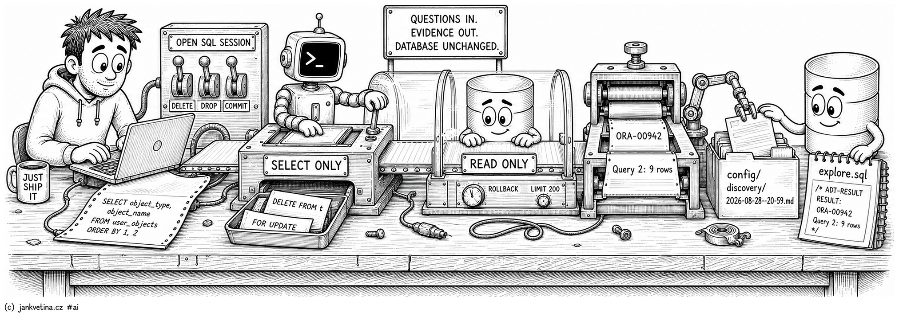

# Read-Only SELECT Discovery (adtai discovery)



`discovery` runs `SELECT` statements against the target database and renders the answers as tables. Reach for it when you want to give a person or an agent a narrow exploration surface instead of an unrestricted SQL session.

Direct DML, DDL, transaction control, PL/SQL blocks, inline `WITH FUNCTION` / `WITH PROCEDURE`, multiple statements and `FOR UPDATE` are rejected before execution. What survives runs inside a read-only transaction that is rolled back after every query.

This is intentionally SELECT-only, not a sandbox for untrusted database code. Oracle permits a `SELECT` to invoke stored functions. Discovery allows those calls, as required for normal Oracle queries, and an autonomous-transaction function can commit independently of the caller's read-only transaction. Use a least-privilege discovery account and do not grant it `EXECUTE` on functions with side effects.

## Examples

Run one query from your project folder:

```bash
adtai discovery -env DEV -schema SANDBOX -sql "SELECT object_type, object_name FROM user_objects ORDER BY 1, 2"
```

Run a file of `;`-separated statements:

```bash
adtai discovery -env DEV -file ./explore.sql
```

Run something throwaway that should leave no report behind:

```bash
adtai discovery -sql "SELECT COUNT(*) FROM user_objects" -nolog
```

Raise the row cap for one run:

```bash
adtai discovery -schema APP -sql "SELECT * FROM app_settings" -limit 500
```

Exactly one of `-sql` or `-file` is required. Passing both, or neither, is an argument error.

## Output

The connection block, then one `RESULT:` section holding the rendered table:

```text
APEX DEPLOYMENT TOOL - DISCOVERY
--------------------------------

CONNECTING TO SCHEMA SANDBOX, DEV:
----------------------------------
              APEX | 26.1.0
          DATABASE | 23.26.1.0.0 | FREEPDB1

RESULT:
-------
| OBJECT_TYPE       | OBJECT_NAME                |
| ----------------- | -------------------------- |
| DOMAIN            | ADT_ANNO_ADDR_DOM          |
| INDEX             | ADT_ANNO_TICKET_IX1        |
| PROCEDURE         | ADT_FIXTURE_OWNED_PRC      |
| TABLE             | ADT_FIXTURE_DDL_LOG        |
| TRIGGER           | ADT_FIXTURE_DDL_TRG        |
| VIEW              | ADT_FIXTURE_DDL_LOG_V      |

TIMER: 0s
```

- A `-file` run prints a per-query row count rather than the tables, since a file can hold many statements: `Query 2: 9 rows`. The tables themselves land in the report and in the file.
- A refused statement prints its reason where the table would be, `> DML statement 'DELETE' is not allowed; discovery permits SELECT only`.
- A statement Oracle rejects prints the error the same way, with the documentation link Oracle supplies, and the run still exits `0`. Only a connection or setup failure exits non-zero, through the shared `DATABASE CONNECTION FAILED` screen.
- Rows are capped at `-limit` (default `200`) per query.

## What it refuses, and the trust boundary

Two controls narrow the session:

- **The validator.** Each statement must have the shape of one `SELECT` or `WITH ... SELECT`. DML, DDL, transaction control, PL/SQL blocks, inline `WITH FUNCTION` / `WITH PROCEDURE`, `FOR UPDATE`, several statements in one string, and commands smuggled inside comments are rejected, recorded as errors, and never sent to the database.
- **The transaction.** What survives the validator runs under `SET TRANSACTION READ ONLY` and is rolled back after the query. This stops writes in that transaction and makes the non-committing path explicit.

The boundary matters: a SELECT may invoke a stored function or view whose implementation the client cannot inspect. Discovery deliberately permits function calls. An autonomous transaction is separate, so the caller cannot roll it back. Database grants are the final control: give an agent only the dictionary, object and function privileges its exploration requires.

Per-query failures, refusals and database errors alike, are captured into the report instead of ending the run, so one bad statement in a file does not throw away the answers around it.

## The report and the write-back

Runs append to a per-minute Markdown report at `config/discovery/<YYYY-MM-DD--HH-MI>.md`, one numbered `## Query N` section each, carrying the SQL and either the rendered table or the captured error. The first run also adds `config/discovery/` to the project `.gitignore`, so transcripts stay out of version control.

`-file` additionally writes each result **back into the source file**, as an `/* ADT-RESULT */` block under the statement it belongs to, which turns the file into a self-contained record of the queries and their latest answers:

```sql
SELECT object_type, COUNT(*) AS objects
FROM   user_objects
GROUP  BY object_type
ORDER  BY object_type;
/* ADT-RESULT
| OBJECT_TYPE       | OBJECTS |
| ----------------- | ------- |
| DOMAIN            | 2       |
| PROCEDURE         | 3       |
| TABLE             | 4       |
*/
```

`-nolog` does **not** turn that off. It suppresses the report and the `.gitignore` update only, and the write-back still happens on every `-file` run. To run a file of statements without changing it, do not pass `-file`.

## One schema per run

`-schema` takes a single schema here, where `export_db`, `export_data`, `export_apex`, `dependencies` and `recompile` all repeat it. That is deliberate. Discovery runs your SQL and prints one result per statement, so N schemas would mean N result sets per query, which is a different output contract rather than a second connection.

Oracle already spans schemas from inside one statement, which is the better tool here:

```bash
adtai discovery -sql "SELECT owner, object_type, COUNT(*) FROM all_objects WHERE owner IN ('APP','CORE') GROUP BY owner, object_type"
```

To run the same query against several schemas separately, run discovery once per schema.

## Arguments

| Argument       | Repeatable | Default | Description |
| -------------- | ---------- | ------- | ----------- |
| `-sql`, `--sql` | No | none | A single `SELECT` statement to run. Stored functions in the SELECT are allowed; PL/SQL blocks are not. Mutually exclusive with `-file`. |
| `-file`, `--file` | No | none | Path to a file of `;`-separated `SELECT` statements. Mutually exclusive with `-sql`. Results are written back into the file. |
| `-limit`, `--limit` | No | `200` | Maximum rows rendered per query. |
| `-nolog`, `--no-log` | No | off | Run without writing a report or touching `.gitignore`. Does not affect the `-file` write-back. |

Shared options (-root, -env, -schema, -config-dir, -key, -debug, -beep, -nobeep) are on [console.md](console.md#shared-arguments).
