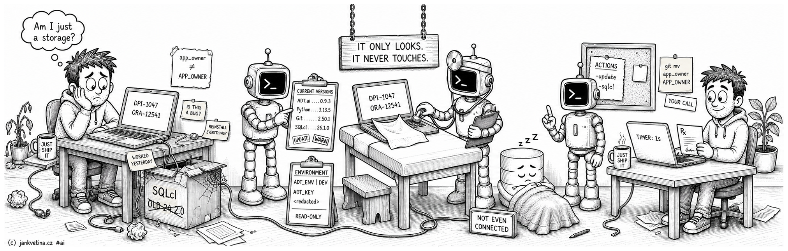
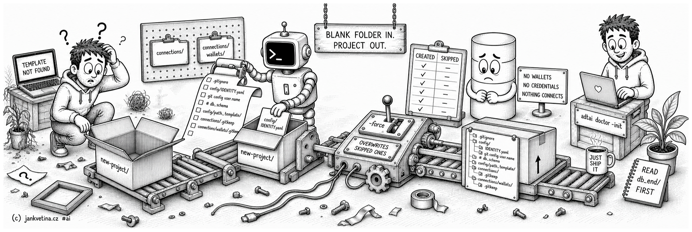

# Environment Check and Updates (adtai doctor)



`doctor` tells you whether this machine can run ADT.ai, and what is out of date. Run it after installing, after a toolchain upgrade, or whenever a command fails in a way that smells environmental rather than like a bug. It also owns the explicit updates and the project scaffolding, since neither should ever happen behind your back.

Installation and environment setup are in [SETUP.md](../SETUP.md); this page owns what the command does.

## Examples

Check the local setup from any folder:

```bash
adtai doctor
```

Check without calling out to remote version metadata:

```bash
adtai doctor -offline
```

Update ADT.ai, its Python requirements and SQLcl, or land a named release:

```bash
adtai doctor -update
adtai doctor -update 0.9.1
```

Update SQLcl on its own, or scaffold a new project folder:

```bash
adtai doctor -sqlcl
adtai doctor -init
adtai doctor -init -root ./new-project
```

## Output

Current versions first, then the runtime environment, then the actions available. Nothing connects to a database:

```text
APEX DEPLOYMENT TOOL - DOCTOR
-----------------------------

CURRENT VERSIONS:
-----------------
  ADT.ai               | 0.9.3
  Python               | 3.13.5
  Git                  | 2.50.1 (Apple Git-155)
  Java                 | 20 2023-03-21
  oracledb             | 4.0.2
  Instant Client       | 23.3.0.23.09
  SQLcl                | 26.2.1.0

ENVIRONMENT:
------------
  ADT_ENV              | DEV
  ADT_KEY              | <redacted>
  ARCH                 | arm64
  JAVA_TOOL_OPTIONS    | -Duser.language=en
  LANG                 | en_US.UTF-8
  NLS_LANG             | AMERICAN_AMERICA.AL32UTF8
  ORACLE_HOME          | /Users/dev/.instantclient_23_3
  SQLCL                | /Users/dev/.instantclient_23_3/sqlcl/bin/sql

TIMER: 1s
```

- A bare version row is good news: that value was detected and no newer one was found, or online checks were skipped.
- Encryption key material is never printed. A direct `ADT_KEY` renders as `<redacted>`, a configured command as `<from ADT_KEY_CMD>`, and no source as `<empty>`. Setting both sources is ambiguous and renders a warning without showing either value.
- The `ENVIRONMENT:` rows are what the process actually holds, so a run under an AI tool shows the values ADT.ai filled in for itself from your startup file. How that works is on [config.md](config.md#environment-variables).
- Status words append after a dot leader, capped at 78 characters.

## What the statuses mean

| Status | Meaning |
| ------ | ------- |
| `UPDATE` | A newer version was found online. |
| `WARN` | Read-only `doctor` still runs, but optional setup is missing, uncertain or contradictory: Java, SQLcl, Instant Client, `ADT_ENV`, the encryption-key source or `JAVA_TOOL_OPTIONS`. |
| `FAIL` | A required prerequisite is missing or broken, Git or the `oracledb` module for instance. The run exits non-zero. |

Plain `doctor` is read-only. It never runs `git pull`, never installs anything, never fetches or replaces SQLcl, and never stashes your work. By default it does check online for newer ADT.ai, Java, SQLcl, `oracledb` and Instant Client, which `-offline` turns off.

For ADT.ai itself, an editable or git install is compared against its own configured `origin`, and a normal install against the latest public GitHub release before falling back to PyPI metadata. Update subprocesses force English and UTF-8 settings, so a local language override cannot change what SQLcl, Oracle or pip report back.

A normal wheel installed inside another repository's `.venv` is still a package install. `doctor` does not mistake that enclosing repository for an editable ADT.ai checkout, and therefore cannot pull, stash, or switch the wrong project.

## Actions

`ACTIONS:` closes the run and lists only upgrades an online check actually found:

- `-update` appears when ADT.ai, `oracledb` or SQLcl is behind. `oracledb` counts because the full update reinstalls `requirements.txt`.
- `-sqlcl` appears only when SQLcl itself is behind.
- A schema folder rename appears when the exported tree disagrees with the case your layout would write.

When none applies the whole section is omitted, header included: an up-to-date machine is offered nothing. `-offline` checks nothing online, so no status is backed by a real check and the section is likewise absent. Under `-update` and `-sqlcl` it always prints, because there it reports the actions that ran.

The offer is always for the latest release. A specific version is something you ask for, never something `doctor` proposes.

### Schema folder case

The schema token in `path_objects` and `path_apex` carries its own case: `<schema>` writes `app_owner/` and `<SCHEMA>` writes `APP_OWNER/`. Flipping it changes what the next export writes and moves nothing already on disk, so `doctor` reads the tree and offers the rename:

```text
ACTIONS:
  Schema folders do not match path_objects: <SCHEMA> writes them uppercase, the repo has app_owner, core.
  Rename them before the next export, git records a case-only move:
    git mv app_owner APP_OWNER
    git mv core CORE
```

`doctor` never performs it. A repository-wide move is yours to review and commit, and on macOS or Windows a case-only difference is invisible to the filesystem, so `git mv` is what actually records it. Nothing is reported when the tree already agrees, when the layout pins no schema level, or when the project has no config yet.

## Landing a specific version

`-update` takes an optional version, and then ADT.ai goes to that release instead of the latest one. The version scopes to the **ADT.ai step alone**: the requirements and SQLcl steps still run after it, because the release you land on decides which requirements you need.

Which way the number moves is not this command's business. An older release is checked out exactly like a newer one, with no confirmation and no override flag, which is how you step back off a release that broke you and how you match the version a colleague is running. `v0.9.1` and `0.9.1` are the same request.

**A shorter version names a LINE, not one release.** `-update 0.3` lands the newest `0.3.x` release, whichever one that is; `-update 0.9.1` still lands exactly that one and only that one. Every ADT.ai release has always been three-part, so a shorter request can only ever mean "the newest on this line."

How the release is found depends on the install, and both spellings, `v<version>` and a bare `<version>`, work either way:

- **A git checkout**, the documented install, fetches tags from its own `origin` and resolves the release against them. Release tags live in the public repository, so a checkout that carries none (an editable install backed by the private DEV repository, for instance) cannot resolve one; this is a real limitation of that install, not a bug, since there is nothing else to check out. A pinned checkout sits on a detached HEAD, and a later bare `-update` returns it to the remote's default branch before pulling, so latest is always one command away.
- **Anything else** resolves the release against the public repository's own tags (no local checkout to ask) and installs it with pip. A fully-specified release tries the `v`-prefixed tag first and falls back to the bare spelling with no extra network round trip; a shorter one always asks the public repository which release the line's newest tag is, since pip cannot resolve an ambiguous ref on its own.

Every pip action runs as `<current Python> -m pip`. It therefore updates the environment that is running ADT.ai, even when a different `pip3` happens to appear first on `PATH`.

A version with no release **fails and stays put**. The `ADT.ai` row reads `FAILED` with the version and the remote it was looked for in underneath, the run exits non-zero, and the checkout does not move.

So a downgrade can never quietly install something newer than what it reached for. A value that is not a version at all is refused before any git command runs.

### Going back below the release that added this

A downgrade installs the older release in full, its own `doctor` included. Land on a release published before this flag existed and you are running a `doctor` that has never heard of it.

`-update <version>` there answers `unrecognized arguments`, and a bare `-update` answers `FAILED` on `git pull`, because the older code has no re-attach step and git will not pull onto a detached HEAD.

Nothing is broken and nothing is lost. The checkout just needs its branch back by hand:

```bash
git checkout main
git pull
python3 -m pip install -e .
```

Between two releases that both carry the flag, `-update <version>` and bare `-update` move the checkout in either direction on their own.

## Scaffolding a project



`-init` writes the project override config and `config/IDENTITY.yaml`, copies ADT.ai's current root `.gitignore` and the `config/patch_template/` scaffold verbatim, and writes the `connections/.gitkeep` and `connections/wallets/.gitkeep` placeholders. Those source files are bundled in the wheel as package resources, so the same scaffold is available from a normal install with no source checkout beside it.

It creates no cache folders, no APEX credential folders, no connection YAML and no wallet contents. Existing generated files are skipped, and `-force` overwrites them.

`config/IDENTITY.yaml` is prefilled from the project folder's own `git config user.name`/`user.email` where it has one, and ships with a commented `db_schema` placeholder either way, the database half has no git equivalent to read. See [Developer identity](config.md#developer-identity).

The patch templates are scaffolded because `patch -create` reads them from the **project** root, so a folder that only ships with ADT.ai is a folder nobody has. All six source files land verbatim; see patch templates for the slots and what each file does.

**Read `db_end/` before your first deploy.** Those three refresh every materialized view, gather schema statistics, and run every enabled daily job with a 60-second wait, and the APEX pair carries `<APEX_WORKSPACE>`, `<APEX_APP_ID>` and `<APEX_VERSION>` placeholders you fill in once. Delete what your deploy should not do.

Patch *scripts* are not scaffolded: `patch_scripts/` is per patch code and generated per patch, so there is nothing fixed to seed.

`adtai update`, `adtai upgrade` and `adtai init` are not commands. Each prints the generic error banner and points at the `doctor` flag that does the job.

Before replacing SQLcl, `doctor` downloads, extracts, validates, and makes the new launcher executable in a staging directory beside the live install. Promotion is a same-filesystem rename. If that final swap fails, both the live install and any pre-existing backup are restored; a corrupt or incomplete archive never moves the live install at all.

## Arguments

| Argument | Repeatable | Default | Description |
| -------- | ---------- | ------- | ----------- |
| `-offline` | No | off | Skip the online update checks and show local versions only. |
| `-update [VERSION]` | No | off | Run the full ADT.ai, Python requirements and SQLcl update. A version lands ADT.ai on that release, up or down, instead of the latest. Cannot be combined with `-sqlcl`. |
| `-sqlcl` | No | off | Upgrade SQLcl only, reading Oracle's own download page for the current release and replacing the resolved install folder. Runs immediately, and cannot be combined with `-update`. |
| `-init` | No | off | Scaffold the project config, `config/IDENTITY.yaml`, the root `.gitignore`, `config/patch_template/`, and the connection and wallet placeholders. |
| `-force`, `--force` | No | off | With `-init`, overwrite generated template files that already exist. |

Shared options (-root, -beep, -nobeep) are on [console.md](console.md#shared-arguments).
