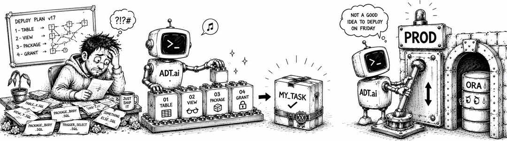

# Patch Deployments (adtai patch)



`patch` turns committed repository changes into a release you can deploy to the next environment. It collects the files a patch names into ordered install scripts, deploys them through SQLcl, and archives what it delivered. Reads are the default, and every write needs an explicit flag.

Nothing is deployed by building a patch. What you get is a folder you can read, review and hand to whoever holds the keys to the target.

## Examples

Preview the recent commits and the patch folders that exist:

```bash
adtai patch -target DEV
```

Build the patch for a code, here the ticket number a commit subject carries:

```bash
adtai patch -target DEV -name 12 -create
```

Deploy that folder exactly as it stands:

```bash
adtai patch -target DEV -name 12 -deploy
```

Narrow the preview to the commits a pattern matches:

```bash
adtai patch -target DEV -search %report%
```

Archive delivered patches by number, or by pattern for a whole month:

```bash
adtai patch -target DEV -archive 12
adtai patch -target DEV -archive 202608%
```

Regenerate the schema install scripts from the exported files alone:

```bash
adtai patch -install
```

## Output

A bare run tops up the commit store, lists what is still outstanding, and lists the folders on disk:

```text
APEX DEPLOYMENT TOOL - PATCH
----------------------------

REBUILDING COMMITS:
-------------------
    BRANCH | adt/docs-capture

  3 COMMITS ................. 33%                                      0:00:00 
  3 COMMITS .................................. 67%                     0:00:00 
  3 COMMITS .................................................... 100%  0:00:00 

RECENT UNPATCHED COMMITS:
-------------------------

  #   MESSAGE
  -   -------------------------------------
  3   @dev #12: add the monthly report view
  2   @dev #11: export the schema as files
  1   @dev #1: scaffold the project

RECENT PATCH FOLDERS:
---------------------

TIMER: 0s
```

- `REBUILDING COMMITS:` appears only when there are commits to hash. It runs before every action, so a patch never records a commit number the store disagrees with.
- `RECENT UNPATCHED COMMITS:` holds the work still to be addressed, so a commit already carried by a folder on disk is not listed. `-commit <n>` reaches a hidden one by number.
- `RECENT PATCH FOLDERS:` lists the folders newest first, so the patch you just made is the top row. Its `STATUS` cell is the newest deploy log for that folder, as `<OUTCOME>/<TARGET>`.
- Both tables are narrowed, which is what `RECENT` names: the folder listing is capped at `patch_show_patches`, and `-by`, `-my` and `-recent` cut both, so `adtai patch -my` means your commits and your patches.

## Naming a patch

`-name` takes an **id**, a **patch code**, or a **full folder name**, and all three work in every mode. The code you pass becomes the folder name, under a `yymmdd-seq-` prefix the run mints.

- An all-digit value is the ticket number in the code's first segment, matched exactly, so `12` never selects a patch whose label merely contains those digits.
- A value naming an existing folder rewrites that folder rather than growing a second one.
- A well-formed folder name that exists nowhere is refused: that is a typo, not a new code.

Selection for an action is **whole-value**: the folder name, the patch code, or the id. A value that only occurs inside a folder name selects nothing and the run stops, naming what it saw, and a value matching two folders stops the same way rather than choosing. A code matching no folder prints the folder listing and exits `2`.

## The commits a patch carries

With `-name <CODE>` and no `-search`, the code is the search term, matched against the commit subject alone. `-search` takes a SQL LIKE pattern instead, matched case-insensitively against the subject, the author and each changed path:

```text
RELEVANT COMMITS FOR "%report%":
--------------------------------

  #   MESSAGE
  -   -------------------------------------
  3   @dev #12: add the monthly report view
```

- A term carrying no `%` is searched as `%term%`. Escape a literal wildcard with a backslash.
- **`-search` is a discovery run, so `-create` beside it lists the commits instead of building.** Finding the right commits is what the flag is for, and a build chosen by nothing is a build over every commit the search matched. Add `-commit`, `-ignore` or `-force` once you know which ones you want and the same command builds. Nothing is written in the meantime, so an existing patch folder, its `patch_scripts/` and its snapshots survive the search untouched. A `-create` with no `-search` is unaffected.
- `-commit` and `-ignore` take a number, a hash prefix, or a range (`12`, `12+`, `12-40`). A commit you name is an instruction and is never filtered out.
- `patch_commit_pattern` in `config.yaml` keeps commits whose subject does not match that shape out of every patch. An explicit `-search` or `-commit` overrides it.
- The commits come from the per-branch store `rebuild` maintains, at `repo_commits_file`. There is one store, shared with `search_repo` and `calendar`, and `patch` tops it up rather than keeping a copy. Use `adtai rebuild` to rebuild one from scratch.

## Building and deploying are two runs

`-create` builds, `-deploy` ships what is on disk, and neither does the other's job:

```text
RELEVANT COMMITS:
-----------------

  #   MESSAGE
  -   -------------------------------------
  3   @dev #12: add the monthly report view

PROCESSED FILES: SANDBOX
----------------
  - sandbox/database/views/
    - monthly_report_v.sql
    - order_summary_v.sql

PATCH FILES:
------------
  - patch/260822-1-12/SANDBOX.sql
```

`-deploy` never creates a folder, rewrites the selected one, or re-orders its files, so what deploys is what was reviewed. The building flags are accepted beside it and reported under `IGNORING WITH -deploy:` rather than silently applied.

What the two runs write, and every section they print, is on [patch_deploy.md](patch_deploy.md). What goes into the folder in the first place is on [patch_install.md](patch_install.md).

## Which version of a file ships

`-create` snapshots the **committed** version of each file: the blob at that file's newest commit inside the patch window, so an uncommitted working-tree edit cannot leak into a deployment. Three mutually exclusive flags override it, `-local`, `-head` and `-nosnap`.

All four modes, what each one costs, and which two refs `-head` reads are on [patch_content.md](patch_content.md).

## Shipping an APEX application whole

`-app` ships an application whole instead of as the components that changed, and the application's own exported files pick the mode: an `apexlang/` tree ships as the tree, anything else as its `f<id>.sql`. Its optional value is where the tree lands rather than which applications ship, so `-app <id>` is a sandbox import.

Both modes, the stale export refusal and the retarget rules are on [patch_app.md](patch_app.md). The import's staging, signatures and refusals are on [patch_import.md](patch_import.md), and the loop around it on apex_round_trip.md.

## What a deleted object generates, and what a moved one does not

A patch window that deletes an object's file ships a `DROP` script for it under `patch_scripts/objects_after/`, guarded so a re-deploy is not an error:

```text
PROMPT -- SCRIPT: patch_scripts/PATCH309/objects_after/drop.package_body.core_lock.sql
@"./patch_scripts/objects_after/drop.package_body.core_lock.sql";
```

Three deletions earn nothing, and each is a different question:

| The window | Why no `DROP` |
| ---------- | ------------- |
| created and deleted the object itself | the target sits at the pre-window state and has no such object |
| deleted a `GRANT` file | a grant is granted or it is not; there is nothing to drop |
| only MOVED the file | the object never left, so dropping it would delete live data |

The last one is what `export_db -groups` does: it arranges a type folder's files into sub-folders, so `packages/core_lock.sql` becomes `packages/CORE/core_lock.sql` and git records a delete plus an add.

**The unit is the object, never the file path.** Those two paths are the same row of `user_objects`, so a deleted file earns no `DROP` when the object it held is still exported anywhere under its own type folder, or when the same window added that object at another path. A group folder is read that way everywhere else too: a moved file keeps its object type, so it installs in its own `patch_map` section rather than at the end, and the staleness check that refuses a patch built on a stale export still covers it.

A generated `DROP` is written per run and never carried into a re-created folder, which is on [patch_install.md](patch_install.md).

## After a patch has landed

`-archive` zips the patch folders you name into `patch_archive/<YYYY-MM>/` and removes them from `patch/`; named nothing, it only lists. `-drop` removes the sandbox APEX applications a `-deploy -app <id>` run created, so a workspace does not fill with dead copies.

Each application gets a receipt at `<path_apex>/logs_<ENV>/<timestamp>_apex_drop_<application-id>_<DELETED|FAILED>.log`: `-target` supplies `<ENV>`, while the value passed to `-drop` is the application id. They are on [patch_archive.md](patch_archive.md) and [patch_drop.md](patch_drop.md).

## Building from hashes instead of commits

`-hash` builds the patch from what the working tree no longer agrees with the target about, which reaches work no commit window covers. `-baseline` records the state you believe the environment is at. Both are on [patch_hash.md](patch_hash.md).

## Arguments

| Argument       | Repeatable | Default | Description |
| -------------- | ---------- | ------- | ----------- |
| `-name`, `--name` | No | none | The patch this run acts on, in every mode: an id, a patch code, or a full folder name. On its own it inspects and builds nothing. A value matching no patch lists the available patches and exits `2`. |
| `-target`, `--target` | No | connection file default environment | Environment to deploy into. An omitted flag uses the connection file's default. |
| `-create`, `--create` | No | off | Build the patch named by `-name`, which is mandatory beside it. An existing folder is rewritten; a well-formed folder name that exists nowhere is refused. |
| `-deploy`, `--deploy` | No | off | Deploy the patch named by `-name`, mandatory beside it, exactly as it stands on disk. Beside `-create`, only a name with no folder is built first. |
| `-force`, `--force` | No | off | Proceed on a patch already deployed to this target. With `-deploy`, re-run a completed deployment of the same payload, otherwise reported `SKIPPED`. With `-create`, rebuild a folder carrying a deploy log: logs are kept and generated artifacts follow the new commit window. With `-drop`, remove a sandbox somebody else created. |
| `-continue`, `--continue` | No | off | With `-deploy`, keep running the remaining install scripts after one fails, instead of stopping and rolling back. It does not resume an interrupted run. |
| `-by`, `--by` | Yes | none | Limit commits and patch folders to an author, as a case-insensitive substring of the commit author email. |
| `-my`, `--my` | No | off | Limit commits and patch folders to you, matched against `IDENTITY.yaml` or `git config user.email`. |
| `-recent [DAYS]`, `--recent [DAYS]` | No | off | Only commits and folders from the last `DAYS` days, or a fraction of a day (`1/24` is the past hour). A whole-day window counts today, so `-recent 1` is today. Bare `-recent` means `1`. |
| `-search`, `--search` | Yes | none | Filter commits by a SQL LIKE pattern, matched against the subject, the author and each changed path. `%` is any run, `_` is one character, and a term with no `%` is searched as `%term%`. A discovery run: `-create` beside it lists the commits and builds nothing until `-commit`, `-ignore` or `-force` narrows them. |
| `-commit`, `--commit` | Yes | none | Include commit numbers, hash prefixes or ranges (`12`, `12+`, `12-40`). One flag takes several refs, comma- or space-separated, and the flag repeats. |
| `-ignore`, `--ignore` | Yes | none | Exclude commit numbers, hash prefixes or ranges, in the same shape as `-commit`. |
| `-app [ID]`, `--app [ID]` | No | off | Ship every APEX application the patch touches whole instead of as the components that changed. The application's own export format picks the mode: an `apexlang/` tree ships as the tree, anything else as its `f<id>.sql` full export with the components dropped. Bare, no application id changes; `ID` lands the tree on that application id instead, with the alias derived alongside it. One id per run. Refuses the build when a full-export application changed after the export it would ship; an APEXlang application needs no `f<id>.sql` and is never compared against one. On `-deploy` it also imports the `apexlang/` tree, refusing on target drift. |
| `-hash [FILE]`, `--hash [FILE]` | No | off | Build the patch from what the working tree no longer matches the baseline on, instead of from commits. `FILE` names the baseline; omitted, it is `patch_hashes/baseline.<TARGET_ENV>.log`. Forces the `local` content mode. |
| `-baseline [FILE]`, `--baseline [FILE]` | No | off | Record every current file hash as this target's deployed baseline, overwriting it whole. Builds nothing and opens no database. |
| `-install`, `--install` | No | off | Regenerate the database install script per schema from the exported files. Needs no name and no connection. |
| `-archive`, `--archive` | No | none | Archive folders by ticket number or LIKE pattern; omit refs to only list. One flag takes several refs and mixes both kinds. A ref matching nothing archives nothing and still exits `0`. `-archive %` takes every folder; `\` escapes a literal `_` in a ticket-number ref, quoted. Closes with `ALL PATCH FOLDERS:`, every folder left on disk. |
| `-drop ID [ID ...]`, `--drop` | No | none | Remove the sandbox APEX applications a `-deploy -app ID` run created. Ids only: no `-name` and no patch folder, and `-target` is required. An id is taken only when it is a derived sandbox, `<application><task>` carrying the derived `<SOURCE_ALIAS>_<task>` alias, so an application's own id refuses and names it. A sandbox drops only when its recorded creator is your `apex_account` in `config/IDENTITY.yaml`; anybody else's, or one recording no creator, needs `-force`. Every id is checked before the first one is dropped. |
| `-local`, `--local` | No | off | Snapshot the working-tree file instead of its committed version. Mutually exclusive with `-head` and `-nosnap`. |
| `-head`, `--head` | No | off | Snapshot the newest committed version of each file, taken from the local branch or the remote default branch, and skip the newer-commit warning. Runs `git fetch --prune origin` first, before anything reads history, best effort on an offline repository. Which ref wins is on [patch_content.md](patch_content.md). Mutually exclusive with `-local` and `-nosnap`. |
| `-nosnap`, `--nosnap` | No | off | Write no snapshots; link each repo file where it already lives. Mutually exclusive with `-local` and `-head`. |
| `-branch`, `--branch` | No | current branch | Scan the named branch's history instead of the checked-out one. Read-only. A name resolving to no ref fails the run. |

Shared options (-root, -config-dir, -key, -debug, -beep, -nobeep) are on [console.md](console.md#shared-arguments).
