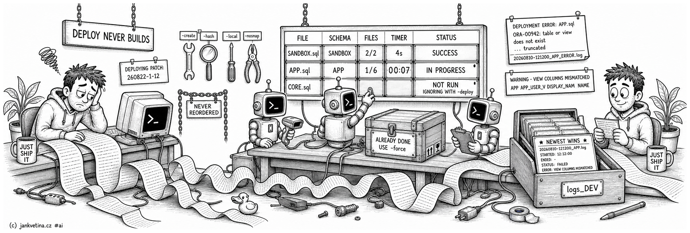

# Deploying a Patch (adtai patch -deploy)



What a build prints, what a deploy prints, where the logs land, and how to read the two checks that run after the last script. The command and its flags are on [patch.md](patch.md).

<br>

## Deploy never builds

`-deploy` ships the patch exactly as it stands on disk. It never creates a folder, never rewrites the selected one and never re-orders its files, so what gets deployed is what was reviewed:

```bash
adtai patch -target DEV -name 12 -create
adtai patch -target DEV -name 12 -deploy
```

The patch-building arguments (`-create`, `-hash`, `-baseline`, `-local`, `-head`, `-nosnap`) are accepted alongside `-deploy` and ignored, reported under an `IGNORING WITH -deploy:` header naming them, so a run never silently deploys something other than what the flags asked for.

The one thing `-deploy` adds to the script is the session defaults. Before the script's first line it sends `SET DEFINE OFF`, `SET TIMING OFF` and `SET SQLBLANKLINES ON`, and the script's own copy runs after and still wins. A folder built by an older tool, or by hand, carries none, and `-deploy` replays whatever is on disk.

What a deploy does write, besides its logs, is the baseline, and only for a patch built with `-hash`. Full rules on [patch_hash.md](patch_hash.md).

<br>

## Object signatures and locks

A patch lists what it will overwrite and asks the target about each one before writing a line, so a colleague's work cannot be buried by a build that predates it. CORE_LOCKS where it is installed, `last_ddl_time` where it is not, and `updated_on` for the REST modules and workspace files `user_objects` never held. Full rules on [patch_signatures.md](patch_signatures.md).

The SQL itself lives in shared scripts under `config/patch_template/locks/`, which the install script links.

<br>

## The deploy order and DEPLOY.sql

A patch folder holding two or more install scripts also gets `DEPLOY.sql`, one line per script in the order `-deploy` runs them:

```sql
-- DEPLOY ORDER
--
-- patch -deploy runs the install scripts below in the order of these @ lines.
-- Reorder the lines to change it. Every install script in this folder must
-- appear exactly once, and a line naming no script here refuses the deploy.
--

@"./APP.sql"
@"./CORE.sql"
@"./APP.100.init.sql"
@"./APP.100.end.sql"
```

The order `-create` writes is the default one: schema scripts first, then each application's `init` half, then its `end` half. Run by hand in SQLcl, the file deploys the whole patch in that order too. A patch with a single install script gets none.

**Reorder the lines to change the order.** `-deploy` runs the `@` lines as they stand, and the APEX import still follows its application's `init` half wherever you moved it. `@./APP.sql` without quotes and a trailing `;` are read the same; blank lines and `--` comments are ignored.

**A re-create keeps your order.** Scripts no longer generated lose their line, new ones are added at the end in the default order, and `-create -force` writes the default order again.

**A driver that disagrees with the folder refuses the deploy before any script runs**: a script in the folder it does not list, a line naming a script that is not there, a script listed twice, or a line that is not a script link. The refusal names each one:

```text
PATCH FAILED:
-------------
DEPLOY.sql does not match patch folder 260914-1-12: not listed: CORE.sql - fix its @ lines, or rebuild it with -create -force
```

`DEPLOY.sql` is never an install script itself, so it gets no row under `DEPLOYING PATCH:` and adds nothing to `PATCH CONTENTS:`.

<br>

## The processing report

`-create` opens with the commits it selected, prints one section per schema while it builds, and closes with `PATCH FILES:`:

```text
RELEVANT COMMITS:
-----------------

    #   MESSAGE
  ---   ----------------------------------------------
  211   @dev #65: rework the chat notifications

ALTER STATEMENTS:
-----------------
  - patch_scripts/REPORTING/
    - tables_after/
      - app_import.211.sql

DELETED OBJECTS:
----------------
             TRIGGER | APP_IMPORT_TRG
                     |

PROCESSED FILES: APP
--------------------
  - app/database/tables/
    - app_import.sql
  - app/database/packages/
    - app_notify.sql
  - app/database/grants/
    - APP.sql

WARNING - OUTDATED FILES:
-------------------------
  - app/database/packages/
    - app_notify.sql
      214) hotfix: widen the chat body column

WARNING - UNCOMMITTED FILES:
----------------------------
  - app/database/grants/
    - APP.sql
```

- **A build opens with two commit tables.** `RELEVANT COMMITS:` holds what went into this patch; `RECENT UNPATCHED COMMITS:` holds what is still outstanding and is omitted when nothing is left. They lead because they are the input a reviewer checks. A `-deploy` run prints only the first.
- **`ALTER STATEMENTS:` and `DELETED OBJECTS:`** list the generated `tables_after/` helpers and the objects the window dropped, each closing with its own blank line. They list different things and print differently: the helpers are FILES, so they carry paths; the drops are OBJECTS, so they carry the shared `TYPE | NAME` listing ([console](console.md)). A dropped path holding no database object keeps a plain `  - <path>` row underneath.
- **`PROCESSED FILES:` lists the files the patch CARRIES**, so a path it ships no content for is not among them. A dropped object is named by `DELETED OBJECTS:` above instead, and the old side of a renamed or `export_db -groups` moved file is named nowhere: its object moved rather than left, so the patch neither installs it nor drops it. A commit that renames a file therefore contributes one row, the target.
- **Every warning is a section of its own**, `WARNING - <SUBJECT>:` with a `  - ` list under it. `OBJECTS CHANGED:` is the exception, listing objects rather than files. `PROCESSED FILES:` above lists files and nothing else.
- **A file list opens on its anchor folder and gives every directory below it a row**, two spaces further in each time. The anchor is the `path_objects` type folder for an exported object, so an `export_db -groups` sub-folder reads as its own row under it, and the directory above its own for anything else, which is what puts a per-patch script's slot on a row of its own. `PATCH FILES:` is the one exception and keeps each whole path on one line. `nested_files: False` in `config.yaml` restores the flat one-path-per-row list everywhere; the rule is on [config.md](config.md).
- **`OUTDATED FILES` is the one with teeth.** It says the patch ships a file version older than a commit that already exists: the file, then those newer commits newest-first, indented under it and carrying no dash of their own. The comparison runs against the whole `patch_scan_commits` window, so a commit the patch-code or author filter dropped is exactly the one worth warning about. `-head` suppresses it.
- **`UNCOMMITTED FILES` asks git**, not the patch window. It lists a file only when `git status --porcelain` reports it dirty or untracked, so a template slot or a grant script pulled in from disk stays out. It says nothing under `-local`.

`-create` prints no `PATCH CONTENTS:` section, because `PROCESSED FILES:` already names every file it installs. `-name <name>` and `-deploy` still print it, one section per schema, in the order the install script links them.

`PATCH FILES:` closes the build with one install script per schema, spelled relative to the project root and kept whole on its own line:

```text
PATCH FILES:
------------
  - patch/260822-1-12/SANDBOX.sql
```

A patch with two or more install scripts lists its `DEPLOY.sql` last, the file that sets their deploy order.

<br>

## Grants

A grant script travels in a patch when a selected commit changed it, and not otherwise.

`GRANT` is an ordinary `object_types` entry, `grants/` by default, so a grant script is chosen, ordered and reported exactly like a view or a package: a `PROCESSED FILES:` row, a link from its own `patch_map` group in the install script, and a line under that script's `NEW FILES:` or `MODIFIED FILES:` header.

So a privilege change ships the way any other change ships: export it, commit it, select that commit.

Earlier versions pulled a grant script in for every schema the patch touched, whether or not it had moved. The patch then carried a file with no commit behind it, which the header block could file under no section at all, so the install script listed content its own summary did not describe.

Re-running unchanged grants was harmless. Not being able to tell from the patch what was in it was not.

A project upgrading from an older version can delete `patch_grants` from its `config.yaml`. Nothing reads it, and leaving it in place changes nothing.

<br>

## The deploy report

`-deploy` runs in the order header, patch listing, connect, deploy. Each install script gets one row under `DEPLOYING PATCH:`, whose header names the **resolved** folder, so a prefix match onto the wrong patch is visible:

```text
PATCH CONTENTS: SANDBOX
---------------
  - sandbox/database/views/
    - monthly_report_v.sql
  - sandbox/database/grants/
    - SANDBOX.sql

CONNECTING TO SCHEMA SANDBOX, DEV:
----------------------------------
              APEX | 26.1.0
          DATABASE | 23.26.1.0.0 | FREEPDB1

DEPLOYING PATCH: 260822-1-12
----------------

  FILE          SCHEMA    BLOCKS   TIMER   STATUS
  -----------   -------   ------   -----   -----------
  SANDBOX.sql   SANDBOX      2/2      4s   SUCCESS
```

- **Schema scripts run first**, then each application's `<SCHEMA>.<APP>.init.sql`, the import, `.end.sql` ([patch_import.md](patch_import.md)), unless `DEPLOY.sql` orders them otherwise.
- **The table is written as the deploy runs, not after it.** The header and the rule print before the first script; `FILE` and `SCHEMA` appear when that script starts, `BLOCKS`, `TIMER` and `STATUS` when it finishes.
- **On a terminal the open row is repainted** rather than left half-written. It opens on `0/n` and `IN PROGRESS`, the total being read off the install script before SQLcl launches, and the timer ticks once a second.
- **`BLOCKS` counts linked blocks finished**, so it reaches `n/n` only when the script returns. The count comes from the `PROMPT -- FILE:` markers SQLcl echoes, and a marker echoes just before its block runs.
- **A redirected run, a pipe and a CI job** print one finished line per script with no repaints, and carry the exact bytes the batch render writes.
- **A script the run never started** is reported `NOT RUN` rather than left out of the table. `BLOCKS` is blank when the run reported no progress at all, and `TIMER` is blank for any script that never ran, because `0s` would claim a measurement nobody took.

On Windows the row fills as the deploy runs too: the transport is a pipe rather than a pseudo console, and SQLcl hands its lines over as it prints them; the log is identical.

<br>

## When a deploy fails

Every `ERROR` row prints why. The table says *that* a script failed; the stanza under it says what SQLcl refused, and names the log holding the full transcript:

```text
DEPLOYMENT ERROR: APP.sql
-------------------------
  Error starting at line : 214 in command -
  CREATE OR REPLACE PACKAGE BODY app_ledger AS
  Error report -
  ORA-00942: table or view does not exist

  LOG: patch/260810-1-65/logs_DEV/20260810-121200_APP_ERROR.log
```

The excerpt is bounded, since a deploy transcript runs to thousands of lines and the log already holds every one. A `... truncated, n more error line(s) in the log` marker says when there were more.

A failure that opens no `Error starting at line` block is still reported: `SP2-0556` and other `ORA-`, `PLS-` and `SP2-` codes are picked up on their own. Under `-continue` each failed script gets its own stanza.

**An object that compiles with errors is a failure too, even though SQLcl says it compiled.** A package body calling something undeclared is accepted by the database and left `INVALID`, so the transcript reads `Package Body APP_LEDGER compiled` with no warning of any kind and the compiler's own diagnosis arrives underneath it, indented, below an `Errors for PACKAGE BODY APP_LEDGER:` heading. That heading is what marks the script `ERROR` and exits non-zero, and the stanza then carries the `PLS-` line under it. A deploy that installs an invalid object has not delivered the patch, so it does not report success.

Not every deploy dies with an Oracle error, so when nothing in the transcript parses as one the stanza falls back to its **tail**, because whatever killed the run is at the end of the output whatever it is called:

```text
DEPLOYMENT ERROR: APP.sql
-----------------
  (no error code in the output, last lines of the transcript)
  Package Body APP_ARRIVAL compiled
  Package Body APP_IMPORT compiled
  Substitution cancelled
  Exception in thread "JLine Mask Thread" java.lang.IllegalStateException: Terminal has been closed

  LOG: patch/260809-1-65/logs_DEV/20260810-113136_APP_ERROR.log
```

The tail carries the last object that did compile, which is what locates the failure. Whitespace-only lines are dropped, since a cancelled prompt leaves several right where the diagnosis belongs.

<br>

## Importing the APEXlang tree

`-app` on a `-deploy` run also lands the application's committed `apexlang/` tree in the Builder, through SQLcl's `apex import`; its row reads `> BUILDING APP`, a command rather than a file. Where it lands, how it is staged, what is read first and what is refused are on [patch_import.md](patch_import.md); the loop around it, export to promotion, is on apex_round_trip.md.

<br>

## Where the logs go

Deployment logs live under `patch_deploy_logs` (`logs_{$TARGET_ENV}`, so `logs_DEV/`) inside the patch folder. The install script's `SPOOL` writes there directly, so a hand-run in SQLcl lands beside a deploy.

Each installer stamps its transcript with its outcome. The name is `patch_deploy_log_file`, `{$TIMESTAMP}_{$SCHEMA}_{$STATUS}.log` by default. SQLcl execution failures retain an `ERROR` transcript too.

**The folder is part of the patch.** Both `-create` and `-deploy` ensure it exists: SQLcl cannot spool into a missing directory, and git does not track empty ones.

The latest-log display still shows the newest script outcome. Skipping requires a separate completed-run receipt, `deployment.json`, for the same payload, target and verification policy. A partial failure, interrupted execution or failed scan cannot complete that receipt. A missing, corrupt or outdated receipt runs again; `-force` also reruns a completed deployment.

<br>

## View column mismatches

After a deploy, when DEV access is configured, each deployed view's columns are compared against DEV. A mismatch prints the warning, one line of advice, and a row per mismatched **column** rather than a prose line per view:

```text
WARNING - VIEW COLUMNS MISMATCHED:
----------------------------------
  use column aliases inside of the query, not on the header

  SCHEMA   VIEW NAME     ID   COLUMN NAME   EXPECTED
  ------   -----------   --   -----------   ---------
  APP      APP_USER_V     2   DISPLAY_NAM   NAME
```

`SCHEMA` is there because every schema in the deploy plan is verified, not one per run.

A successful deploy also recompiles invalid objects in each touched target schema. Those connections inherit the shared `DDL_LOCK_TIMEOUT = 10` default from connection bootstrap, immediately before `STARTUP.sql`, and a project can override the wait in its own `STARTUP.sql`.

The recompile is one `ALTER ... COMPILE` per object and a compile that fails raises nothing, so the run reads the invalid objects back afterwards. Whatever is still invalid is listed under `INVALID OBJECTS:`, the same header and the same rows `recompile` prints, and nothing prints when everything came back valid.

The list does not change the deploy's exit code. The read is schema-wide rather than patch-scoped, so an object that has been invalid since long before this patch would otherwise fail every deploy against that schema.

<br>

## Verifying the applications the deploy landed

An install script reporting `SUCCESS` says the import worked, not that the application still runs. So a deploy that lands an APEX application finishes by asking it whether its own SQL still compiles, and a finding fails the run.

What the scan reads, where its log goes, and what a clean answer does not prove are on [patch_verify.md](patch_verify.md).

<br>

## After the deploy

`-archive` zips delivered patch folders into `patch_archive/` and removes them from `patch/`, taking ticket numbers, LIKE patterns, or both. What a bare run prints, how a pattern selects folders, and the month the zips are filed under are on [patch_archive.md](patch_archive.md).

`-drop` removes the sandbox applications this section's `-app <id>` created, refusing any id that is not a derived sandbox and offering no override. It is on [patch_drop.md](patch_drop.md).
