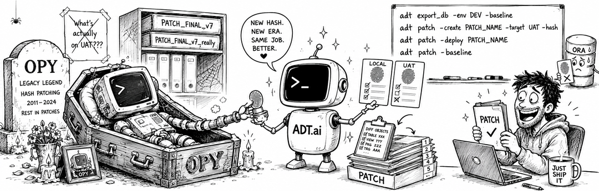

# Hash Mode (adtai patch -hash)



Building a patch from commits works when the commits and the work you want to ship are the same thing. Often they are not: a file changed months ago and never made it out of DEV, somebody fixed the target by hand overnight, or the change is spread over a branch nobody wants to walk commit by commit.

Hash mode asks a different question. What does my repository no longer agree with the target about? Every file gets a hash, the environment has a baseline of hashes, and the patch is the difference between the two. The command itself is on [patch.md](patch.md).

<br>

## Examples

Record the baseline, the state you believe the environment is at:

```bash
adtai patch -target DEV -baseline
```

Preview what has moved since:

```bash
adtai patch -target DEV -hash
```

Build a patch out of exactly those files:

```bash
adtai patch -target DEV -name 13 -create -hash
```

Deploy it as usual, and the baseline advances itself:

```bash
adtai patch -target DEV -name 13 -deploy
```

<br>

## The baseline

One complete file per environment, `patch_hashes/baseline.<TARGET_ENV>.log`, with one `file | commit | hash` line per file the layout resolves and a `#` header naming the environment, the time and the count. The folder comes from `patch_hashes`, and it is one flat folder holding every environment you track:

```text
patch_hashes/
  baseline.DEV.log
  baseline.UAT.log
  baseline.PROD.log
```

The environment is on the file rather than on a folder above it, so a baseline stays self-describing when it is copied, attached to a mail, or read in a diff. `{$TARGET_ENV}` and `#TARGET_ENV#` still resolve inside `patch_hashes` for a project that configured a per-environment folder.

**It belongs in version control.** It is a record of what an environment holds, and a single file overwritten in place is a diff you can read: the lines that moved are the files that deployed.

**Tables are stored beside it.** A hash says a table changed and nothing about its shape, so every table file is also kept under a folder named after the log, at its repo path, as plain DDL:

```text
patch_hashes/
  baseline.PROD.log
  baseline.PROD/
    app/database/tables/app_import.sql
```

A stored table is used only while it hashes to the value its log line records, so a stale or hand-edited one is ignored rather than trusted.

`-baseline` means one thing, hash everything. It reads every file the layout resolves out of the working tree, stores every table, needs no database and no patch name, and overwrites the file and the folder whole.

The commit column is filled from the commit store the run has already levelled, so a file whose newest commit sits outside `patch_scan_commits` records a blank commit rather than a guessed one.

<br>

## Output

It reports what moved, not how many lines it wrote:

```text
APEX DEPLOYMENT TOOL - PATCH
----------------------------

WRITING BASELINE:
-----------------
  - patch_hashes/baseline.DEV.log

  STATUS   FILES
  ------   -----
  TOTAL       11

TIMER: 0s
```

- The comparison is against the baseline being replaced, read just before the overwrite, so `MODIFIED` means this file changed since you last recorded this environment.
- **A first baseline has nothing to compare against and prints `TOTAL` alone**, as above, rather than four zeroes over it. A later run adds `UNCHANGED`, `MODIFIED`, `NEW` and `REMOVED` rows.
- Every path on screen is relative to the project root.

<br>

## What a hash is

Hashes are SHA-1 over a **canonical** form of the file, the same value the commit store records for a committed blob, so a working-tree hash and a committed one are directly comparable.

The canonical form is the file's text with every CRLF and lone CR collapsed to LF, and the whole payload trimmed once, top and tail, never line by line.

That is what makes a hash a property of the content rather than of the machine that wrote it. `file_crlf` writes CRLF when a project asks for it, and Oracle returns whatever was compiled, so hashing the raw bytes meant one object hashed two ways on two platforms.

Two consequences worth knowing. A file differing from another only in trailing whitespace or a final newline has the same hash, while a change to indentation inside the body does not. And the value is not `git hash-object` minus its header, so read the baseline rather than reproducing a hash by hand.

<br>

## What a hash patch contains

`-hash` compares the working tree against the baseline and sorts the difference into three classes, which is what `CHANGED FILES:` reports:

```text
LOADING BASELINE:
-----------------
  - patch_hashes/baseline.DEV.log (412 files, snapshot 2026-08-19 17:40)

CHANGED FILES: 3
----------------
  FILE                                      COMMIT   STATUS
  ---------------------------------------   ------   --------
  app/database/packages/app_notify.sql         214    MODIFIED
  app/database/views/app_user_v.sql                   NEW
  app/database/packages/app_dead.sql           198    DELETED
```

A `MODIFIED` or `NEW` file is snapshotted and linked; a `DELETED` one reaches the same DROP helper a commit-built patch generates. `COMMIT` is the newest commit that touched the file, blank when there is none.

Three consequences follow, and they are the reason the mode exists:

- **No commit window.** A file changed five hundred commits ago and never deployed is still in the patch.
- **Uncommitted work is patchable.** The comparison is against the working tree, so an edit you have not committed yet ships like any other change, and is listed under `WARNING - UNCOMMITTED FILES:` because it carries no commit.
- **The working tree is what ships.** `-hash` forces the `local` content mode, because what was compared has to be what deploys, or the baseline would advance to the hash of bytes nobody sent. `-head` and `-nosnap` beside `-hash` are refused, naming both flags; `-local` is accepted as the redundant spelling.

A rebuild after the patch deployed yields an empty one, correctly, since nothing has changed since:

```text
LOADING BASELINE:
-----------------
  - patch_hashes/baseline.DEV.log (11 files, snapshot 2026-08-22 15:02)

ERROR - PATCH FAILED:
---------------------
  NO HASH-CHANGED FILES TO PATCH

  The working tree matches baseline.DEV.log in every file the layout resolves.
```

The folder, its snapshots and its `hashes.log` are all still on disk, so re-deploying it and reading back what it carried are unaffected.

<br>

## Pointing at another baseline

Both flags take an optional `FILE`, so a baseline can live anywhere:

```bash
adtai patch -target DEV -name 13 -create -hash hashes/alternative.log
adtai patch -baseline before-the-refactor.log
```

A relative value resolves against the project root and an absolute one stands. Naming a file is the whole address, so `-target` is only required when there is no `FILE` for the path to come from.

<br>

## Table changes

An ALTER helper needs the version the target database holds, and hash mode has no commit range to walk for it. The baseline answers directly: the table stored beside the log is that version, and the ALTER is Oracle's answer from it to the working tree.

That is what covers a hotfix. Somebody changes a table on PROD by hand, `export_db -env PROD -baseline` stores the table as PROD holds it, and the next `-create -hash` generates the ALTER from that shape to yours, although no commit ever held it.

A baseline recorded before tables were stored has no table beside it, and then the previous body is read from the newest commit in the scanned history carrying exactly the recorded hash.

A table absent from the baseline earns no ALTER, correctly, since the `CREATE TABLE` shipping in the patch is the whole statement. A table with no stored version and no commit carrying its hash earns none either, and that one is reported:

```text
WARNING - NO TABLE BASELINE:
----------------------------
  the recorded version is not in the scanned history, so no ALTER was generated
  - app/database/tables/
    - app_import.sql
```

Read it when it appears. The patch will ship a `CREATE TABLE` against a table that already exists: record the baseline again so the table is stored, or write the column change into `patch_scripts/`.

`WARNING - NO TABLE DIFF:` is the same silence one step later, and hash mode reaches it exactly as the commit walk does: the two versions were both found, and the target database refused one of them, so `DBMS_METADATA_DIFF` was never asked. Oracle's own error prints under the file. See [patch_templates.md](patch_templates.md) for how the comparison is made.

<br>

## The baseline advances on deploy

A patch built with `-hash` records what it shipped in a `hashes.log` inside the patch folder, and a successful deploy merges that into the target's baseline:

```text
UPDATING BASELINE:
------------------
  - patch_hashes/baseline.DEV.log

   STATUS      FILES
   ---------   -----
   ADVANCED        3
   UNCHANGED     409
   TOTAL         412
```

`ADVANCED` is the files whose hash actually moved. The rest of the baseline is untouched by design, which is the point of the rules below, so the table says so rather than leaving one number beside a header to be interpreted.

- **Only a hash-built patch advances anything.** `hashes.log` is written by `-create -hash` alone and its presence is the marker, so a commit-built patch leaves the baseline exactly as it found it. The two modes are not meant to be mixed.
- **Only the files that patch shipped move.** Work done between `-create` and `-deploy` stays pending, which a re-read of the working tree could not have managed.
- **Only the files whose own install script succeeded.** Under `-continue` a run can land one schema and fail another, and advancing the whole patch there would mark the failed schema's objects live.
- **An APEXlang application moves only where its import landed in place.** Its `end` script runs whatever the import did, so the application's own `> BUILDING APP` row has to succeed on its own id too, with no failing scan, a waived one included, and no revert. A run without `-app` never imports, and `-app` with another id lands on a sandbox the baseline does not track, so both leave the application pending for the next patch.
- **`SKIPPED` and `ERROR` advance nothing.**
- **A shipped table moves its stored file too**, read off the working tree where it still holds the bytes that shipped. A table edited since `-create` keeps its old file, which the log line no longer agrees with, so the next patch falls back to the history lookup instead of trusting it.

Handing the patch to a DBA instead? Then nothing here runs, and the baseline is yours to advance: run `-baseline` once the patch is known to be in.

Do it before doing further work, because a full snapshot records the tree as it stands, so edits made in between would be recorded as deployed and drop out of the next patch.
