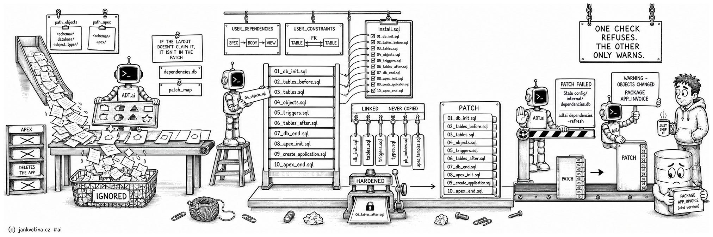

# What Goes Into a Patch (adtai patch)



Which committed files a patch picks up, the order they run in, the two checks that stand in front of a build, and the project SQL a generated install script injects around them. The command itself is on [patch.md](patch.md).

## Which files become a patch

A committed file enters a patch when it sits under the project's **object layout**, the folders `path_objects` describes, or under its **APEX export layout**, the folders `path_apex` describes. Everything else in the commit is ignored.

The layout is read from the template rather than assumed. `<schema>` matches whichever segment it occupies, `<object_type>` marks the per-type folder, and every literal segment has to match. So the shipped `<schema>/database/<object_type>/` maps `app/database/packages/x.sql`, while a project setting `path_objects: 'database/<schema>/<object_type>/'` maps `database/app/packages/x.sql`.

Two further shapes resolve on top of the configured one, both deliberate:

- **The schema level is optional.** `database/views/x.sql` maps beside `app/database/views/x.sql`, and reports its schema as `DATABASE`.
- **The legacy `database/<schema>/<object_type>/` layout always resolves**, whatever `path_objects` says, so a project laid out that way needs no config change.

The APEX side reads `path_apex` for the export root and `apex_path_app` for the per-application folder, so the shipped `<schema>/apex/` plus `{$APP_ID}_{$APP_ALIAS}` maps `app/apex/122_REPORTING/f122.sql` and reads that application's id as `122`. The classic `apex/<id>/` tree resolves too. Static files are recognised by the configured `apex_path_files` folder.

If a patch comes out empty, read the install script's `-- COMMITS:` header against the `PATCH CONTENTS:` section `adtai patch -name <CODE>` prints. Commits in the header with nothing listed under them means nothing mapped.

Rebuilding the same patch folder replaces its generated artifact set. A schema or application excluded by the new selection leaves no old generated installer behind. Generated snapshots are refreshed with those installers; unrelated authored files and deployment history remain. A previously deployed folder still requires `-force` to rebuild.

## APEX files that never enter a patch

`apex_files_ignore` lists them. Each shipped pattern either recreates the application from scratch, deletes it, or is an installer APEX writes for a full import, so shipping one inside a patch is at best a no-op and at worst drops the application the patch was meant to change:

```text
application/create_application.sql
application/delete_application.sql
application/pages/delete_*.sql
install.sql
install_component.sql
```

Patterns match on the path tail, written relative to an application's own folder, and `*` is a wildcard. The two environment scripts are ignored here and re-added by `apex_files_copy`: they are not a change worth patching, and they are needed in the snapshot folder regardless. A database file is never checked against these patterns.

## Ordering

Files are grouped by `patch_map`, which fixes the coarse order (sequences, tables, types, synonyms, objects, triggers, and so on). Within each group the order comes from `config/internal/dependencies.db`, and that graph has two halves because Oracle stores them apart:

- `USER_DEPENDENCIES`, the PL/SQL and view half. A view follows the view it selects from, and a package body follows its spec.
- `USER_CONSTRAINTS`, the table half. Oracle records no table-to-table rows in `USER_DEPENDENCIES`, so foreign keys are reconstructed from enabled `R` constraints. A table with a foreign key is emitted after the table it references.
- File name is the tie-break, so the output is stable, and a dependency cycle degrades to name order for the objects inside it.

## REST modules

Files written by `export_apex -rest` are patchable objects like any other. They map to the `REST` object type, resolved from `path_apex` plus `apex_path_rest`, and to the `rest` group.

`patch_map` places that group **last**: an ORDS module depends on nothing else in the patch and nothing else depends on it. Inside the group the name tie-break puts `__enable_schema.sql` ahead of the modules it enables.

They take the database route rather than the APEX application route, because what they contain is schema-level PL/SQL the schema owner runs directly. Recognition needs the `REST` entry in `object_types`.

## The graph gate

Both order objects from `config/internal/dependencies.db`, and a graph that is absent, unreadable, or stale produces a script that looks fine and fails in SQLcl. When a refresh cannot run, nothing is written and the message names the fix:

```text
PATCH FAILED
------------
No readable config/internal/dependencies.db: objects cannot be ordered from a graph that is absent or unreadable, and name order is not a runnable script.
Run: adtai dependencies -refresh
```

A graph that is present but stale reports one row per affected scope, with the stamp it was measured against and the object that outran it:

```text
PATCH FAILED
------------
Stale config/internal/dependencies.db: the graph is older than the objects it would order.
  APP: refreshed 2026-07-30 09:12:44, newest object 2026-07-31 14:02:11 (app/database/tables/app_role.sql)
Run: adtai dependencies -refresh -schema APP
```

Four things follow, and they are deliberate:

- **`-create` refreshes rather than refusing.** A scope names a schema, so the run refreshes exactly those schemas itself, prints an `UPDATING DEPENDENCIES:` section, and continues. A graph that was never built is covered too: the schemas come from the files, not the mirror. `-install` keeps the refusal, because it orders every install target and has no narrower scope.
- **The refusal survives the remedy.** A run that cannot connect, or whose refresh leaves a scope stale anyway, lands on the message above. The gate re-measures instead of trusting its own fix.
- **A layout naming no schema is still refused**, having no owner to scope a refresh to.
- **Read-only previews are never gated**, because they order nothing. A layout matching no exported objects reports what it searched and exits `0`.

Staleness is measured against the mirror's own refresh stamps, the rows [dependencies](dependencies.md) prints with `-age`, versus the newest mtime among the object files that would be ordered. A schema the mirror has never refreshed reads `refreshed never`.

## The export check

The graph gate proves the order is current. It says nothing about whether the exported files still match the schema: a repository nobody has exported for a week passes it cleanly, because the graph and the files are equally old.

That gap is the quiet one. A patch snapshots repository **files**, so an object edited in the database and never re-exported ships its previous body, and deploying it reverts the live change while the console reports the right file count. So `-create` names every object the database has moved past, and builds the patch anyway:

```text
WARNING - OBJECTS CHANGED:
--------------------------
             PACKAGE | APP_INVOICE
                     |
```

The rows are the shared object listing ([console](console.md)). The fix is `adtai export_db -schema <SCHEMA>` and a rebuild. Until you run it the patch ships the exported version of every object listed, which is the older one.

This warning covers the repository already being behind when you build. The other window, somebody changing the target after you build, is caught at deploy time by the signature block on [patch_deploy.md](patch_deploy.md), which refuses rather than warns.

Neither covers the other. An object stale here signs against its stale base and then deploys cleanly, which is exactly what this warning is here to tell you.

It reads `USER_OBJECTS.LAST_DDL_TIME` from the dependency mirror, so the check is offline and still authoritative: the graph gate has already proven the mirror is at least as new as the files. Only the files this patch selected are compared, and an object absent from the mirror is never guessed stale.

Both sides of that comparison are read on the same clock. A database in another timezone would disagree by the offset between them, so each refresh records the schema's database UTC offset beside its stamp. A mirror old enough to carry no offset says so rather than guessing:

```text
WARNING - NO DATABASE CLOCK:
----------------------------
  - APP
```

`adtai dependencies -refresh -schema <SCHEMA>` clears it permanently.

## The install script

`-install` regenerates the database install script from the objects already exported into the repository. It reads the working tree rather than commits, so it needs no patch name and no database connection:

```bash
adtai patch -install
```

Where the script lands follows `path_objects`, which is a path **template** rather than a literal folder. `<schema>` resolves against the schema folders that exist on disk, `<object_type>` marks the per-type level, and the install script sits above that level:

```text
app/database/INSTALL.sql
core/database/INSTALL.sql
```

The `@"./…"` links inside each script are relative to that folder, so the script runs from its own directory. A layout with no placeholders still produces the single `database/INSTALL.sql`. `<schema>`, `<SCHEMA>` and `<object_type>` are the only placeholders; every other token is refused as `CONFIGURATION INVALID` before anything is written.

The console reports one segment per schema: an `OBJECTS OVERVIEW: <SCHEMA>` table counting files per object type, then an `INSTALL SCRIPT: <SCHEMA>` header with the generated path. A schema root holding no objects is skipped entirely.

## Generated DROP scripts are per run

A patch window that deletes an object's file ships a guarded `DROP` for it under `patch_scripts/objects_after/`, and which deletions earn one is on [patch.md](patch.md).

**A generated `DROP` is written per run, so a re-create never inherits one.** Re-creating a patch code on a later day mints a new folder and carries the previous one's scripts into it, which is what stops a re-create shipping a patch with no scripts at all. A generated helper is excluded from that carry-forward: it is derived from the patch window, so a copy of one answers an earlier window, and the run that still earns it writes it again.

Without the exclusion the rule holds for the first build and is undone by the second, which is what a project whose folder predates it would have seen. Your own one-offs are unaffected: the exclusion reads the generator's `drop.<object_type>.<name>.sql` spelling against your configured `object_types`, so a script you named `drop_old_rows.sql` is an ordinary patch script.

## Templates and the project SQL around the objects

Every generated patch opens with session defaults, `SET DEFINE OFF` above all, since SQLcl reads a literal `&` as a substitution prompt. It then links the project's own reusable SQL in at fixed slots, moves any per-patch one-off script into the patch, and emits the APEX environment with real values. All of it is on [patch_templates.md](patch_templates.md).
