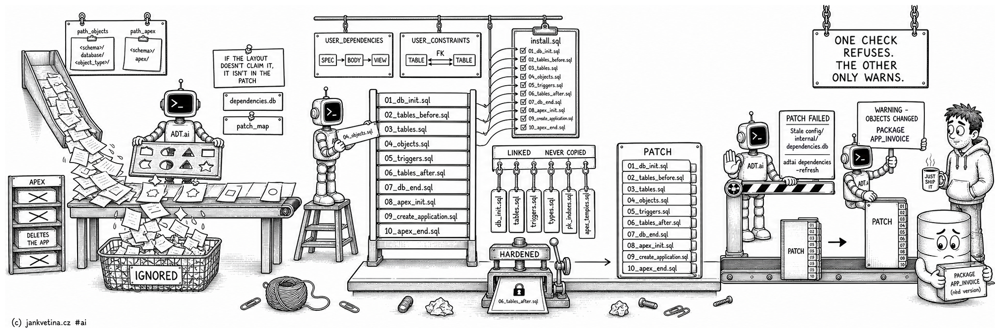

# What Goes Into a Patch (adtai patch)



Which committed files a patch picks up, the order they run in, the checks that stand in front of a build, the code scan, and the project SQL a generated install script injects around them. The command itself is on [patch.md](patch.md).

<br>

## Which files become a patch

A committed file enters a patch when it sits under the project's **object layout**, the folders `path_objects` describes, or under its **APEX export layout**, the folders `path_apex` describes. Everything else in the commit is ignored.

The layout is read from the template rather than assumed. `<schema>` matches whichever segment it occupies, `<object_type>` marks the per-type folder, and every literal segment has to match. So the shipped `<schema>/database/<object_type>/` maps `app/database/packages/x.sql`, while a project setting `path_objects: 'database/<schema>/<object_type>/'` maps `database/app/packages/x.sql`.

Two further shapes resolve on top of the configured one, both deliberate:

- **The schema level is optional.** `database/views/x.sql` maps beside `app/database/views/x.sql`, and reports its schema as `DATABASE`.
- **The legacy `database/<schema>/<object_type>/` layout always resolves**, whatever `path_objects` says, so a project laid out that way needs no config change.

The APEX side reads `path_apex` for the export root and `apex_path_app` for the per-application folder, so the shipped `<schema>/apex/` plus `{$APP_ID}_{$APP_ALIAS}` maps `app/apex/122_REPORTING/f122.sql` and reads that application's id as `122`. The classic `apex/<id>/` tree resolves too. Static files are recognised by the configured `apex_path_files` folder.

If a patch comes out empty, read the install script's `-- COMMITS:` header against the `PATCH CONTENTS:` section `adtai patch -name <CODE>` prints. Commits in the header with nothing listed under them means nothing mapped.

Rebuilding the same patch folder replaces its generated artifact set. A schema or application excluded by the new selection leaves no old generated installer behind. Generated snapshots are refreshed with those installers; unrelated authored files and deployment history remain. A previously deployed folder still requires `-force` to rebuild.

<br>

## APEX files that never enter a patch

`apex_files_ignore` lists them. Each shipped pattern either recreates the application from scratch, deletes it, or is an installer APEX writes for a full import, so shipping one inside a patch is at best a no-op and at worst drops the application the patch was meant to change:

```text
application/create_application.sql
application/delete_application.sql
application/pages/delete_*.sql
install.sql
install_component.sql
```

Patterns match on the path tail, written relative to an application's own folder, and `*` is a wildcard. The two environment scripts are ignored here and re-added by `apex_files_copy`: they are not a change worth patching, and they are needed in the snapshot folder regardless. A database file is never checked against these patterns.

<br>

## Ordering

Files are grouped by `patch_map`, which fixes the coarse order (sequences, tables, types, synonyms, objects, triggers, and so on). Within each group the order comes from `config/internal/dependencies.db`, and that graph has two halves because Oracle stores them apart:

- `USER_DEPENDENCIES`, the PL/SQL and view half. A view follows the view it selects from, and a package body follows its spec.
- `USER_CONSTRAINTS`, the table half. Oracle records no table-to-table rows in `USER_DEPENDENCIES`, so foreign keys are reconstructed from enabled `R` constraints. A table with a foreign key is emitted after the table it references.
- Every group is ordered this way, tables, objects and data alike. A data file orders as its table does, so a child table's rows load after its parent's.
- Only a real edge moves a file. Otherwise `-create` keeps `patch_map`'s type order and then the path, so a view that calls a function follows it even though `VIEW` is listed first, and `-install` keeps the file name. A dependency cycle keeps that order for the objects inside it.

<br>

## REST modules

Files written by `export_apex -rest` are patchable objects like any other. They map to the `REST` object type, resolved from `path_apex` plus `apex_path_rest`, and to the `rest` group.

`patch_map` places that group **last**: an ORDS module depends on nothing else in the patch and nothing else depends on it. Inside the group the name tie-break puts `__enable_schema.sql` ahead of the modules it enables.

They take the database route rather than the APEX application route, because what they contain is schema-level PL/SQL the schema owner runs directly. Recognition needs the `REST` entry in `object_types`.

<br>

## Exported table data

A table exported by [`export_data`](export_data.md) installs through its MERGE, `data/<table>.sql`, and only that file is linked.

The CSV beside it and a LOB table's `data/<table>/` folder, with one file per value and one script loading each, are copied into the snapshot and never run on their own: the MERGE calls those scripts itself with `@@`, which resolves beside the MERGE's snapshot. A folder counts as a table's value folder when a `<table>.csv` sits next to it.

<br>

## The graph gate

Both order objects from `config/internal/dependencies.db`, and a graph that is absent, unreadable, or stale produces a script that looks fine and fails in SQLcl. When a refresh cannot run, nothing is written and the message names the fix:

```text
ERROR - PATCH FAILED:
---------------------
  NO READABLE config/internal/dependencies.db

  Objects cannot be ordered from a graph that is absent or unreadable,
  and name order is not a runnable script.
  Run: adtai rebuild
```

A graph that is present but stale reports one row per affected scope, with the stamp it was measured against and the object that outran it:

```text
ERROR - PATCH FAILED:
---------------------
  STALE config/internal/dependencies.db

  The graph is older than the objects it would order.
    APP: refreshed 2026-07-30 09:12:44, newest object 2026-07-31 14:02:11 (app/database/tables/app_role.sql)
  Run: adtai rebuild -schema APP
```

Five things follow, and they are deliberate:

- **Both refresh rather than refusing.** A scope names a schema, so the run refreshes exactly those schemas itself, prints an `UPDATING DEPENDENCIES:` section, and continues. A graph that was never built is covered too: the schemas come from the files, not the mirror. `-install` never rebuilds the commit history at all, because it reads none.
- **`-create` measures only the schemas its own files live in.** A schema the patch carries nothing from is never checked and never refreshed, however far behind it is, and a patch with no database object at all, an APEX-only one, connects to nothing here. `-install` measures every schema it writes for, or the ones `-schema` names.
- **The refusal survives the remedy.** A run that cannot connect, or whose refresh leaves a scope stale anyway, lands on the message above. The gate re-measures instead of trusting its own fix.
- **A layout naming no schema is still refused**, having no owner to scope a refresh to.
- **Read-only previews are never gated**, because they order nothing. A layout matching no exported objects reports what it searched and exits `0`.

Staleness is measured against the mirror's own refresh stamps, the `refreshes` rows on [storage_dependencies.md](storage_dependencies.md), versus the newest mtime among the object files that would be ordered. A schema the mirror has never refreshed reads `refreshed never`.

<br>

## The export check

The graph gate proves the order is current. It says nothing about whether the exported files still match the schema: a repository nobody has exported for a week passes it cleanly, because the graph and the files are equally old.

That gap is the quiet one. A patch snapshots repository **files**, so an object edited in the database and never re-exported ships its previous body, and deploying it reverts the live change while the console reports the right file count. So `-create` names every object the database has moved past, and builds the patch anyway:

```text
WARNING - OBJECTS CHANGED:
--------------------------
             PACKAGE | APP_INVOICE
                     |
```

The rows are the shared object listing ([console](console.md)). The fix is `adtai export_db -schema <SCHEMA>` and a rebuild. Until you run it the patch ships the exported version of every object listed, which is the older one.

This warning covers the repository already being behind when you build. The other window, somebody changing the target after you build, is caught at deploy time by the signature block on [patch_deploy.md](patch_deploy.md), which refuses rather than warns.

Neither covers the other. An object stale here signs against its stale base and then deploys cleanly, which is exactly what this warning is here to tell you.

It reads `USER_OBJECTS.LAST_DDL_TIME` from the dependency mirror, so the check is offline and still authoritative: the graph gate has already proven the mirror is at least as new as the files. Only the files this patch selected are compared, and an object absent from the mirror is never guessed stale.

Both sides of that comparison are read on the same clock. A database in another timezone would disagree by the offset between them, so each refresh records the schema's database UTC offset beside its stamp. A mirror old enough to carry no offset says so rather than guessing:

```text
WARNING - NO DATABASE CLOCK:
----------------------------
  - APP
```

`adtai rebuild -schema <SCHEMA>` clears it permanently.

<br>

## The application check

`-deploy -app` refuses to import an APEXlang application somebody changed since your export ([patch_deploy.md](patch_deploy.md)). `-create` asks the same question first, so you can reconcile before the deploy fails.

It reads the application's live signature on the environment `export_apex` recorded ([export_apex.md](export_apex.md#the-application-checksum)), never `-target`, and compares it with the checksum recorded there. An export taken before that environment was recorded falls back to the connection `-create` itself opens (`-target`, or the connection file's default), exactly as before:

```text
WARNING - APP 100 CHANGED SINCE YOUR EXPORT:
--------------------------------------------
  CHANGED BY  | DEVELOPER
  CHANGED ON  | 2026-09-24 22:26
  YOUR BASE   | 2026-09-24 22:26 (64d9c42b)

  1) run: adtai export_apex -app 100 -apexlang -files
  2) reconcile your change with it
  3) create the patch again
```

Each changed application gets its own warning. The rows are the ones the deploy refusal prints, and the first two steps are its own ([patch_import.md](patch_import.md)): fetch the live application, which records its new checksum, then reconcile your change with it. The patch is still written and the run exits `0`.

- **The source application is read**, the one the tree was exported from, never the `-app <id>` it will land on.
- **An application missing from the environment is not reported.** One with no recorded export is reported as `WARNING - APP <id> HAS NO RECORDED SIGNATURE:`, with the steps to export it, commit the export and create the patch again.
- **A read that fails prints nothing**, since the deploy still checks.
- **Only APEXlang trees are checked.**

<br>

## The APEX release check

An APEXlang tree records the APEX release that exported it, in `apexlang/.apex/apexlang.json`. After an APEX upgrade the tree has to be exported again on the new release, so when the target runs a newer release than the tree, `-create` warns inside the same validation rows:

```text
WARNING - APP 100 EXPORTED ON APEX 26.1, TARGET RUNS 26.2:
----------------------------------------------------------
  1) run: adtai export_apex -app 100 -apexlang on APEX 26.2
  2) commit the export
  3) create the patch again
```

The target is the connection `-create` opens for its table ALTERs (`-target`, or the connection file's default). Releases are compared on major and minor, so a patch level is not drift. The patch is still written, a release either side cannot read prints nothing, and `-deploy -app` repeats the warning ([patch_import.md](patch_import.md#the-tree-is-older-than-the-target)).

<br>

## The code scan

`patch_codescan` in `config.yaml` runs SQLcl's `codescan` over the files the patch carries, after the APEXlang compile and before anything is written. `off`, the default, scans nothing. `warn` lists what it found and builds the patch. `block` lists it and writes nothing.

Each carried file is copied, in the version the patch ships, into a folder of its own under `config/temp/`, named for the patch folder and removed once the scan is read. One row, named for the patch folder, and findings in the carried files only:

```text
CODESCAN:
---------
  000000-1-1025 ...................................................... 0:00:06


NEW VIOLATIONS IN 000000-1-1025:
--------------------------------

  sandbox/apex/100_ORDERS/apexlang/pages/p00001-orders.apx:182:5
    APEX-005
    Component dynamic actions require an authorization scheme

BASELINE: 1 known, 1 new, 0 fixed
```

**An APEXlang file is scanned with its application beside it**, because codescan reads application-scope settings off the rest of the tree. Scanned alone, a page reports rules its application already satisfies. A finding in a file the patch does not carry is never listed.

Each finding is held to the baseline `adtai validate -codescan` keeps for the tree its file sits in ([validate_codescan.md](validate_codescan.md#the-baseline)), read for only the files this patch carries. The gate never records a baseline itself.

`codescan_ignore` suppresses findings here exactly as it does for `validate -codescan`, each `file` read as the path from the project root ([validate_codescan.md](validate_codescan.md#suppressing-a-finding)). `codescan_rules` narrows what counts here as it does there ([validate_codescan.md](validate_codescan.md#the-rule-profile)).

**A file no baseline covers has every finding counted as new**, so a tree `validate -codescan` never scanned fails the gate rather than passing it. Run that first to accept what a tree already holds.

`codescan_fail_on` decides what counts, as it does for `validate`: `new` lists the new findings, `any` lists every finding under `ERRORS IN <folder>:`, and `none` lists the new ones and never stops the build. Under `block` a refusal reads:

```text
ERROR - PATCH FAILED:
---------------------
  CODESCAN REFUSED THE PATCH

  patch_codescan is block, so nothing was written.
  Fix what is listed above and create the patch again.
```

**A scan that proves nothing is a violation too**: output SQLcl did not finish, a scan that read none of the files, or a file opening on a UTF-8 byte order mark, which codescan reads as clean. A patch carrying no code starts no scan.

<br>

## Files that are not UTF-8

A patch is written in UTF-8. A file saved in another encoding is read in `repo_encoding` from `config.yaml` when you set one, so its national characters arrive intact. A file that fits neither is copied into the patch byte for byte, unconverted, and `-create` names it with the first bad byte and builds the patch anyway:

```text
WARNING - NOT UTF-8:
--------------------
  copied byte for byte; save as UTF-8, or set repo_encoding in config.yaml
  - sandbox/database/views/
    - legacy_v.sql
```

`-debug` adds where the first bad byte sits under each file, `byte 0x93 at offset 3`, which is what finds it in an editor. A plugin's files group under one `apexlang/shared-components/plugins/` row, however many plugins carry one.

**A binary is never on this list.** A font, image or archive, anything holding a NUL byte or named `.woff2`, `.gif`, `.zip` and the like, is not text, so no encoding applies to it: it is copied byte for byte and named nowhere. The warning is for text files only.

A licence or readme inside an APEX plugin is the usual one, and it deploys unharmed. A script that holds `č` saved as Windows-1250 deploys whatever SQLcl makes of those bytes, which is why the warning names it: save it as UTF-8, or set `repo_encoding: cp1250`.

<br>

## The install script

`-install` writes one install script per exported schema from the objects already in the repository. It reads the checked-out files rather than commits, so it needs no patch name, and `-branch` is refused beside it:

```bash
adtai patch -install
adtai patch -install -schema APP
```

Every script lands in one folder, under the same name on every branch, so regenerating one reads as a diff:

```text
config/install/APP.sql
config/install/CORE.sql
```

`<schema>` in `path_objects` resolves against the schema folders that exist on disk, and `-schema` narrows them: repeatable, comma- or space-separated, `%` as a wildcard. A value matching no exported schema is refused as `ARGUMENT INVALID`, exit `2`, naming the schemas found. It narrows the dependency refresh too, so a schema nobody asked for is never refreshed.

A layout with no `<schema>` placeholder writes `config/install/DATABASE.sql`. `<schema>`, `<SCHEMA>` and `<object_type>` are the only placeholders; every other token is refused as `CONFIGURATION INVALID` before anything is written.

The `@"./…"` links are project-relative, so a script runs from the project root. A script left at the old `<schema>/database/INSTALL.sql` is moved into `config/install/` on the next run; when one is already there, the old copy is removed.

The console reports one segment per schema: an `OBJECTS OVERVIEW FOR <SCHEMA>:` table counting files per object type, then an `INSTALL SCRIPT FOR <SCHEMA>:` header with the generated path. A schema root holding no objects is skipped entirely.

<br>

## Generated DROP scripts are per run

A patch window that deletes an object's file ships a guarded `DROP` for it under `patch_scripts/objects_after/`, and which deletions earn one is on [patch.md](patch.md).

**A generated `DROP` is written per run, so a re-create never inherits one.** Re-creating a patch code on a later day mints a new folder and carries the previous one's scripts into it, which is what stops a re-create shipping a patch with no scripts at all. A generated helper is excluded from that carry-forward: it is derived from the patch window, so a copy of one answers an earlier window, and the run that still earns it writes it again.

Without the exclusion the rule holds for the first build and is undone by the second, which is what a project whose folder predates it would have seen. Your own one-offs are unaffected: the exclusion reads the generator's `drop.<object_type>.<name>.sql` spelling against your configured `object_types`, so a script you named `drop_old_rows.sql` is an ordinary patch script.

<br>

## Templates and the project SQL around the objects

Every generated patch opens with session defaults, `SET DEFINE OFF` above all, since SQLcl reads a literal `&` as a substitution prompt. It then links the project's own reusable SQL in at fixed slots, moves any per-patch one-off script into the patch, and emits the APEX environment with real values. All of it is on [patch_templates.md](patch_templates.md).
