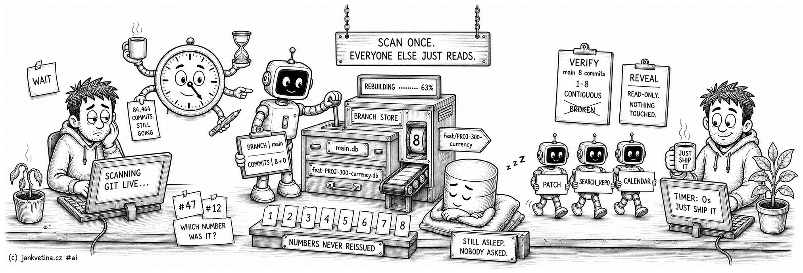

# Rebuild Commit Store (adtai rebuild)



`rebuild` keeps the local commit store up to date, one database per branch of commit metadata that [`search_repo`](search_repo.md) and [`calendar`](calendar.md) read instead of scanning git live. Run it when the store should catch up with new commits.

Scans are incremental by default, so a steady-state run costs seconds. It also lists and switches branches, and it never connects to Oracle.

## Examples

Update the store for the branch you are on:

```bash
adtai rebuild
```

Rebuild a bounded window, by commit count or by date:

```bash
adtai rebuild -limit 200
adtai rebuild -since 7
adtai rebuild -since 2026-08-01
```

Update named branches rather than the current one:

```bash
adtai rebuild -branch main -branch feat/PROJ-300-currency
```

Look at what the stores hold, and at the branches on the remote:

```bash
adtai rebuild -verify
adtai rebuild -reveal
adtai rebuild -reveal PROJ-300
```

## Output

The header names the branch and how many commits the run will read, then one redrawn bar carries the scan:

```text
APEX DEPLOYMENT TOOL - REBUILD
------------------------------
    BRANCH | main
   COMMITS | 8

  REBUILDING ...... 13%                                                0:00:00 
  REBUILDING ............ 25%                                          0:00:00 
  REBUILDING ................... 38%                                   0:00:00 
  REBUILDING ......................... 50%                             0:00:00 
  REBUILDING ................................ 63%                      0:00:00 
  REBUILDING ...................................... 75%                0:00:00 
  REBUILDING ............................................ 88%          0:00:00 
  REBUILDING ................................................... 100%  0:00:00 

TIMER: 0s
```

- `COMMITS | 8` is a full build. An incremental update reads `COMMITS | 8 + 0`, the branch total plus the commits missing from the store, and a bounded window reads `COMMITS | 8 - 5` for a count or `COMMITS | 5 SINCE <date>` for a window.
- The bar advances per commit and the time on the right is what is left. There is no per-commit text.
- A branch with no new commits leaves its store untouched.

## One store per branch

Stores go where `repo_commits_file` points, `./config/commits/#BRANCH#.db` by default. One file per branch is deliberate: a branch you no longer care about is one file you can delete, and deleting it costs nothing anywhere else. What a store holds is on [storage_commits.md](storage_commits.md).

`#BRANCH#` becomes one readable filename. Letters, digits, `.`, `_`, `-` and `/` are accepted; `/` is flattened to `-`, so `feat/PROJ-300-currency` writes `feat-PROJ-300-currency.db`. Anything else is rejected rather than escaped. If two accepted names flatten to the same filename, the exact branch recorded inside the store prevents them from sharing it.

Only the branch is rewritten: the separators in your own template are the folder layout you configured. The branch keeps its real name everywhere you read it, the `BRANCH |` header included.

YAML commit history is decommissioned. A configured `repo_commits_file` that does not end in `.db`, or an old `.yaml` cache beside the supported store path, stops the command with remove-and-rebuild guidance. ADT.ai does not convert it: the old format cannot represent the complete file-status data the SQLite store requires.

## Commit numbering

A commit's number is allocated once and never worked out again. It is a name for that commit on that branch rather than a position in a list, so nothing that happens to the list afterwards moves it.

On a first build the oldest commit in the window takes its true position from the root (`git rev-list --count`), and the rest count up. From then on:

- **A new commit takes the next free number** above the tip.
- **A merge moves nothing.** Commits arriving from another branch are new to this branch, so they take numbers above the tip rather than the slots their dates suggest.
- **A bounded window bounds the work, never the numbering.** `-limit 1000` on a branch of 84,464 commits stores `83465` to `84464` and leaves the range below reserved. Widening the window later fills it in underneath.
- **A full rebuild reproduces the same numbers**, because the rule does not depend on what the window happened to include.

History rewritten under the branch is the one thing that drops numbers. When the stored tip is no longer an ancestor of the branch, after a rebase or a force-push, those numbers describe commits that no longer exist, so the branch is reset and rebuilt.

## How far back a first build reaches

`patch_history_bottom_days` in `config/config.yaml` (default `365`) decides how far a from-scratch build walks. The oldest commit inside that window becomes the bottom of the store and older ones are never read. On a large repository that is the difference between a usable first run and an unusable one, since the expensive half of a rebuild is one file scan per commit.

It is a floor rather than a mode:

- An incremental run never re-cuts an existing store. Commits already below the floor are already numbered, and dropping them would open a hole.
- An explicit `-limit` or `-since` outranks it, and may reach further back than the project default.
- Raising the value pulls the extra commits in underneath, leaving every assigned number where it was.

Set it to `0` to walk the whole history.

## Incremental, bounded, or full

With no window flag, `rebuild` reads the existing store, takes its highest-numbered commit as the resume point, and fetches only what came after it. Stored records are reused verbatim and never re-hashed.

`-limit N` and `-since WHEN` both switch that branch to a full bounded window instead. They bound the same window, one by count and one by date, so they cannot be combined in normal mode.

`WHEN` is a `YYYY-MM-DD` date or an integer number of days back. It resolves against the committer date at local midnight, so a commit made on the boundary day is included.

A branch whose store is missing, empty, or whose stored tip no longer exists is rebuilt in full. That fallback is per branch, so one stale branch in a `-branch` list does not force the others to re-scan.

## Verifying a store

`rebuild -verify` reports what each store holds and changes nothing:

```text
COMMIT STORES:
--------------

  main                                 8 commits, 1-8, CONTIGUOUS
```

`CONTIGUOUS` means floor to ceiling with nothing missing, which is the only shape allocation can produce, so `BROKEN` means something outside ADT.ai wrote the file. A store bounded by `patch_history_bottom_days` starts above `1` and is still contiguous: the range below it is reserved rather than missing. Exit code is `1` when any branch reports a problem.

## Inspecting and switching branches

`-reveal` lists branches without touching any store. It reads the remote refs (`refs/remotes/origin/*`) rather than your local heads, after a best-effort `git fetch --prune`, so the list is right whatever you have checked out and a failed fetch falls back to the cached refs:

```text
RECENT BRANCHES: (3)
----------------

  feat/PROJ-300-currency
  main
  fix/PROJ-204-trigger-order
```

- Rows are newest-first by committer date, clipped to 78 characters, with the count folded into the header. A truncated list reads `(20/1958)`, shown out of total.
- Filter words are AND-matched against the branch name and retitle the list `BRANCHES MATCHING <words>`. Each word is a case-insensitive contains-glob, so `feat 4995` keeps a branch holding both and `feat*4995` still works.
- `-limit` caps the rows here (default `20`, `0` lists all), and `-my` keeps branches whose tip-commit author email is your own.
- `-since WHEN` keeps branches whose tip commit is on or after `WHEN`, and composes with the rest: the date filter runs first, then `-limit` caps the survivors.

Add `-switch [N]` to check the tree out to the Nth branch in the filtered order, 1-based, bare `-switch` meaning the first. The branch list is replaced by the branch you landed on and its own commits:

```text
BRANCH SWITCHED:
----------------

  feat/PROJ-300-currency

COMMITS:
--------

  2026-08-23 09:14 | PROJ-300: settle the rounding on the currency column
```

- Only commits made **on** the branch are listed, so the ones it inherited at creation are excluded. Switching to the default branch lists all of its commits.
- `-limit` caps this section rather than the branch list, since the rank resolves against the full filtered set, and `-my` keeps only your own commits.
- Already being on the target branch runs no git operations at all, so work in progress is left exactly where it is. Otherwise `git checkout` creates a local tracking branch when none exists, non-conflicting work rides along, and a checkout git refuses is shown verbatim.
- A rank outside the filtered range errors without switching, and `-switch` without `-reveal` is an error.

## Arguments

| Argument       | Repeatable | Default | Description |
| -------------- | ---------- | ------- | ----------- |
| `-branch`, `--branch` | Yes | current branch | Branch name or names to include. Any commit-ish git accepts works: a local branch, `origin/<name>`, a tag, or a SHA. A name git cannot resolve fails fast and names the flag that lists the branches. |
| `-reveal [WORD ...]`, `--reveal [WORD ...]` | No | off | Read-only branch inspector: list the remote branches with no store change, newest-first. Optional filter words are AND-matched against the branch name, each a case-insensitive contains-glob. |
| `-limit`, `--limit` | No | mode-dependent | **Normal mode:** maximum commits to read per branch, running a full bounded window. Absent, the run is an incremental update. **`-reveal`:** maximum branch rows (default `20`, `0` lists all). **`-reveal -switch`:** maximum commits for the switched branch (default `20`, `0` all); the rank is resolved against the full list, so this does not bound it. |
| `-since`, `--since` | No | off | A `YYYY-MM-DD` date or an integer number of days back. **Normal mode:** rebuild a full bounded window of every commit since that date; mutually exclusive with `-limit`. **`-reveal`:** keep only branches whose tip commit is on or after it, composing with `-limit` and the word filters. |
| `-my`, `--my` | No | off | In `-reveal`, keep branches whose tip-commit author email equals `git config user.email`. Under `-switch`, also keep only your own commits in the listing. |
| `-verify`, `--verify` | No | off | Read-only check: each branch store's commit count, its floor-to-ceiling range, and whether the numbering is `CONTIGUOUS`. Never scans git and never writes. Exits `1` when any branch reports a problem. |
| `-switch [N]`, `--switch [N]` | No | `1` when given | With `-reveal`, check the tree out to the Nth branch in the filtered order and print that branch and its own commits instead of the list. Errors without `-reveal`, and errors on a rank outside the range without switching. |

Shared options (-root, -beep, -nobeep) are on [console.md](console.md#shared-arguments).
