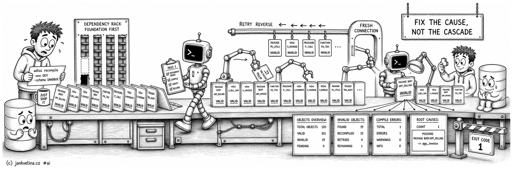

# Recompile Objects (adtai recompile)



`recompile` gets a schema back to a working state after something has broken it. It recompiles invalid PL/SQL, views, synonyms and materialized views in dependency-safe passes, then reports what stayed broken, why, and which failures are the real cause rather than a consequence.

It also carries a set of read-only health reports (materialized views, synonyms, disabled objects, scheduler jobs) and one repair action that is not a recompile at all (`-trailing`). Each of those replaces the ordinary pass rather than adding to it.

## Examples

Recompile whatever is invalid in a schema:

```bash
adtai recompile -env DEV -schema SANDBOX
```

Force-recompile everything to a named compiler state:

```bash
adtai recompile -env DEV -force -native -level 3
```

Narrow by object type and name, in any of the four separator forms:

```bash
adtai recompile -env DEV -type PACKAGE% -name APP%
adtai recompile -env DEV -name APP% CORE%
adtai recompile -env DEV -name APP%,CORE%
```

Recompile several schemas, each an independent pass against its own connection:

```bash
adtai recompile -env DEV -schema CORE APP
```

Compile invalid and refresh stale materialized views, or read one of the reports:

```bash
adtai recompile -env DEV -mviews
adtai recompile -env DEV -synonyms
adtai recompile -env DEV -disabled
adtai recompile -env DEV -jobs
```

## Output

A run reads the overview, recompiles, retries whatever failed on a fresh connection, then re-checks.

The retry runs in reverse order, and repeats for as long as each pass compiles something new. Reversing alone is enough when the dependencies run with the alphabet, and not enough when they criss-cross.

`A` needs `C`, `C` needs `B`, `B` needs nothing: one retry leaves `A` and `C` invalid on a schema two more passes would finish. A pass that compiles nothing new is where it stops, so a genuinely broken object costs one wasted pass and never a loop.

When anything is still invalid the run prints three more sections and exits non-zero:

```text
OBJECTS OVERVIEW:
-----------------

                                                   MISSING       MISSING
  OBJECT TYPE    TOTAL   VALIDATED   INVALID   IDENTIFIERS    STATEMENTS
  ------------   -----   ---------   -------   -----------    ----------
  PACKAGE            1                                   1             1
  PACKAGE BODY       1                     1             1             1
  VIEW               1                                                  

INVALID OBJECTS:
----------------

  OBJECT TYPE    OBJECT NAME   ERROR       ERRORS
  ------------   -----------   ---------   ------
  PACKAGE BODY   APP_BILLING   ORA-00942        2

COMPILE ERRORS:
---------------

  PACKAGE BODY.APP_BILLING
    - 5.46 PL/SQL: ORA-00942: table or view does not exist

ROOT CAUSES:
------------

  OBJECT TYPE    OBJECT NAME   CAUSE     BLAST
  ------------   -----------   -------   -----
  PACKAGE BODY   APP_BILLING   MISSING

  MISSING - not there; restore it, then recompile:
    PACKAGE BODY.APP_BILLING -> app_invoice
```

The section order is fixed, and the verdict reads last because it belongs under the evidence it is drawn from. A run with nothing to compile keeps the overview and skips the re-check. None of these sections needs a flag.

- **`VALIDATED` sits beside `INVALID` so the two read as a pair**, what the run fixed and what it could not. It counts objects that were invalid before the run and are not any more, as a set difference over object identity rather than a count delta: recompiling a spec invalidates its dependents, so a run that fixes one object and breaks another leaves `INVALID` unchanged, and a delta would report the repair as nothing happening.
- Zero renders blank, so only real repairs draw the eye.
- **`COMPILE ERRORS:` is a list, not a table column.** A compiler message is prose, and the one column left over at 80 characters truncates the very identifier you need to grant.

## Reading the compile errors

Four rules shape the list:

- **The heading is `<OBJECT TYPE>.<OBJECT NAME>`, never the bare name.** A schema can carry one name as both a `PACKAGE` and a `PACKAGE BODY`, two objects with different errors, which a name-keyed stanza would merge.
- **Cascade rows never print.** Oracle files a `PL/SQL: Statement ignored` or `Compilation unit analysis terminated` beside every statement the real error killed, so one missing grant can contribute ten. All three are restatements of a failure reported next to them.
- **A repeated message prints once, at its lowest `line.pos`.** A missing grant referenced eight times is one thing to fix. Deduping compares the full message, never the rendered one.
- **Dedupe is per object.** Two objects failing on the same grant both say so.

A message too long for one line wraps under a hanging indent aligned to the message start, and is never cut. Each message is stripped on both sides with interior line breaks collapsed first, which is what makes the dedupe key stable.

## Root causes, where to start

A flat list stops helping once it is long. Drop a sequence and the package that used it goes invalid, then the trigger and the view that used *that*: twenty rows where three are the actual damage. `ROOT CAUSES:` separates the objects that are broken from the ones that are merely downstream.

`BLAST` counts the invalid objects that clear transitively once this one compiles, blank for none, and it orders the table: most downstream damage first, ties broken by error count. What to fix is listed below the table, grouped by verdict, because a qualified culprit is longer than any column left at 80 characters.

**Every knock-on is counted under one root only.** An object that two unrelated roots both break belongs to the nearer of them, because fixing either root alone would not clear it, and two rows each claiming it would add up to more damage than the schema has. Where one root is upstream of another, both figures still count what sits below them, so the head of a chain reports the whole chain.

Each heading doubles as the verdict's definition:

- **MISSING**, an object or identifier it needs is not there. The listed name is what to restore.
- **GRANT**, the object exists and this schema has no privilege on it (`PLS-00904`, `ORA-01031`). No amount of recompiling fixes this; reading it as MISSING sends you hunting for something that is already there.
- **SOURCE**, the object's own text does not parse (`PLS-00103`). Nothing upstream to fix, so no list follows it.
- **UNKNOWN**, invalid with no compile error to explain it. Also listless.

A fifth verdict appears in the `CAUSE` column and has no list of its own:

- **CYCLE**, the blame runs in a circle. A blames B and B blames A, which a half-applied deployment leaves behind routinely. Every member of such a circle is a knock-on by its own evidence, so the table would have had no rows at all. One member is promoted instead, the one with the most compile errors of its own, ties broken by type then name. Fix it and the circle breaks; the rest clear behind it.

The knock-ons are classified but not listed again: `INVALID OBJECTS:` above already names them.

The ranking reads four sources, because no one of them is enough:

- **The compile errors.** Oracle usually names the culprit, and whether that culprit is itself invalid separates a knock-on from a root. An owner prefix is stripped only when it is the connected schema's own.
- **The stored source**, for errors that name nothing. `ORA-00942` reports no object and Oracle records no dependency row for a reference that never resolved, so the error's own line and position are read back from `user_source` for exactly those lines.
- **The schema's invalid objects**, all of them, whatever `-type` and `-name` narrowed the run to. It answers one question, is the object Oracle blamed itself invalid, and the answer must not depend on what the run selected: a `-type "PACKAGE BODY"` run cannot see the spec that broke the body, and used to report it as MISSING and tell you to restore something already there. Only the classification reads this list. What gets compiled stays scoped exactly as you asked.
- **The dependency mirror**, `config/internal/dependencies.db`, read offline and never refreshed here. It supplies the edges no error text carries, which is what makes `BLAST` meaningful. A project with no mirror ranks on the compile errors alone; that is never an error. Keep it current with `adtai dependencies -refresh -schema <SCHEMA>`.

There is no lock report. It read `gv$locked_object`, which needs a DBA grant no application schema holds, and Oracle offers no unprivileged substitute. Nothing is lost operationally: the connection bootstrap sets `DDL_LOCK_TIMEOUT = 10`, so a lock wait is bounded, and an object that stays locked surfaces as its own compile error.

## Object types

`-type` names an Oracle object type, and Oracle's own vocabulary is the contract. A type without a wildcard is an **exact** match, so a bare `PACKAGE` processes specifications only.

| You write | It means | It does not mean |
| --------- | -------- | ---------------- |
| `PACKAGE` | package specifications | bodies; ask with `PACKAGE%` |
| `PACKAGE SPEC` | the same as `PACKAGE` | anything else |
| `PACKAGE BODY`, `"PACKAGE BODY"`, `PACKAGE_BODY`, `package_body` | package bodies | one filter, however it is spelled or cased |
| `PACKAGE TRIGGER` | packages **and** triggers | one type; those two words name none |
| `MVIEW`, `MATERIALIZED`, `MATERIALIZED VIEW`, `MATERIALIZED_VIEW` | `MATERIALIZED VIEW` | materialized view logs |
| `MVIEW LOG`, `MVIEW_LOG`, `MATERIALIZED VIEW LOG` | the log object class | the views; `M%` matches both |
| `MATERIALIZED VIEW` | the single type | `MATERIALIZED VIEW` plus `VIEW`; write `MVIEW VIEW` for that |
| `%BODY`, `PACKAGE%` | a LIKE pattern passed through unchanged | a resolved type name |

Words are rejoined only when they name a real type, which is what keeps two types side by side as two filters. This resolution applies to `-type` alone: `-name` is an identifier pattern, where `_` stays LIKE's single-character wildcard.

## Force, and narrowing by drift

Bare `-force` recompiles every matching object, not just the invalid ones, and each of them exactly once. Combined with a compile modifier (`-native`, `-interpreted`, `-level`, `-scope`, `-warnings`) it instead recompiles only the objects whose **current** settings drift from the state you asked for, and then applies the full requested state rather than the mismatched setting alone:

```bash
adtai recompile -env DEV -force -level 2
adtai recompile -env DEV -force -scope ALL -level 2 -interpreted -warnings PERF+SEVERE
```

Only VALID PL/SQL objects are considered, since invalid ones are already recompiled by the ordinary pass, and non-PL/SQL types carry no settings to drift from, so a modifier-gated `-force` skips them entirely. A plain recompile with neither `-native` nor `-interpreted` leaves each object's code type untouched.

## The report modes

Each of these opts into exactly one object class, so it takes no name pattern of its own and is scoped by the shared `-name` filter. All of them skip the invalid-object recompile, the overview and the invalid-object table.

| Flag | What it does | Acts on the database |
| ---- | ------------ | -------------------- |
| `-mviews` | `MATERIALIZED VIEWS` table, then `COMPILE` invalid views and `REFRESH` stale ones | yes |
| `-synonyms` | one `SYNONYMS TO SCHEMA <OWNER>:` table per target owner | no |
| `-disabled` | `DISABLED CONSTRAINTS:`, `DISABLED INDEXES:` and `DISABLED TRIGGERS:` | no |
| `-jobs` | today's scheduler runs, one compact table per status | no |
| `-trailing` | rewrites stored source without trailing whitespace | yes |

An empty result still prints a header-only table, so the report is visibly present.

**`-mviews`** renders a live stream: each view's name prints first, its `COMPILE` or `REFRESH` runs at that point, and only then does the rest of the row print, so the pause attaches to the view being worked on. `TYPE` is derived from the view's **configured** refresh method, never the volatile last-refresh type, and a `FORCE` method resolves to `F` when a usable log backs it or `C` when none does, which is what the `LOG` column reports. `TIMER` is Oracle's own recorded duration rather than a tool-measured clock, rounded up, so a genuinely sub-second refresh reads `1s` and a view that has never been refreshed leaves the cell blank. With `-force`, every matching view is refreshed regardless of staleness.

**`-disabled`** is the one report spanning several object types, so `-type` picks which of `CONSTRAINT`, `INDEX` and `TRIGGER` to report. It lists disabled constraints, indexes whose status is not `VALID` or whose function-index status is not `ENABLED`, and disabled triggers.

## Stripping trailing whitespace

`-trailing` fixes the version-control noise the export creates: `export_db` strips trailing whitespace from every line it writes, so an untouched package still differs from the database's stored source on every export, and this repairs the *source* side once per schema. What it rewrites, the separate path a view takes, and what the sweep guarantees are on [recompile_trailing.md](recompile_trailing.md).

## Arguments

| Argument       | Repeatable | Default | Description |
| -------------- | ---------- | ------- | ----------- |
| `-type`, `--type` | Yes | `%` | Object type pattern or patterns, comma- or space-separated, `%`/`_` wildcards, `\`-escaped. Oracle type names, so a bare `PACKAGE` means specifications only. See [Object types](#object-types). |
| `-name`, `--name` | Yes | `%` | Object name pattern or patterns, comma- or space-separated, `%`/`_` wildcards, `\`-escaped: `-name 'CORE\_LOCK'`. |
| `-force`, `--force` | No | off | Recompile all matching objects, not just invalid ones. Beside a compile modifier it narrows to the objects whose settings drift from the requested state. |
| `-level`, `--level` | No | none | PL/SQL optimize level (1-3). |
| `-native`, `--native` | No | off | Compile PL/SQL to native code. |
| `-interpreted`, `--interpreted` | No | off | Compile PL/SQL to interpreted code (`-native` takes precedence). Neither flag leaves the code type untouched. |
| `-scope`, `--scope` | Yes | none | PL/Scope settings (`IDENTIFIERS`, `STATEMENTS`, `ALL`); space-, comma-, `+`- or repeated-flag-separated. |
| `-warnings`, `--warnings` | Yes | none | PL/SQL warnings (`SEVERE`, `PERF`, `INFO`); same separators as `-scope`. |
| `-mviews`, `--mviews` | No | off | Report materialized views (scoped by `-name`), then compile invalid ones and refresh stale ones. With `-force`, refresh every match. |
| `-synonyms`, `--synonyms` | No | off | Report-only: one table per target owner mapping each synonym to its target, one privilege per row, with `GRNT` and `VALID`. |
| `-disabled`, `--disabled` | No | off | Report-only: disabled constraints, invalid or function-disabled indexes, and disabled triggers, scoped by `-name` and by `-type` to one of `CONSTRAINT`/`INDEX`/`TRIGGER`. |
| `-jobs`, `--jobs` | No | off | Report-only: today's scheduler job runs in status-grouped compact tables, scoped by `-name`. |
| `-trailing`, `--trailing` | No | off | Strip trailing whitespace from stored source through `CREATE OR REPLACE`, scoped by `-type` and `-name`. |
| `-silent`, `--silent` | No | off | Suppress object overview details while keeping the banner, connection block and final timer. |

Shared options (-root, -env, -schema, -config-dir, -key, -debug, -beep, -nobeep) are on [console.md](console.md#shared-arguments).
