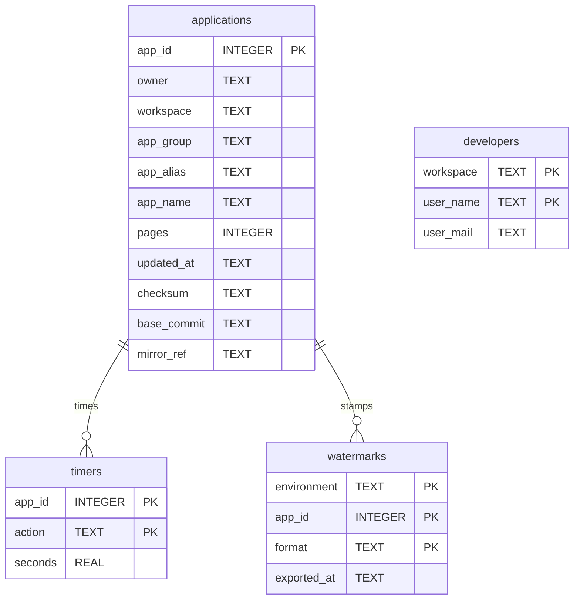

# APEX Cache (adtai export_apex)

`export_apex` remembers what it learns about a project's applications in `config/internal/apex.db`: which schema owns each application, its alias and page count, its checksum, the commit its APEXlang tree was exported at, the workspace developers, how long each export action took, and the watermark bare `-recent` measures from. The owner spares a wasted connection on the next run.

 

## Diagram

Nothing is declared: the lines say which rows describe the same application, and the store keeps them consistent by writing every table from the same run. A timer or a watermark can outlive its listing row, so a link would refuse rows the export means to keep.

 

## Tables

Nullable is No where the column is declared NOT NULL or belongs to the primary key.

 

### applications

| Column      | Type    | Nullable | Key | Meaning                                                                                                                                   |
| ----------- | ------- | -------- | --- | ----------------------------------------------------------------------------------------------------------------------------------------- |
| app_id      | INTEGER | No       | PK  | The application id.                                                                                                                       |
| owner       | TEXT    | Yes      |     | The parsing schema that owns the application.                                                                                             |
| workspace   | TEXT    | Yes      |     | The workspace name.                                                                                                                       |
| app_group   | TEXT    | Yes      |     | The application group.                                                                                                                    |
| app_alias   | TEXT    | Yes      |     | The alias.                                                                                                                                |
| app_name    | TEXT    | Yes      |     | The name.                                                                                                                                 |
| pages       | INTEGER | Yes      |     | The page count at the last listing.                                                                                                       |
| updated_at  | TEXT    | Yes      |     | When APEX last changed the application: `YYYY-MM-DD HH:MM`, APEX's own stamp at the precision the export writes into every metadata file. |
| checksum    | TEXT    | Yes      |     | The id-independent SHA-256 APEX computes over the whole application; NULL until an export has run.                                        |
| base_commit | TEXT    | Yes      |     | The commit the last `-apexlang` export was taken at, which is what a refused deploy rebases onto. Empty when that export could name none. |
| mirror_ref  | TEXT    | Yes      |     | The `-mirror` ref that commit sits on, spelled as the user typed it. Empty when the export was not mirrored.                              |

 

### developers

| Column    | Type | Nullable | Key | Meaning                                                    |
| --------- | ---- | -------- | --- | ---------------------------------------------------------- |
| workspace | TEXT | No       | PK  | The workspace name.                                        |
| user_name | TEXT | No       | PK  | The developer's login.                                     |
| user_mail | TEXT | Yes      |     | The e-mail address, empty when the workspace records none. |

 

### timers

| Column  | Type    | Nullable | Key | Meaning                                                                                                  |
| ------- | ------- | -------- | --- | -------------------------------------------------------------------------------------------------------- |
| app_id  | INTEGER | No       | PK  | The application id.                                                                                      |
| action  | TEXT    | No       | PK  | The export action: `full`, `split`, `readable`, `embedded`, `apexlang`, `rest`, `files` or `files_ws`.   |
| seconds | REAL    | Yes      |     | A rolling average: the last elapsed time averaged with the figure before it, for the progress countdown. |

 

### watermarks

| Column      | Type    | Nullable | Key | Meaning                                                                             |
| ----------- | ------- | -------- | --- | ----------------------------------------------------------------------------------- |
| environment | TEXT    | No       | PK  | The `-env` name.                                                                    |
| app_id      | INTEGER | No       | PK  | The application id.                                                                 |
| format      | TEXT    | No       | PK  | The covering format: `full`, `split`, `readable` or `embedded`.                     |
| exported_at | TEXT    | No       |     | The database clock at the start of the last covering export, `YYYY-MM-DD HH:MM:SS`. |

 

## Indexes

None. Every read is by primary key, and the tables are small: one row per application, developer, action or watermark.

 

## Version and lifetime

The file is at version 4. A version 1 file, which keyed its watermarks by a TEXT application id and allowed an empty version value, is lifted in place on open with every watermark kept; a watermark row that never named an application is dropped.

A version 2 file gains `base_commit` and `mirror_ref` as added columns, so every checksum it already recorded is left exactly where it was. A version 3 file loses `workspace_id`, which every export stored and nothing read, and keeps every other value. A file several versions behind takes each step in one open.

Both stamps are the database's. `updated_at` is APEX's own last-updated time at minute precision, read off the application listing. `exported_at` is read from the database clock before the export lists anything, so an object changed during the run is still selected next time, and it advances only for a run that covered the whole application.

Every write is an upsert, so a half-finished run can be repeated and the checksum can land on a later pass without erasing the listing row. Delete the file to start over: the next run refills applications and developers, the timers restart from nothing, and bare `-recent` exports everything once.
