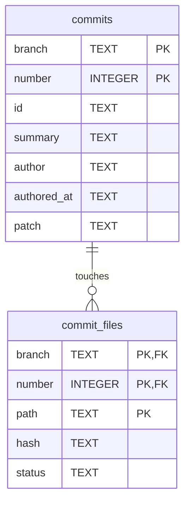

# Commit Store (adtai rebuild)

`rebuild` keeps one SQLite file per branch at `config/commits/<branch>.db`, the path `repo_commits_file` points at. It is a cache of `git log` for that branch, numbered so that a commit keeps its number for life, plus the files each commit touched with their status and content hash. `search_repo`, `calendar` and the patch commands read it instead of walking git.

## Diagram

The foreign key is declared with a cascade and switched on by the opener, so dropping a branch's commits takes their file rows with them.

## Tables

Nullable is No where the column is declared NOT NULL or belongs to the primary key.

### commits

| Column      | Type    | Nullable | Key | Meaning                                                                                                                                  |
| ----------- | ------- | -------- | --- | ---------------------------------------------------------------------------------------------------------------------------------------- |
| branch      | TEXT    | No       | PK  | The branch name as git spells it.                                                                                                        |
| number      | INTEGER | No       | PK  | The commit's number on this branch, one for the oldest, upwards without holes.                                                           |
| id          | TEXT    | No       |     | The full commit hash, unique per branch.                                                                                                 |
| summary     | TEXT    | Yes      |     | The subject line.                                                                                                                        |
| author      | TEXT    | Yes      |     | The author's e-mail address.                                                                                                             |
| authored_at | TEXT    | Yes      |     | The author date on the author's own clock: `YYYY-MM-DD HH:MM:SS+HH:MM`, the offset kept because git's is the one clock ADT does not own. |
| patch       | TEXT    | Yes      |     | The patch folder the commit touched, the first `patch/<name>/` path among its files, or NULL.                                            |

### commit_files

| Column | Type    | Nullable | Key                   | Meaning                                                                                                                  |
| ------ | ------- | -------- | --------------------- | ------------------------------------------------------------------------------------------------------------------------ |
| branch | TEXT    | No       | PK, FK commits.branch | The branch, repeated so a row is addressable without a join.                                                             |
| number | INTEGER | No       | PK, FK commits.number | The commit number the file belongs to.                                                                                   |
| path   | TEXT    | No       | PK                    | The repository-relative path.                                                                                            |
| hash   | TEXT    | Yes      |                       | SHA-1 of the file's canonical payload, line endings normalised and trailing whitespace trimmed; NULL for a deleted file. |
| status | TEXT    | Yes      |                       | Git's status letter for the file in that commit: `A` added, `M` modified, `D` deleted.                                   |

## Indexes

| Index                | Table        | Columns      | Unique |
| -------------------- | ------------ | ------------ | ------ |
| ux_commits_branch_id | commits      | branch, id   | Yes    |
| ix_commit_files_path | commit_files | branch, path | No     |

The primary keys are the numbering contract written down: a number belongs to one commit, and the unique index says a commit carries one number, so a hole or a reused number is unwritable rather than merely tested for.

## Version and lifetime

The file is at version 2. A version 1 file, which kept its row in a table called `meta` and its date under `date` with git's `T`, is lifted in place on open: every number and file row survives, and a file row whose commit is gone is dropped.

`authored_at` is the only stamp, and it is git's rather than this machine's. The store carries no refresh stamp; `rebuild` compares the numbered tail against git and appends what is new.

A branch whose history was rewritten is dropped and rebuilt, because its numbers point at commits that no longer exist. Nothing else ever renumbers. Deleting the file costs nothing: `rebuild` recreates it from git.
