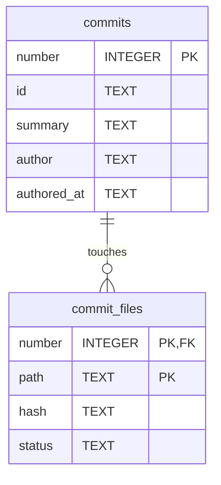

# Commit Store (adtai rebuild)

`rebuild` keeps one SQLite file per branch at `config/commits/<branch>.db`, the path `repo_commits_file` points at. It is a cache of `git log --first-parent` for that branch, each commit numbered by its position on that line, plus the files each commit touched with their status and content hash. `search`, `calendar` and the patch commands read it instead of walking git.

 

## Diagram

The foreign key is declared with a cascade and switched on by the opener, so dropping the commits takes their file rows with them.

 

## Tables

Nullable is No where the column is declared NOT NULL or belongs to the primary key.

 

### commits

| Column      | Type    | Nullable | Key | Meaning                                                                                                                                  |
| ----------- | ------- | -------- | --- | ---------------------------------------------------------------------------------------------------------------------------------------- |
| number      | INTEGER | No       | PK  | The commit's position on the branch's first-parent line, one for the oldest. A merge is one commit.                                      |
| id          | TEXT    | No       |     | The full commit hash, unique in the file.                                                                                                |
| summary     | TEXT    | Yes      |     | The subject line.                                                                                                                        |
| author      | TEXT    | Yes      |     | The author's e-mail address.                                                                                                             |
| authored_at | TEXT    | Yes      |     | The author date on the author's own clock: `YYYY-MM-DD HH:MM:SS+HH:MM`, the offset kept because git's is the one clock ADT does not own. |

 

### commit_files

| Column | Type    | Nullable | Key                   | Meaning                                                                                                                  |
| ------ | ------- | -------- | --------------------- | ------------------------------------------------------------------------------------------------------------------------ |
| number | INTEGER | No       | PK, FK commits.number | The commit number the file belongs to.                                                                                   |
| path   | TEXT    | No       | PK                    | The repository-relative path.                                                                                            |
| hash   | TEXT    | Yes      |                       | SHA-1 of the file's canonical payload, line endings normalised and trailing whitespace trimmed; NULL for a deleted file. |
| status | TEXT    | Yes      |                       | Git's status letter for the file in that commit: `A` added, `M` modified, `D` deleted.                                   |

`commit_files` is a `WITHOUT ROWID` table: its key is the row, so each file row is stored once, in key order.

 

## Indexes

| Index                | Table        | Columns | Unique |
| -------------------- | ------------ | ------- | ------ |
| ix_commit_files_path | commit_files | path    | No     |

The primary key and the uniqueness of `id` are the numbering contract written down: a number belongs to one commit and a commit carries one number, so a reused number is unwritable rather than merely tested for.

The path index serves `search`, which reads the status a path had in its previous commit when an early store wrote the file row without one.

 

## Which branch

The file holds one branch and `_meta` records which, under the key `branch_name`, written the first time a command opens the file for a branch. A second branch name that flattens to the same file name is refused rather than mixed in, so no row needs to repeat the branch.

`_meta` also records how the file is numbered, under the key `numbering`, as `first-parent`. A file without it was written by an older ADT.ai, and the next `rebuild` moves it to first-parent numbering once.

 

## Reads

Every read is bounded. `patch` reads the newest commits up to its window, `rebuild` counts through the key and looks up only the commits it just scanned, `calendar` reads one month without file rows, and `search` reads newest first a page at a time with its date, summary, file and author filters applied in SQL.

 

## Version and lifetime

The file is at version 4. A version 1 file, which kept its row in a table called `meta` and its date under `date` with git's `T`, is lifted in place on open: every number and file row survives, and a file row whose commit is gone is dropped.

A version 2 file loses its `commits.patch` column the same way. `patch` reads the patch folder a commit shipped off its `commit_files` rows, with the project's `patch_root`, which a value written by `rebuild` could not know.

A version 3 file loses `branch` from both tables and has both rebuilt on their new keys, every number, hash, file row and status kept. A file that never recorded its branch in `_meta` records it first, and a file that holds two branches is refused and left as it was.

`authored_at` is the only stamp, and it is git's rather than this machine's. The store carries no refresh stamp; `rebuild` compares the numbered tail against git and appends what is new.

A merge moves no number: it is one new commit on the first-parent line, and the commits behind its second parent are never stored. A dropped unpushed commit, a rebase or a force-push cuts the line back, and `rebuild` then forgets what the branch no longer has, so the next commit takes the freed number.

Deleting the file costs nothing: `rebuild` recreates it from git with the same numbers.
