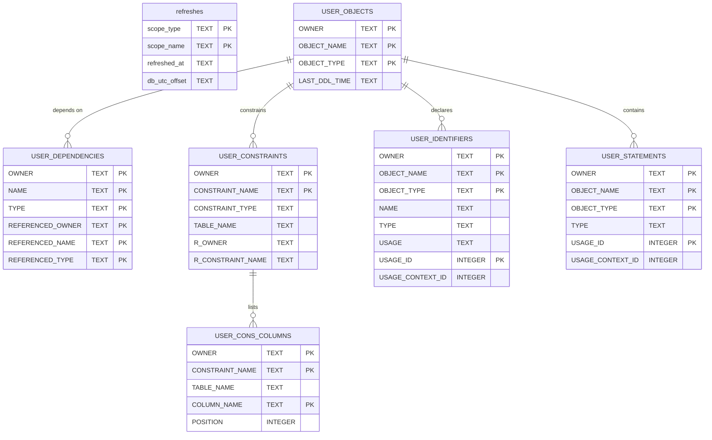

# Dictionary Mirror (adtai dependencies)

`dependencies` keeps a local mirror of the Oracle data dictionary in `config/internal/dependencies.db`, so every query answers offline. Tables and columns carry the dictionary's own names, upper case, and hold only the columns a query mode or a generated artifact reads.

The `USER_*` views scope themselves to the connected schema and carry no owner, so the mirror adds a leading `OWNER` to each and one file holds many schemas. This page is the schema half, refreshed per schema; the APEX half, refreshed per application, is on [storage_dependencies_apex.md](storage_dependencies_apex.md).

## Diagram

The mirror declares no foreign keys, because the dictionary declares none either: the lines follow the owner and name pairs the views share.

## Tables

Nullable is No where the column is declared NOT NULL or belongs to the primary key. Every `USER_*` table's first column is the `OWNER` the mirror adds.

### refreshes

| Column        | Type | Nullable | Key | Meaning                                                                                                                              |
| ------------- | ---- | -------- | --- | ------------------------------------------------------------------------------------------------------------------------------------ |
| scope_type    | TEXT | No       | PK  | `schema` for the schema half, `app` for an application refreshed by the APEX half.                                                   |
| scope_name    | TEXT | No       | PK  | The owner, upper case, or the application id.                                                                                        |
| refreshed_at  | TEXT | Yes      |     | When the scope was last refreshed: `YYYY-MM-DD HH:MM:SS` on this machine's local clock.                                              |
| db_utc_offset | TEXT | Yes      |     | The database's UTC offset, `+02:00` shape, read on that refresh so a mirrored `LAST_DDL_TIME` is read on the clock that produced it. |

### USER_OBJECTS

| Column        | Type | Nullable | Key | Meaning                                                                                |
| ------------- | ---- | -------- | --- | -------------------------------------------------------------------------------------- |
| OWNER         | TEXT | No       | PK  | The schema.                                                                            |
| OBJECT_NAME   | TEXT | No       | PK  | The object's name.                                                                     |
| OBJECT_TYPE   | TEXT | No       | PK  | `TABLE`, `VIEW`, `PACKAGE`, `PACKAGE BODY` and the rest of Oracle's object types.      |
| LAST_DDL_TIME | TEXT | Yes      |     | The last DDL on the object, `YYYY-MM-DD HH:MM:SS` on the database server's wall clock. |

### USER_DEPENDENCIES

| Column           | Type | Nullable | Key | Meaning                                 |
| ---------------- | ---- | -------- | --- | --------------------------------------- |
| OWNER            | TEXT | No       | PK  | The schema of the dependent object.     |
| NAME             | TEXT | No       | PK  | The dependent object.                   |
| TYPE             | TEXT | No       | PK  | Its type.                               |
| REFERENCED_OWNER | TEXT | No       | PK  | The schema of the object it depends on. |
| REFERENCED_NAME  | TEXT | No       | PK  | That object's name.                     |
| REFERENCED_TYPE  | TEXT | No       | PK  | That object's type.                     |

### USER_CONSTRAINTS

| Column            | Type | Nullable | Key | Meaning                                                        |
| ----------------- | ---- | -------- | --- | -------------------------------------------------------------- |
| OWNER             | TEXT | No       | PK  | The schema.                                                    |
| CONSTRAINT_NAME   | TEXT | No       | PK  | The constraint's name.                                         |
| CONSTRAINT_TYPE   | TEXT | Yes      |     | `P` primary key, `R` foreign key, `U` unique, `C` check.       |
| TABLE_NAME        | TEXT | No       |     | The table the constraint is on.                                |
| R_OWNER           | TEXT | Yes      |     | For a foreign key, the schema of the constraint it references. |
| R_CONSTRAINT_NAME | TEXT | Yes      |     | For a foreign key, the referenced constraint.                  |

### USER_CONS_COLUMNS

| Column          | Type    | Nullable | Key | Meaning                                      |
| --------------- | ------- | -------- | --- | -------------------------------------------- |
| OWNER           | TEXT    | No       | PK  | The schema.                                  |
| CONSTRAINT_NAME | TEXT    | No       | PK  | The constraint.                              |
| TABLE_NAME      | TEXT    | No       |     | The table.                                   |
| COLUMN_NAME     | TEXT    | No       | PK  | One column the constraint covers.            |
| POSITION        | INTEGER | Yes      |     | The column's position within the constraint. |

### USER_IDENTIFIERS

| Column           | Type    | Nullable | Key | Meaning                                                                                |
| ---------------- | ------- | -------- | --- | -------------------------------------------------------------------------------------- |
| OWNER            | TEXT    | No       | PK  | The schema.                                                                            |
| OBJECT_NAME      | TEXT    | No       | PK  | The compilation unit PL/Scope analysed.                                                |
| OBJECT_TYPE      | TEXT    | No       | PK  | The unit's type.                                                                       |
| NAME             | TEXT    | Yes      |     | The identifier.                                                                        |
| TYPE             | TEXT    | Yes      |     | `VARIABLE`, `FUNCTION`, `COLUMN`, `TABLE` and the rest of PL/Scope's identifier types. |
| USAGE            | TEXT    | Yes      |     | `DECLARATION`, `DEFINITION`, `REFERENCE`, `CALL` or `ASSIGNMENT`.                      |
| USAGE_ID         | INTEGER | No       | PK  | The usage's number, unique within the unit.                                            |
| USAGE_CONTEXT_ID | INTEGER | Yes      |     | The `USAGE_ID` of the enclosing usage.                                                 |

### USER_STATEMENTS

| Column           | Type    | Nullable | Key | Meaning                                                                                                 |
| ---------------- | ------- | -------- | --- | ------------------------------------------------------------------------------------------------------- |
| OWNER            | TEXT    | No       | PK  | The schema.                                                                                             |
| OBJECT_NAME      | TEXT    | No       | PK  | The compilation unit.                                                                                   |
| OBJECT_TYPE      | TEXT    | No       | PK  | The unit's type.                                                                                        |
| TYPE             | TEXT    | Yes      |     | `SELECT`, `INSERT`, `UPDATE`, `DELETE`, `EXECUTE IMMEDIATE` and the rest of PL/Scope's statement types. |
| USAGE_ID         | INTEGER | No       | PK  | The statement's number, unique within the unit.                                                         |
| USAGE_CONTEXT_ID | INTEGER | Yes      |     | The `USAGE_ID` of the enclosing usage.                                                                  |

## Indexes

| Index                                | Table             | Columns                                            | Unique |
| ------------------------------------ | ----------------- | -------------------------------------------------- | ------ |
| ix_user_objects_type_owner           | USER_OBJECTS      | OBJECT_TYPE, OWNER                                 | No     |
| ix_user_dependencies_referenced      | USER_DEPENDENCIES | REFERENCED_OWNER, REFERENCED_TYPE, REFERENCED_NAME | No     |
| ix_user_dependencies_referenced_node | USER_DEPENDENCIES | REFERENCED_TYPE, REFERENCED_NAME, REFERENCED_OWNER | No     |
| ix_user_dependencies_source          | USER_DEPENDENCIES | TYPE, NAME                                         | No     |
| ix_user_constraints_table            | USER_CONSTRAINTS  | TABLE_NAME, OWNER                                  | No     |
| ix_user_constraints_referenced       | USER_CONSTRAINTS  | R_OWNER, R_CONSTRAINT_NAME                         | No     |
| ix_user_cons_columns_table           | USER_CONS_COLUMNS | OWNER, TABLE_NAME                                  | No     |

## Version and lifetime

The file is at version 4. A version 3 file, which kept its refresh stamps as `_meta` rows and named its indexes `idx_`, is lifted in place on either path with every row kept. A file older than that is wiped and rebuilt by a refresh and refused by a query mode, so nothing destructive can happen mid-report.

A refresh replaces the rows of the scope it covers, a schema or an application, and writes that scope's `refreshes` row. `-force` deletes the scope first, and bare `-recent` patches per object instead of replacing. A table the schema no longer has, `ALL_USERS`, is dropped on every open.
