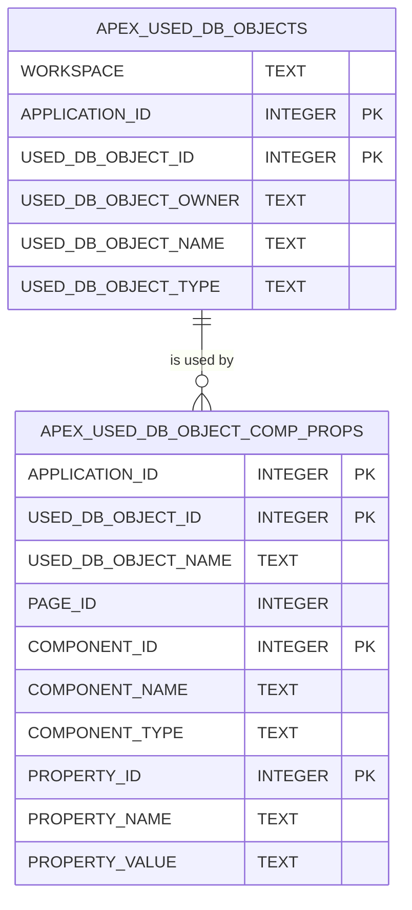

# APEX Usage Mirror (adtai dependencies)

The APEX half of `config/internal/dependencies.db`, refreshed per application with `-app`, is what lets `-impact` name the page, component and property that use a database object. Two APEX dictionary views are mirrored under their own names and keyed by application id, so a second application's refresh never touches the first. The schema half is on [storage_dependencies.md](storage_dependencies.md).

 

## Diagram

The mirror declares no foreign keys; the lines follow the `APPLICATION_ID` and `USED_DB_OBJECT_ID` pair both tables carry.

 

## Tables

Nullable is No where the column is declared NOT NULL or belongs to the primary key.

 

### APEX_USED_DB_OBJECTS

| Column               | Type    | Nullable | Key | Meaning                                               |
| -------------------- | ------- | -------- | --- | ----------------------------------------------------- |
| WORKSPACE            | TEXT    | Yes      |     | The workspace name.                                   |
| APPLICATION_ID       | INTEGER | No       | PK  | The application.                                      |
| USED_DB_OBJECT_ID    | INTEGER | No       | PK  | APEX's id for one used object within the application. |
| USED_DB_OBJECT_OWNER | TEXT    | Yes      |     | The schema of the database object.                    |
| USED_DB_OBJECT_NAME  | TEXT    | Yes      |     | The object's name.                                    |
| USED_DB_OBJECT_TYPE  | TEXT    | Yes      |     | The object's type as APEX resolved it.                |

 

### APEX_USED_DB_OBJECT_COMP_PROPS

| Column              | Type    | Nullable | Key | Meaning                                                             |
| ------------------- | ------- | -------- | --- | ------------------------------------------------------------------- |
| APPLICATION_ID      | INTEGER | No       | PK  | The application.                                                    |
| USED_DB_OBJECT_ID   | INTEGER | No       | PK  | The used object, as above.                                          |
| USED_DB_OBJECT_NAME | TEXT    | Yes      |     | The object's name, repeated for the lookup index.                   |
| PAGE_ID             | INTEGER | Yes      |     | The page the component is on; NULL for a shared component.          |
| COMPONENT_ID        | INTEGER | No       | PK  | APEX's internal id of the component.                                |
| COMPONENT_NAME      | TEXT    | Yes      |     | The component's name or label.                                      |
| COMPONENT_TYPE      | TEXT    | Yes      |     | Region, item, process, list and the rest of APEX's component types. |
| PROPERTY_ID         | INTEGER | No       | PK  | APEX's id of the property that references the object.               |
| PROPERTY_NAME       | TEXT    | Yes      |     | The property's display name.                                        |
| PROPERTY_VALUE      | TEXT    | Yes      |     | The property's value, the SQL or PL/SQL that names the object.      |

 

## Indexes

| Index                                  | Table                          | Columns                                   | Unique |
| -------------------------------------- | ------------------------------ | ----------------------------------------- | ------ |
| ix_apex_used_db_objects_lookup         | APEX_USED_DB_OBJECTS           | USED_DB_OBJECT_OWNER, USED_DB_OBJECT_NAME | No     |
| ix_apex_used_db_object_comp_props_name | APEX_USED_DB_OBJECT_COMP_PROPS | USED_DB_OBJECT_NAME, APPLICATION_ID       | No     |

Every index serves the same question, which components use this object, asked by owner and name.

 

## Lifetime

An application refresh replaces that application's rows in both tables and writes the application's `refreshes` row, `app` and its id, described on the schema half's page. Until version 5 a third table mirrored `APEX_USED_DB_OBJ_DEPENDENCIES`; nothing read it back, so the lift drops it.

The component ids are stored as INTEGER, because the queries sort and join on them numerically; the flow store keeps its copy as text for ids that exceed a signed 64-bit integer. The conventions page records the difference as a standing one.
