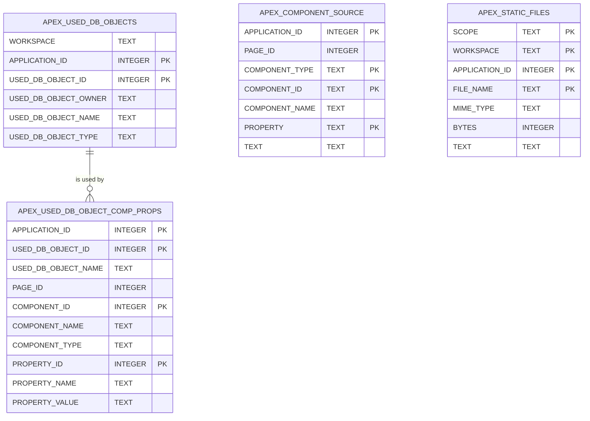

# APEX Usage Mirror (adtai rebuild)

The APEX half of `config/internal/dependencies.db`, refreshed per application with `rebuild -app`, is what lets `search -impact` name the page, component and property that use a database object. Two APEX dictionary views are mirrored under their own names and keyed by application id, so a second application's refresh never touches the first. The schema half is on [storage_dependencies.md](storage_dependencies.md).

Beside them sit the two text mirrors `search TERM` reads for its APEX and STATIC layers: every component's text properties, and the static files.

 

## Diagram

The mirror declares no foreign keys; the lines follow the `APPLICATION_ID` and `USED_DB_OBJECT_ID` pair both tables carry. The two text mirrors share only the application id with them and draw no line.

 

## Tables

Nullable is No where the column is declared NOT NULL or belongs to the primary key. SQLite enforces only the declaration, so a key column can still hold NULL, as `COMPONENT_ID` does from APEX 24.2.

 

### APEX_USED_DB_OBJECTS

| Column               | Type    | Nullable | Key | Meaning                                               |
| -------------------- | ------- | -------- | --- | ----------------------------------------------------- |
| WORKSPACE            | TEXT    | Yes      |     | The workspace name.                                   |
| APPLICATION_ID       | INTEGER | No       | PK  | The application.                                      |
| USED_DB_OBJECT_ID    | INTEGER | No       | PK  | APEX's id for one used object within the application. |
| USED_DB_OBJECT_OWNER | TEXT    | Yes      |     | The schema of the database object.                    |
| USED_DB_OBJECT_NAME  | TEXT    | Yes      |     | The object's name.                                    |
| USED_DB_OBJECT_TYPE  | TEXT    | Yes      |     | The object's type as APEX resolved it.                |

 

### APEX_USED_DB_OBJECT_COMP_PROPS

| Column              | Type    | Nullable | Key | Meaning                                                             |
| ------------------- | ------- | -------- | --- | ------------------------------------------------------------------- |
| APPLICATION_ID      | INTEGER | No       | PK  | The application.                                                    |
| USED_DB_OBJECT_ID   | INTEGER | No       | PK  | The used object, as above.                                          |
| USED_DB_OBJECT_NAME | TEXT    | Yes      |     | The object's name, repeated for the lookup index.                   |
| PAGE_ID             | INTEGER | Yes      |     | The page the component is on; NULL for a shared component.          |
| COMPONENT_ID        | INTEGER | No       | PK  | APEX's internal id of the component; NULL on APEX 24.2 and later.   |
| COMPONENT_NAME      | TEXT    | Yes      |     | The component's name or label.                                      |
| COMPONENT_TYPE      | TEXT    | Yes      |     | Region, item, process, list and the rest of APEX's component types. |
| PROPERTY_ID         | INTEGER | No       | PK  | APEX's id of the property that references the object.               |
| PROPERTY_NAME       | TEXT    | Yes      |     | The property's display name.                                        |
| PROPERTY_VALUE      | TEXT    | Yes      |     | The property's value, the SQL or PL/SQL that names the object.      |

APEX 24.2 and later give a component no id, so there `COMPONENT_ID` is NULL and `search -app` tells components apart by page, type and name.

 

### APEX_COMPONENT_SOURCE

One row per non-empty text property of a component, unpivoted from the `APEX_APPLICATION_*` views: page JavaScript, dynamic actions and their actions, buttons, items, regions, processes, validations, computations, lists of values, plugins, authorization and authentication schemes, templates, list entries, the navigation bar and branches.

| Column         | Type    | Nullable | Key | Meaning                                                                                                         |
| -------------- | ------- | -------- | --- | --------------------------------------------------------------------------------------------------------------- |
| APPLICATION_ID | INTEGER | No       | PK  | The application.                                                                                                |
| PAGE_ID        | INTEGER | Yes      |     | The page the component is on; NULL for a shared component.                                                      |
| COMPONENT_TYPE | TEXT    | No       | PK  | `PAGE`, `DYNAMIC ACTION`, `DA ACTION`, `REGION`, `PLUGIN`, `PAGE TEMPLATE` and the rest of the reader's labels. |
| COMPONENT_ID   | TEXT    | No       | PK  | The view's own id, as text: an APEX id can pass 64 bits. The application id for an application-level property.  |
| COMPONENT_NAME | TEXT    | Yes      |     | The component's name; a dynamic action's action carries the name of its dynamic action.                         |
| PROPERTY       | TEXT    | No       | PK  | The dictionary column, `JAVASCRIPT_CODE` or `ATTRIBUTE_01`, or `ATTRIBUTES.<key>` for a key of the JSON column. |
| TEXT           | TEXT    | Yes      |     | The property's text, never empty and never `{}`.                                                                |

 

### APEX_STATIC_FILES

The application's files, the files of the plugins it carries, and its workspace's files.

| Column         | Type    | Nullable | Key | Meaning                                                                                                |
| -------------- | ------- | -------- | --- | ------------------------------------------------------------------------------------------------------ |
| SCOPE          | TEXT    | No       | PK  | `APP`, `PLUGIN` or `WORKSPACE`.                                                                        |
| WORKSPACE      | TEXT    | No       | PK  | The workspace the application belongs to.                                                              |
| APPLICATION_ID | INTEGER | No       | PK  | The application; 0 for a workspace file, which belongs to no one application.                          |
| FILE_NAME      | TEXT    | No       | PK  | The file's path; a plugin file is written `<plugin name>/<file name>`.                                 |
| MIME_TYPE      | TEXT    | Yes      |     | The MIME type APEX recorded.                                                                           |
| BYTES          | INTEGER | Yes      |     | The file's size.                                                                                       |
| TEXT           | TEXT    | Yes      |     | The decoded content of a text file; NULL for a binary one, or one that does not decode in its charset. |

 

## Indexes

| Index                                  | Table                          | Columns                                   | Unique |
| -------------------------------------- | ------------------------------ | ----------------------------------------- | ------ |
| ix_apex_used_db_objects_lookup         | APEX_USED_DB_OBJECTS           | USED_DB_OBJECT_OWNER, USED_DB_OBJECT_NAME | No     |
| ix_apex_used_db_object_comp_props_name | APEX_USED_DB_OBJECT_COMP_PROPS | USED_DB_OBJECT_NAME, APPLICATION_ID       | No     |

Every index serves the same question, which components use this object, asked by owner and name.

 

## Lifetime

An application refresh replaces that application's rows in both tables and writes the application's `refreshes` row, `app` and its id, described on the schema half's page. Until version 5 a third table mirrored `APEX_USED_DB_OBJ_DEPENDENCIES`; nothing read it back, so the lift drops it.

The two text mirrors arrived with version 6. Every application refresh replaces them whole, `-force` or not, because the dictionary keeps no change stamp per component: the component rows and the `APP` and `PLUGIN` files by application id, the `WORKSPACE` files by the application's workspace. It then stamps `apex_source` with the application id, the one stamp `search TERM` trusts here.

The component reader is driven by a spec of views and columns rather than one query per APEX release. The columns the connected release has are read once per run from `ALL_TAB_COLUMNS`, so a column an older release lacks is left out of the SELECT, and a view left without a text column is skipped.

A static file whose MIME type or extension says text is text when its bytes decode in its own charset, UTF-8 by default, and hold no NUL byte. One whose MIME type or extension says binary, an image, audio, video, font, archive or PDF, stays binary unread.

A file that says neither is judged by its bytes: text when they decode strictly, hold no NUL and no control character other than tab, newline, carriage return and form feed. That is how CSS a workspace serves as `application/octet-stream` under a bare name stays searchable.

The component ids are stored as INTEGER, because the queries sort and join on them numerically; the flow store keeps its copy as text for ids that exceed a signed 64-bit integer. The conventions page records the difference as a standing one.
