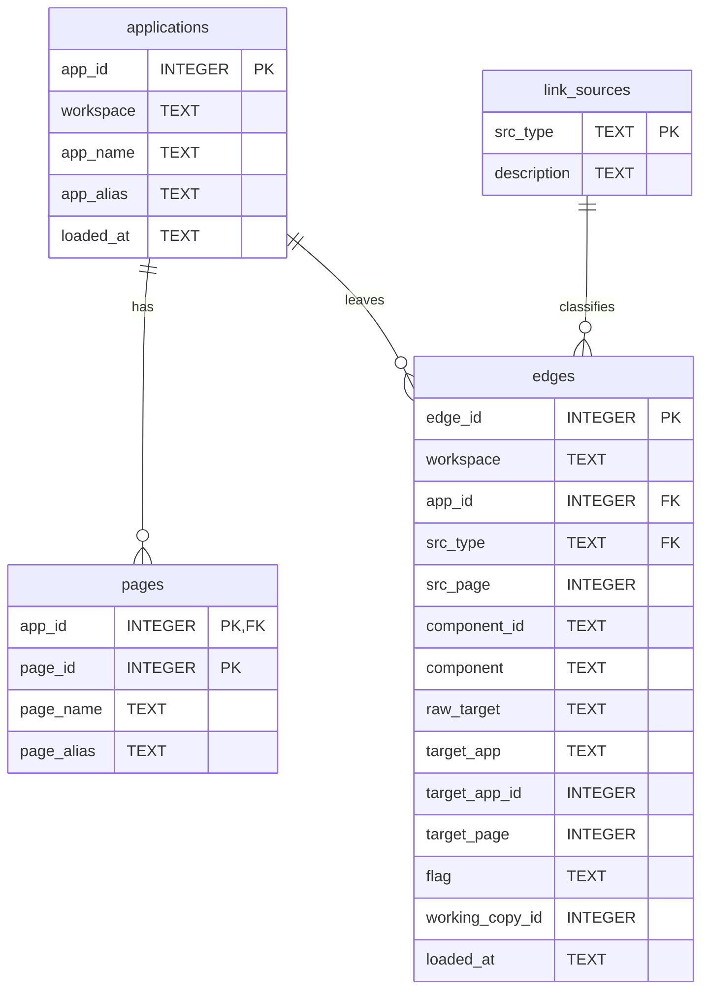

# Navigation Store (adtai flow)

`flow -refresh` scrapes one application's links out of the APEX dictionary into `config/internal/flow.db`, and every later `flow` question is answered from the file. Four tables: the application, its pages, a catalog of the twelve link sources the scrape resolves statically, and one row per link found.

## Diagram

The foreign keys are declared with a cascade and switched on by the opener, so deleting an application row takes its pages and edges with it.

## Tables

Nullable is No where the column is declared NOT NULL or belongs to the primary key.

### applications

| Column    | Type    | Nullable | Key | Meaning                                                                                    |
| --------- | ------- | -------- | --- | ------------------------------------------------------------------------------------------ |
| app_id    | INTEGER | No       | PK  | The application id.                                                                        |
| workspace | TEXT    | No       |     | The workspace name.                                                                        |
| app_name  | TEXT    | Yes      |     | The name.                                                                                  |
| app_alias | TEXT    | Yes      |     | The alias.                                                                                 |
| loaded_at | TEXT    | Yes      |     | When the application was last refreshed: UTC, `YYYY-MM-DD HH:MM:SS`, this machine's clock. |

### pages

| Column     | Type    | Nullable | Key                        | Meaning                              |
| ---------- | ------- | -------- | -------------------------- | ------------------------------------ |
| app_id     | INTEGER | No       | PK, FK applications.app_id | The application the page belongs to. |
| page_id    | INTEGER | No       | PK                         | The page number.                     |
| page_name  | TEXT    | Yes      |                            | The name.                            |
| page_alias | TEXT    | Yes      |                            | The alias.                           |

### link_sources

| Column      | Type | Nullable | Key | Meaning                                                                                                                                                          |
| ----------- | ---- | -------- | --- | ---------------------------------------------------------------------------------------------------------------------------------------------------------------- |
| src_type    | TEXT | No       | PK  | `BRANCH`, `BUTTON`, `TAB`, `PARENT_TAB`, `LIST_ENTRY`, `BREADCRUMB`, `NAV_BAR`, `IR_COL_LINK`, `RPT_COL_LINK`, `CHART_SERIES`, `REGION_LINK` or `PAGE_DUP_GOTO`. |
| description | TEXT | Yes      |     | What the source is, reseeded on every open.                                                                                                                      |

### edges

| Column          | Type              | Nullable | Key                      | Meaning                                                                                                                   |
| --------------- | ----------------- | -------- | ------------------------ | ------------------------------------------------------------------------------------------------------------------------- |
| edge_id         | INTEGER           | No       | PK                       | Assigned by SQLite and never reused.                                                                                      |
| workspace       | TEXT              | No       |                          | The workspace, repeated for its index.                                                                                    |
| app_id          | INTEGER           | No       | FK applications.app_id   | The application the link is in.                                                                                           |
| src_type        | TEXT              | No       | FK link_sources.src_type | Which kind of component carries the link.                                                                                 |
| src_page        | INTEGER           | Yes      |                          | The page the link is on; NULL for a shared component.                                                                     |
| component_id    | TEXT              | Yes      |                          | APEX's id of the component, kept as text because the ids exceed a signed 64-bit integer.                                  |
| component       | TEXT              | Yes      |                          | The component's name or label.                                                                                            |
| raw_target      | TEXT              | Yes      |                          | The link target as APEX stores it.                                                                                        |
| target_app      | TEXT              | Yes      |                          | The application token in the link, as written.                                                                            |
| target_app_id   | INTEGER           | Yes      |                          | The resolved target application: the application itself for a `PAGE` link, the named one for `CROSS_APP`, NULL otherwise. |
| target_page     | INTEGER           | Yes      |                          | The resolved target page.                                                                                                 |
| flag            | TEXT              | No       |                          | How far the target resolved: `PAGE`, `CROSS_APP`, `DYNAMIC`, `OTHER` or `NONE`, enforced by a check constraint.           |
| working_copy_id | INTEGER DEFAULT 0 | No       |                          | Zero for the application itself, otherwise the working copy the link was scraped from.                                    |
| loaded_at       | TEXT              | Yes      |                          | When the row was written: UTC, `YYYY-MM-DD HH:MM:SS`, this machine's clock.                                               |

## Indexes

| Index              | Table | Columns                                         | Unique |
| ------------------ | ----- | ----------------------------------------------- | ------ |
| ux_edges_component | edges | app_id, src_type, component_id, working_copy_id | Yes    |
| ix_edges_target    | edges | target_app_id, target_page, flag                | No     |
| ix_edges_source    | edges | app_id, src_page                                | No     |
| ix_edges_workspace | edges | workspace, app_id                               | No     |

The unique index is what makes a refresh an upsert: the same component scraped again replaces its row. The two directional indexes answer the two questions the command asks, what links into a page and what leaves it.

## Version and lifetime

The file is at version 1, the first it carries. A file from before it wore an `apex_` prefix on every table and no version; it is a cache, so the opener drops the old tables, creates these, and the next `flow -refresh` per application refills them. The link source catalog is reseeded on every open.

Both stamps are this machine's clock in UTC. A refresh rewrites one application's rows and leaves every other application in the file untouched.
