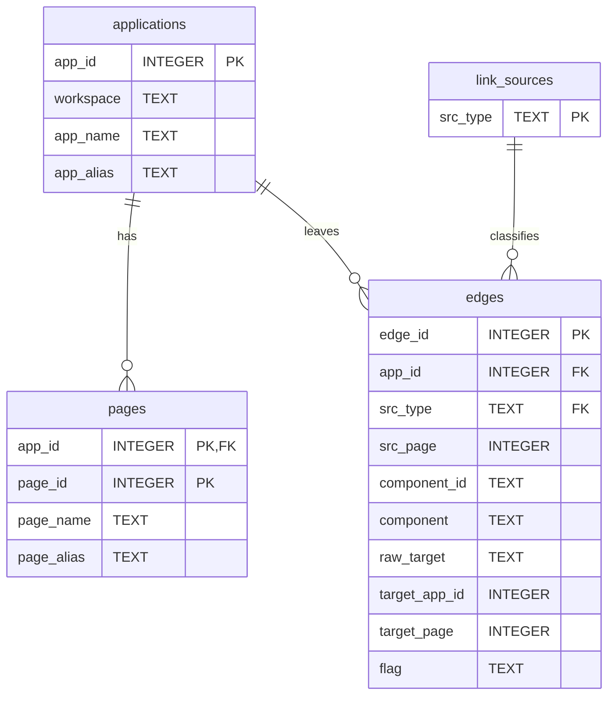

# Navigation Store (adtai rebuild)

`rebuild -app` scrapes one application's links out of the APEX dictionary into `config/internal/flow.db`, and every later `search -to` or `-from` on a page is answered from the file. Four tables: the application, its pages, a catalog of the twelve link sources the scrape resolves statically, and one row per link found.

 

## Diagram

The foreign keys are declared with a cascade and switched on by the opener, so deleting an application row takes its pages and edges with it.

 

## Tables

Nullable is No where the column is declared NOT NULL or belongs to the primary key.

 

### applications

| Column    | Type    | Nullable | Key | Meaning                                                                                    |
| --------- | ------- | -------- | --- | ------------------------------------------------------------------------------------------ |
| app_id    | INTEGER | No       | PK  | The application id.                                                                        |
| workspace | TEXT    | No       |     | The workspace name.                                                                        |
| app_name  | TEXT    | Yes      |     | The name.                                                                                  |
| app_alias | TEXT    | Yes      |     | The alias.                                                                                 |

 

### pages

| Column     | Type    | Nullable | Key                        | Meaning                              |
| ---------- | ------- | -------- | -------------------------- | ------------------------------------ |
| app_id     | INTEGER | No       | PK, FK applications.app_id | The application the page belongs to. |
| page_id    | INTEGER | No       | PK                         | The page number.                     |
| page_name  | TEXT    | Yes      |                            | The name.                            |
| page_alias | TEXT    | Yes      |                            | The alias.                           |

 

### link_sources

| Column   | Type | Nullable | Key | Meaning                                                                                                                                                          |
| -------- | ---- | -------- | --- | ---------------------------------------------------------------------------------------------------------------------------------------------------------------- |
| src_type | TEXT | No       | PK  | `BRANCH`, `BUTTON`, `TAB`, `PARENT_TAB`, `LIST_ENTRY`, `BREADCRUMB`, `NAV_BAR`, `IR_COL_LINK`, `RPT_COL_LINK`, `CHART_SERIES`, `REGION_LINK` or `PAGE_DUP_GOTO`. |

 

### edges

| Column        | Type    | Nullable | Key                      | Meaning                                                                                                                   |
| ------------- | ------- | -------- | ------------------------ | ------------------------------------------------------------------------------------------------------------------------- |
| edge_id       | INTEGER | No       | PK                       | Assigned by SQLite and never reused.                                                                                      |
| app_id        | INTEGER | No       | FK applications.app_id   | The application the link is in.                                                                                           |
| src_type      | TEXT    | No       | FK link_sources.src_type | Which kind of component carries the link.                                                                                 |
| src_page      | INTEGER | Yes      |                          | The page the link is on; NULL for a shared component.                                                                     |
| component_id  | TEXT    | Yes      |                          | APEX's id of the component, kept as text because the ids exceed a signed 64-bit integer.                                  |
| component     | TEXT    | Yes      |                          | The component's name or label.                                                                                            |
| raw_target    | TEXT    | Yes      |                          | The link target as APEX stores it, with `&APP_ID.` replaced by the application id.                                        |
| target_app_id | INTEGER | Yes      |                          | The resolved target application: the application itself for a `PAGE` link, the named one for `CROSS_APP`, NULL otherwise. |
| target_page   | INTEGER | Yes      |                          | The resolved target page.                                                                                                 |
| flag          | TEXT    | No       |                          | How far the target resolved: `PAGE`, `CROSS_APP`, `DYNAMIC`, `OTHER` or `NONE`, enforced by a check constraint.           |

 

## Indexes

| Index              | Table | Columns                          | Unique |
| ------------------ | ----- | -------------------------------- | ------ |
| ux_edges_component | edges | app_id, src_type, component_id   | Yes    |
| ix_edges_target    | edges | target_app_id, target_page, flag | No     |
| ix_edges_source    | edges | app_id, src_page                 | No     |

The unique index is what makes a refresh an upsert: the same component scraped again replaces its row. The two directional indexes answer the two questions `search` asks of a page, what links into it and what leaves it.

 

## Version and lifetime

The file is at version 2. A file from before version 1 wore an `apex_` prefix on every table and no version; it is a cache, so the opener drops the old tables, creates these, and the next `rebuild -app` per application refills them. The link source catalog is reseeded on every open.

A version 1 file is lifted in place with every row kept. It loses the columns nothing read back: the edge's `workspace`, `target_app`, `working_copy_id` and `loaded_at`, the link source's `description`, the application's `loaded_at`, and the workspace index. `working_copy_id` was always zero, so the unique index names the same edges without it.

The stamp is this machine's clock in UTC. A refresh rewrites one application's rows and leaves every other application in the file untouched.
