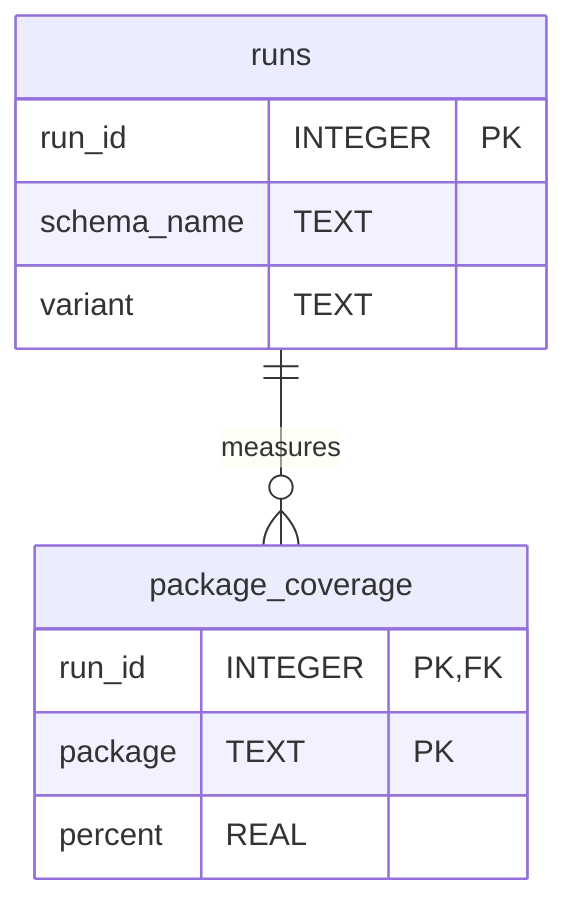

# Run History (adtai ut)

`ut` records every run in `config/internal/ut.db`: one row per run per schema, and one row per package the run measured, so `-verbose` can say what moved since the last run that differed. The last twenty runs per schema are kept, and a root that cannot be written skips the history and runs normally.

 

## Diagram

The foreign key is declared with a cascade and switched on by the opener, so pruning a run takes its package rows with it.

 

## Tables

Nullable is No where the column is declared NOT NULL or belongs to the primary key.

 

### runs

| Column      | Type    | Nullable | Key | Meaning                                                                                                                                                                                |
| ----------- | ------- | -------- | --- | -------------------------------------------------------------------------------------------------------------------------------------------------------------------------------------- |
| run_id      | INTEGER | No       | PK  | Assigned by SQLite and never reused, so a pruned number does not come back.                                                                                                            |
| schema_name | TEXT    | No       |     | The schema, upper case, so two spellings read one history.                                                                                                                             |
| variant     | TEXT    | Yes      |     | What the run selected: `%` for every suite, otherwise the `-name` selection as the timers key it. NULL on a row written before the column existed, and such a row is never a baseline. |

 

### package_coverage

| Column  | Type    | Nullable | Key                | Meaning                                                                                                                                     |
| ------- | ------- | -------- | ------------------ | ------------------------------------------------------------------------------------------------------------------------------------------- |
| run_id  | INTEGER | No       | PK, FK runs.run_id | The run.                                                                                                                                    |
| package | TEXT    | No       | PK                 | The package name, upper case.                                                                                                               |
| percent | REAL    | Yes      |                    | Covered over total; NULL when the collector saw no blocks, so a package scoring nothing and a package measured as nothing never look alike. |

 

## Indexes

| Index          | Table | Columns             | Unique |
| -------------- | ----- | ------------------- | ------ |
| ix_runs_schema | runs  | schema_name, run_id | No     |

One index, for the one question the store answers: this schema's runs, newest first.

 

## Version and lifetime

The file is at version 2. A file from before version 1 is lifted in place with every run kept: the index takes its prefix and a file older than the `variant` column gets the column.

A version 1 file loses the columns no comparison read, the run's `recorded_at` and each package's `lines`, `blocks_total` and `blocks_covered`, and keeps every run and every percent.

After each write the store keeps the newest twenty runs of that schema and deletes the rest with their package rows. Delete the file to start over; the next run recreates it and the comparison table stays empty until a second run differs.
