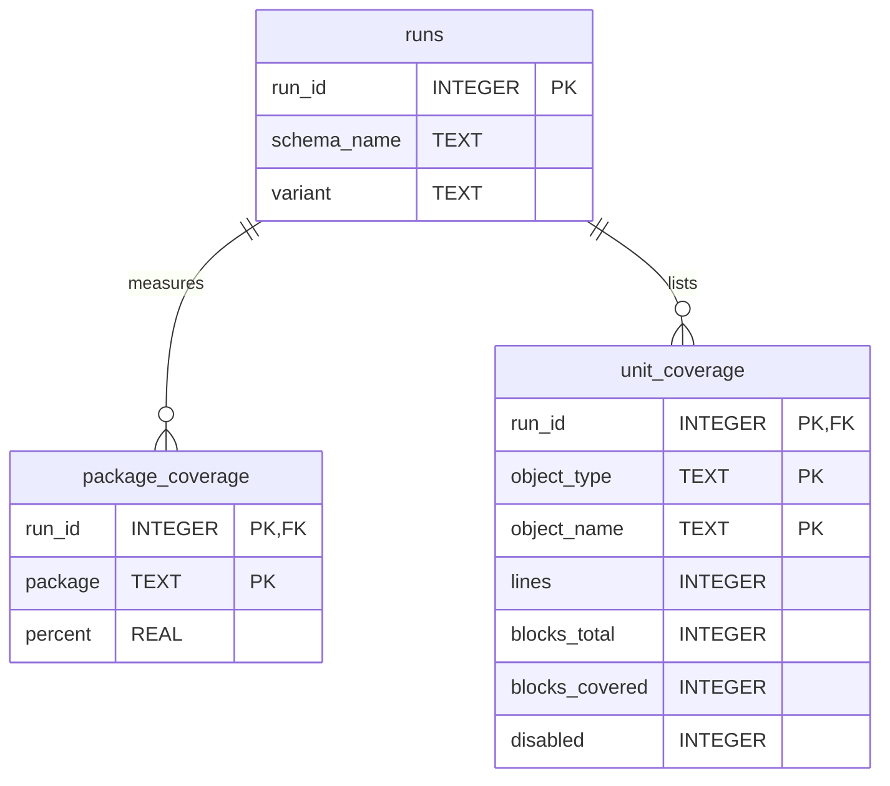

# Run History (adtai ut)

`ut` records every run in `config/internal/ut.db`: one row per run per schema, one per package it measured, so `-verbose` can say what moved since the last run that differed, and one per other unit listed. The last twenty runs per schema and `-name` selection are kept, and a root that cannot be written skips the history and runs normally.

 

## Diagram

```mermaid
erDiagram
    runs {
        run_id INTEGER PK
        schema_name TEXT
        variant TEXT
    }
    package_coverage {
        run_id INTEGER PK, FK
        package TEXT PK
        percent REAL
    }
    unit_coverage {
        run_id INTEGER PK, FK
        object_type TEXT PK
        object_name TEXT PK
        lines INTEGER
        blocks_total INTEGER
        blocks_covered INTEGER
        disabled INTEGER
    }
    runs ||--o{ package_coverage : measures
    runs ||--o{ unit_coverage : lists
```

The foreign keys are declared with a cascade and switched on by the opener, so pruning a run takes its package and unit rows with it.

 

## Tables

Nullable is No where the column is declared NOT NULL or belongs to the primary key.

 

### runs

| Column      | Type    | Nullable | Key | Meaning                                                                                                                                                                                |
| ----------- | ------- | -------- | --- | -------------------------------------------------------------------------------------------------------------------------------------------------------------------------------------- |
| run_id      | INTEGER | No       | PK  | Assigned by SQLite and never reused, so a pruned number does not come back.                                                                                                            |
| schema_name | TEXT    | No       |     | The schema, upper case, so two spellings read one history.                                                                                                                             |
| variant     | TEXT    | Yes      |     | What the run selected: `%` for every suite, otherwise the `-name` selection as the timers key it. NULL on a row written before the column existed, and such a row is never a baseline. |

 

### package_coverage

| Column  | Type    | Nullable | Key                | Meaning                                                                                                                                     |
| ------- | ------- | -------- | ------------------ | ------------------------------------------------------------------------------------------------------------------------------------------- |
| run_id  | INTEGER | No       | PK, FK runs.run_id | The run.                                                                                                                                    |
| package | TEXT    | No       | PK                 | The package name, upper case.                                                                                                               |
| percent | REAL    | Yes      |                    | Covered over total; NULL when the collector saw no blocks, so a package scoring nothing and a package measured as nothing never look alike. |

 

### unit_coverage

Every non-package unit the run listed, entered or not, kept apart from the packages so no comparison can read one; `OTHER UNITS:` prints the entered ones.

| Column         | Type    | Nullable | Key                | Meaning                                                                                   |
| -------------- | ------- | -------- | ------------------ | ----------------------------------------------------------------------------------------- |
| run_id         | INTEGER | No       | PK, FK runs.run_id | The run.                                                                                  |
| object_type    | TEXT    | No       | PK                 | `TYPE BODY`, `PROCEDURE`, `FUNCTION` or `TRIGGER`; a trigger and a procedure share names. |
| object_name    | TEXT    | No       | PK                 | The unit name, upper case.                                                                |
| lines          | INTEGER | No       |                    | Its source line count.                                                                    |
| blocks_total   | INTEGER | No       |                    | Blocks the collector saw, `NOT_FEASIBLE` excluded; 0 when nothing entered the unit.       |
| blocks_covered | INTEGER | No       |                    | Of those, the blocks that ran.                                                            |
| disabled       | INTEGER | No       |                    | 1 for a DISABLED trigger, which has no figure; 0 otherwise.                               |

 

## Indexes

| Index          | Table | Columns             | Unique |
| -------------- | ----- | ------------------- | ------ |
| ix_runs_schema | runs  | schema_name, run_id | No     |

One index, for the one question the store answers: this schema's runs, newest first.

 

## Version and lifetime

The file is at version 3. A file from before version 1 is lifted in place with every run kept: the index takes its prefix and a file older than the `variant` column gets the column.

A version 1 file loses the columns no comparison read, the run's `recorded_at` and each package's `lines`, `blocks_total` and `blocks_covered`, and keeps every run and every percent. A version 2 file gains `unit_coverage`, empty for the runs it already held.

After each write the store keeps the newest twenty runs of that schema and `-name` selection, the key a comparison reads them by, and deletes the rest with their package and unit rows. Twenty `-name` runs therefore never push out the full runs' baseline.

Delete the file to start over; the next run recreates it and the comparison table stays empty until a second run differs.
