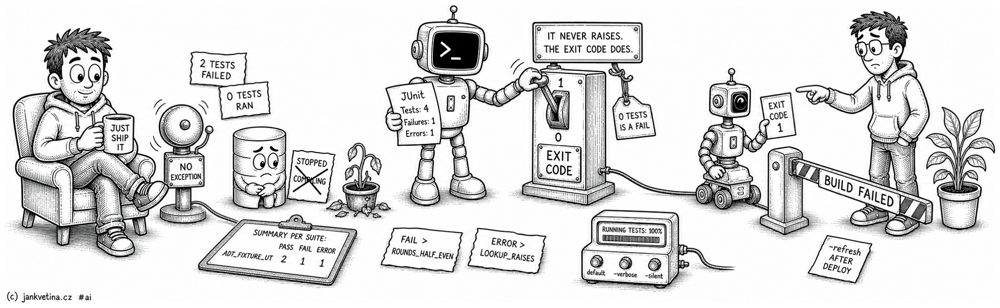

# Run utPLSQL Test Suites (adtai ut)



`ut` runs the [utPLSQL](https://www.utplsql.org) v3 test suites installed in a configured Oracle schema, prints what it is about to run, shows a progress bar while it runs it, and turns the result into an exit code.

utPLSQL does not raise when a test fails, so a caller that only watches for an exception sees a clean run. The exit code is what this command is for. Which packages a run selects, and the configuration behind that, are on [ut_discovery.md](ut_discovery.md); coverage, the gate and the delta report are on [ut_coverage.md](ut_coverage.md).

<br>

## Examples

Run every suite in the schema:

```bash
adtai ut -env DEV -schema SANDBOX
```

Rebuild utPLSQL's annotation cache first, which a freshly compiled suite needs:

```bash
adtai ut -refresh
```

Run only the suites whose package name matches a pattern, or several:

```bash
adtai ut -name APP_SEC%
adtai ut -name APP_SEC% APP_COM%
```

Swap the progress bar for a verdict per test, or for nothing at all:

```bash
adtai ut -verbose
adtai ut -silent
```

Collapse both summary tables into the run's one-line score:

```bash
adtai ut -compact
```

Fail the run when a tested package is under a coverage threshold:

```bash
adtai ut -gate 90
```

<br>

## Output

```text
APEX DEPLOYMENT TOOL - UT
-------------------------


CONNECTING TO SCHEMA SANDBOX, DEV:
----------------------------------
              APEX | 26.1.0
          DATABASE | 23.26.1.0.0 | FREEPDB1


RUNNING TESTS:
--------------

  4 TESTS  0%                                                          0:00:03 
  4 TESTS ...................................................... 100%  0:00:00 


ERRORS & FAILURES:
------------------

  FAIL > ADT_FIXTURE_UT.TEST_TOTALS#ROUNDS_HALF_EVEN
    Actual: 3 (number) was expected to equal: 2 (number)
    at "SANDBOX.ADT_FIXTURE_UT.TEST_TOTALS#ROUNDS_HALF_EVEN", line 19
    ut.expect(ROUND(2.5)).to_equal(2);

  ERROR > ADT_FIXTURE_UT.TEST_LABELS#LOOKUP_RAISES
    ORA-20501: adt_fixture: unhandled error, on purpose
    ORA-06512: at "SANDBOX.ADT_FIXTURE_UT", line 32
    ORA-06512: at line 7


SUMMARY PER SUITE:
------------------

  SUITE PACKAGE    PASS   FAIL   ERROR   TIMER   COVERAGE
  --------------   ----   ----   -----   -----   --------
  ADT_FIXTURE_UT      2      1       1     0.2          ?


TIMER: 0s
```

Two of those four tests are meant to go wrong, so the run exits non-zero. The summaries are on [ut_coverage.md](ut_coverage.md).

Between the connection block and `SUMMARY PER SUITE:` the output belongs to the mode, and there are three:

| Mode | What prints there | What it is for |
| ---- | ----------------- | -------------- |
| default | `RUNNING TESTS:` | One dotted bar: how big the run is, how much is done, roughly how long is left. |
| `-verbose` | `UNIT TESTS SUITES:` then `TEST RESULTS:` | The suites that matched, rolled up before anything runs, then a verdict per test grouped under its package. |
| `-silent` | none | Neither listing and no bar; a green run is four lines and a table. |

Everything below is identical in all three, with one exception: `-verbose` also prints `COVERAGE CHANGED SINCE LAST RUN:` above the summaries when there is something to compare against.

What sits below has a flag of its own, `-compact`, and the two halves of the screen do not overlap: a mode decides what you watch while the run happens, `-compact` decides how much of the report you read afterwards. See [The compact run](#the-compact-run).

- **The label is the tests the run targets; the bar is bumped by finished suites.** A test is knowable before anything runs, so it is what the row says out loud. A suite is the only unit utPLSQL reports back, so it is the only thing that can move a bar honestly.
- **The bar moves when a suite returns and at no other moment.** utPLSQL buffers a run's whole reporter output until `ut.run` returns, so a suite is the smallest unit of progress that exists.
- **The time on the right is what is left, not what has passed.** Before the first suite returns the only thing known is what the last run of this schema and `-name` variant cost; from there the run measures its own rate and the two blend. At 100% the row shows real elapsed time.
- **A run that matched nothing prints the heading and no bar.** Every percentage a bar could show beside no work would be a claim rather than a report. What says what was found is the empty `SUMMARY PER SUITE:` and the exit code.
- **With `-name` passed the heading names the filter**, `RUNNING TESTS FOR <PATTERNS>:`, upper-cased and comma-joined, so the one line on screen for the length of the run says which part of the schema is running.

A run reaches the database in four stretches, and each one waits under a heading the run was going to print anyway, so `ut` mints no string for any of them. The annotation rebuild and discovery wait under the run's own heading, each suite under the bar or its package heading, and the coverage read under `SUMMARY PER SUITE:`.

So the bar closes when the last suite returns, which means its closing time is the suites' own rather than the whole run's. The `TIMER` footer is what reports the run.

<br>

## The verbose run

`-verbose` prints the suites roll-up, then replaces the bar with a per-test section, one block per suite, opened by the package name as that suite starts and completed by its rows as it finishes.

```text
UNIT TESTS SUITES:
------------------

  SUITE PACKAGE    TESTS
  --------------   -----
  ADT_FIXTURE_UT       4


TEST RESULTS:
-------------

  ADT_FIXTURE_UT
    TEST_TOTALS#ADDS_UP .................................................. 0.0
    TEST_LABELS#TRIMS_WHITESPACE ......................................... 0.0
    TEST_TOTALS#ROUNDS_HALF_EVEN ........................................ FAIL
    TEST_LABELS#LOOKUP_RAISES .......................................... ERROR
```

- **A passing row shows its own elapsed seconds, not the word `PASS`.** One decimal place, always present: a clean test's own timing is a fact the reader did not already have, where `PASS` only restates that the row carries none of `FAIL`/`ERROR`/`SKIP`.
- **The four status words are `PASS`, `FAIL`, `ERROR` and `SKIP`**, each a single constant that is both the column header that counts it and the word a row prints, so a row can never read one spelling under a header that reads another.
- **`UNIT TESTS SUITES:` always prints inside this mode**, header and column row included, even when the list is empty: a run that matched nothing reports it in the same shape as a run that matched ten. Only runnable suites are listed.
- **Order is fixed and not the reporter's.** Packages print A to Z, and tests in the order the package specification declares them, so a results block reads down the same way the source does.
- **Test rows print the procedure name, never the `%test` description.** utPLSQL puts the description in the reported name whenever the annotation carries one; the procedure name is what a reader greps for in the source.
- **`TEST RESULTS:` prints as the run proceeds.** The package name lands before `ut.run` is called for that suite, so a slow suite visibly hangs on its own name.
- **A name longer than the grid is trimmed in the middle**, never left to overhang it: the tail is what tells rows sharing a procedure apart, and the dot leader never falls below two dots.

**`ERRORS & FAILURES:` is a stanza list, not a table column.** A failure message is prose, and a shared column is sized to its widest cell, so one long message would widen the table past the terminal.

- **The status leads the heading**, so a reader scanning for which ones errored is not reading behind a package-qualified identifier first. A raised exception reads `ERROR`; a refused expectation reads `FAIL`.
- **The section is capped at `ut_limit_errors`, and the header says when the cap bit**: `FIRST 20 ERRORS & FAILURES:` with more problems than the limit, plain with fewer.
- **The cap never touches the counts.** The summaries report every failure and error, so the two disagreeing is the signal that there is more detail than the screen. Set `ut_limit_errors: 0` to print every stanza.
- **`-silent` does not silence it.** It prints on exactly the same condition as without the flag: at least one test failed or errored. The flag makes a passing run quiet, not a failing run unreadable.

<br>

## The compact run

`-compact` replaces both summary tables with one row: how big the run was, what it cost, how much of the code it reached, and whether it is green. It is the same fixture run the `## Output` block above shows, reported in five cells instead of a table.

```text
RESULTS:
--------

  PACKAGES   LINES   TIMER   COVERAGE   STATUS
  --------   -----   -----   --------   ------
         1             0.2              ERROR
```

- **The four measured cells are the module total's own**, built by the same helper, so the short form and the long one cannot report two different figures for one run. `PACKAGES` is how many suites ran, `LINES` the deduplicated body size of the packages they test, `TIMER` their own wall clock, `COVERAGE` the group figure over the same set, scaled the same way. Both blank here for the reason the module table's own row blanks: that suite pairs to no package, so there is no body to measure.
- **They print with no module convention too.** `ut_module` decides whether a table of *groups* is meaningful; a total over every suite needs no convention to name it, so blanking the expression takes `SUMMARY PER MODULE:` out and leaves this row whole.
- **`STATUS` is the exit code in words**, `PASS` or `ERROR`, so a green row above a non-zero exit is not a state this command can reach. It reads `ERROR` on a failed or errored test, on a run that executed nothing, and on a package under the `-gate` threshold. Which of the three it was is what the sections around the row say, and one word is deliberately not asked to carry that.
- **It removes the tally, never the detail that explains one.** `ERRORS & FAILURES:` above the row and `COVERAGE BELOW <n>:` below it print exactly as they do without the flag. This is the line `-silent` already draws: a green run gets short, a red one stays readable.
- **`RESULTS:` leads the coverage read** like the heading it replaces, so it is on screen before the profiler round trips rather than after them.
- **It composes with the modes rather than outranking them**, because they own different halves of the screen: `-silent -compact` is command chrome and one row, `-verbose -compact` keeps the per-test listing above it. The one thing `-compact` does take from `-verbose` is `COVERAGE CHANGED SINCE LAST RUN:`, which is per-package detail inside the region the row replaces.

<br>

## What counts as a test suite

A package is run when **both** are true:

- its name matches `ut_pattern`, so production code can never be swept into a test run by a loose pattern; and
- utPLSQL has parsed it as a suite, meaning its spec carries a `%suite` annotation and at least one `%test`, and utPLSQL's annotation cache knows about it.

The two facts come from two places and `ut` reads both, because neither is sufficient alone. The data dictionary is the only place an **INVALID** test package is visible at all; utPLSQL's own metadata is the only place the annotations have been parsed.

A matched package satisfying only the first half is **ignored**: no row in either summary, no stanza under `ERRORS & FAILURES:`, and no effect on the exit code. A section headed errors and failures is a list of tests that ran badly, and a package that never ran is not one of them.

The vanished-suite case is still caught, by the zero-test rule rather than by name: a run that executed no test is a failure, so a schema whose only test package stopped compiling exits non-zero anyway.

<br>

## The exit code is the deliverable

| Outcome | Exit |
| ------- | ---- |
| Every test passed (skipped tests do not fail the run). | `0` |
| Any test failed or errored. | non-zero |
| A suite ran but the reporter returned nothing, or output that could not be parsed. | non-zero |
| Nothing ran at all: no matching package, none matching `-name`, or none that is a runnable suite. | non-zero |
| A tested package is below the `-gate` threshold. | non-zero |

The zero-test row is the important one: **a zero-test run is a failure, not an empty pass.** An empty green run is exactly what a vanished suite looks like from the outside. `ut` reads those counters out of utPLSQL's **JUnit reporter** XML rather than pattern-matching a summary line, because they are the only in-database signal that a run failed.

<br>

## Requirements

- **utPLSQL v3 installed**, with the connected schema holding `EXECUTE` on `ut` and `ut_runner` plus the `ut_*` types and the matching synonyms. This is utPLSQL's standard `ut_user` grant set.
- Test packages compiled into the schema being tested, or into the `ut_owner` schema. `ut` runs suites; it does not install them, and deploying one is the project's own deployment path.
- The ordinary query path, never the read-only one: running a test writes to utPLSQL's own output buffer, and a read-only session makes the reporter's data producer fail to start rather than report anything.
- One `ut.run` call per suite rather than one per test, so the fixtures run once each. A **skipped** test (`%disabled`) neither passes nor fails: its row reads `SKIP` and it lands in no verdict column, so a suite quietly disabled wholesale shows up as a package with test rows and no counts rather than as green.

<br>

## Arguments

| Argument | Repeatable | Default | Description |
| -------- | ---------- | ------- | ----------- |
| `-name`, `--name` | Yes | everything | Name pattern or patterns, comma- or space-separated, with `%` and `_` LIKE wildcards (`\` escapes a literal one, quoted: `-name 'APP\_INT%'`). Selects the suites to run, and names itself in the `RUNNING TESTS FOR <PATTERNS>:` header. LIKE wildcards, not regex; `ut_pattern` is what uses regular expressions. |
| `-refresh`, `--refresh` | No | off | Rebuild utPLSQL's annotation cache for the schema before discovery, so a suite compiled since the last run is found. |
| `-gate [N]`, `--gate [N]` | No | off | Fail the run when a tested package's `COVERAGE` is below a threshold. With a number that number is the threshold; bare it comes from `ut_coverage_gate`; absent nothing gates. See [ut_coverage.md](ut_coverage.md). |
| `-compact`, `--compact` | No | off | Replace both summary tables with one `RESULTS:` row: the run's `PACKAGES`, `LINES`, `TIMER`, `COVERAGE` and a `PASS` or `ERROR` status. `ERRORS & FAILURES:` and the `-gate` list still print; the `-verbose` change table does not. |
| `-silent`, `--silent` | No | off | Suppress whatever the mode prints between the connection block and `SUMMARY PER SUITE:`. The banner, connection block, `ERRORS & FAILURES:` when a run has any, the summaries and the timer stay. Outranks `-verbose`. |
| `-verbose`, `--verbose` | No | off | Print `UNIT TESTS SUITES:` and then `TEST RESULTS:`, a row per test under its package heading, instead of the progress bar. The heading is streamed before the suite runs and its rows land once the verdict is known. Ignored under `-silent`. |

Shared options (-root, -env, -schema, -config-dir, -key, -debug, -beep, -nobeep) are on [console.md](console.md#shared-arguments).
