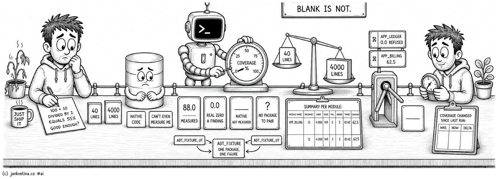

# Test Coverage (adtai ut)



Every `ut` run measures code coverage. The figure lands as the `COVERAGE` column of the two summary tables, `-gate` turns it into a pass or fail condition, and `-verbose` reports what moved since the last run that was different. The command itself is on [ut.md](ut.md).

## The summaries

```text
SUMMARY PER SUITE:
------------------

  SUITE PACKAGE    PASS   FAIL   ERROR   TIMER   COVERAGE
  --------------   ----   ----   -----   -----   --------
  ADT_FIXTURE_UT      2      1       1     0.2          ?

SUMMARY PER MODULE:
-------------------

  MODULE NAME   PACKAGES   LINES   PASS   FAIL   ERROR   TIMER   COVERAGE
  -----------   --------   -----   ----   ----   -----   -----   --------
  FIXTURE              1              2      1       1     0.2
                       1              2      1       1     0.2
```

That suite's `COVERAGE` reads `?` because `ut_match` derives `ADT_FIXTURE` from its name and the schema holds no such package, which is the fourth of the four states below. `LINES` blanks for the same reason: a group whose suites pair to nothing has no code to count.

`SUMMARY PER SUITE:` says which suite is red. `SUMMARY PER MODULE:`, which prints whenever `ut_module` is set, says which *area* is: on a schema of ninety suites the first is a list you scroll and the second is the one you read.

`-compact` replaces both with the module total row alone, under a `RESULTS:` heading, plus a `PASS`/`ERROR` status: the same `LINES` and the same `COVERAGE` figure, over the same deduplicated set, through the same helper. See [The compact run](ut.md#the-compact-run).

- **A zero renders as an empty cell** in the verdict columns. A column of zeroes competes for the eye with the counts that matter, and the row a reader scans for is the one that is not all-passed.
- **There is no `TESTS` column.** Every test lands in exactly one verdict, so the total is derivable from the other three.
- **`TIMER` carries that suite's own seconds**, one decimal always present. It is wall clock around the suite's `ut.run` call rather than the sum of utPLSQL's per-test times, because a suite spends as much time in fixtures and the round trip as in its assertions. It is one of the two columns a zero does not blank out of: a suite that finished inside a tenth of a second was measured. The `TIMER:` footer below the table is a different thing, the whole command.
- **`MODULE NAME` replaces `SUITE PACKAGE`, and `PACKAGES` and `LINES` are the two new columns**, the group's size in suites and in code. Four failures spread over nine suites and four in one are not the same news, and neither are ninety percent of forty lines and ninety percent of four thousand.
- **`LINES` counts the packages the group's suites test**, each once however many suites name it, over the same deduplicated set `COVERAGE` beside it is computed over, so the two columns can never describe two different bodies of code.
- **The last row is the whole run and its module name is blank.** A `TOTAL` label would be a value in a column of module names and would sort among them. A suite whose name `ut_module` cannot parse groups at the top with `?` in that cell: two blank names in one table would say nothing about which row is which.

## What the figure is

**`COVERAGE` is a property of the package a suite tests, not of the suite.** The pairing is `ut_match`'s capture group, resolved by Oracle at discovery, so a suite named for a package puts its figure on that package's block coverage. Two suites testing one package print the same figure, because block coverage records which blocks ran and never which test ran them.

**A derived name that is not a package falls back to the longest one it prefixes.** A regular expression cannot know which of a schema's names exist, so `ut_match` answers with a name and the schema's own package list decides whether it means anything. The walk drops one trailing token at a time until a package answers, longest first, stopping on the first hit, so a suite whose derived name **is** a package keeps it.

**A suite that resolves to nothing reads `?`, and that is not a blank.** Attaching it to a near name would put a figure another suite earned beside a suite that did not. Four states are kept apart:

| Cell | What happened |
| ---- | ------------- |
| `88.0` | Oracle instrumented the package and 88% of its blocks ran. |
| `0.0` | Oracle instrumented the package and nothing entered it. A real finding: the suite ran and reached none of its target. |
| blank | The package was listed and nothing was measured. `PLSQL_CODE_TYPE = NATIVE` strips instrumentation, so Oracle writes no block row however hard the tests hammer it. |
| `?` | The suite pairs to no package at all, so the run never got as far as having something to measure. |

`?` is the same marker, and the same argument, as the module column's: a column of short values has no room for a word, and it cannot be mistaken for a figure the way `0` or `-` can.

**Coverage is run-scoped, and that is a deliberate trade.** The report is built from the pairings of the suites that ran, so a package no suite tests appears nowhere: no row, no contribution to any module figure, no total. `ut` does not answer "what in this schema is untested"; it answers "how much of what these suites test did they reach", which is the question the rest of the table is about.

## The module figure covers the whole group

**A module row is not the average of the suite rows above it.** It is the group's own figure: covered blocks over measured blocks across the group's target packages, scaled by the share of the group's body lines Oracle measured at all. A group every target of which was measured has a share of 1 and is unchanged, so the scaling can only move a figure that was over-claiming.

The scaling exists because unreached code is invisible to Oracle. A package a suite is supposed to test and never enters produces no coverage rows, so it has no denominator to contribute, and pooling the measured blocks alone described the reached part of a group as if it were the group.

`LINES`, the package body's row count from `ALL_SOURCE`, is the only size every package has, so it is what the scaling uses.

**A group with nothing measured reads `0.0`, not a blank.** Unreached code is 0% covered and that is the answer the column is scanned for; an empty cell reads as "no data" and files the group under nothing to see. Only a group holding no package body at all has nothing to print.

The group rows and the unnamed total go through one helper, so a group and the total beneath it can never be two calculations that drift apart.

## Which coverage source, and why

Oracle has two and they do not measure the same thing. `DBMS_PROFILER` is **line**-level, "was this source line executed". `DBMS_PLSQL_CODE_COVERAGE` is **basic-block**-level, "was this single-entry single-exit block executed". One line holds several blocks and one block spans several lines, so the two row sets cannot agree.

utPLSQL already runs **both** in parallel on 12.2 and above and pairs them in its own coverage-run table, so `ut` starts no collection of its own and reconciles nothing by hand: it calls utPLSQL's coverage start and stop and reads the result through that mapping. The percentage reported is the **block** figure, the finer of the two.

One deliberate disagreement with utPLSQL's own HTML percentage: blocks marked through the `COVERAGE` pragma (`NOT_FEASIBLE` and its start and end markers) are **excluded from the denominator**. Oracle flags such a block rather than dropping it, so subtracting it is the reporter's job.

A figure that honours the pragma reads higher than utPLSQL's, and that is intended: the pragma exists so an author can say a block is not coverable.

**`PLSQL_OPTIMIZE_LEVEL` is not a prerequisite.** Level 2 is Oracle's default and block coverage is collected there regardless. The optimizer reshapes the *line* map the profiler reads, not the basic-block map this figure is built on.

**Collection costs a session and every run pays it.** What buys it back is run-scoping, which removed the schema-wide package listing and a per-package compile-settings query.

## Collected but not shown

utPLSQL gathers coverage for **five** source types, not one: package bodies, type bodies, procedures, functions and triggers. One coverage session covers a whole run, so Oracle measures all five whether or not anything asks for them, and the read keeps all five.

**Only package bodies are printed.** The `COVERAGE` column, the module figure, the gate and the change table all describe the packages the run's suites test. A trigger belongs to no suite, so putting one on that path would move a printed percentage with nothing about the measured code having changed.

The other four are kept beside them, keyed by object type **and** name, and nothing renders them yet.

The type is part of that key because triggers have their own Oracle namespace. `AUDIT_ROW` can be a trigger and a procedure in one schema, and a report keyed on the name alone would keep whichever row was read last.

Two details worth knowing if you go looking at the numbers:

- **A unit no test entered still gets a row, reading 0 blocks.** Oracle writes a coverage row only for a unit something executed, so the dictionary listing leads and coverage joins onto it. Unreached code is the finding, so it may not be the thing that disappears.
- **The type is the coverage spelling, not the dictionary one.** `ALL_OBJECTS` says `PACKAGE` and `TYPE` where `ALL_SOURCE` and `dbmspcc_units` say `PACKAGE BODY` and `TYPE BODY`. The listing maps one onto the other in SQL.

The compile-time prerequisites are the ones package bodies already have: an `INTERPRETED` unit that is not wrapped. A natively compiled trigger produces no block row however often it fires.

## What moved since last time

Every run records what it measured, and `-verbose` prints the difference above the summaries, under `COVERAGE CHANGED SINCE LAST RUN:`. Four columns: the suite package, `WAS`, `NOW`, and the signed `DELTA` between them.

- **Only the suites that moved.** Two full summaries already list everything, so a third table repeating them would be the second and worse telling of something already told.
- **The comparison is against the last run that was different, not the last run.** Running `ut` changes no coverage, so two runs of unchanged code measure the same thing, and comparing each run against the one immediately before it emptied the table on precisely the run a reader opens it for: the one after a deploy. The walk stops on its first candidate, so a run that follows a real move costs nothing extra.
- **Ordered by the size of the move, largest first**, drops and gains together, so a regression cannot hide under a long tail of rounding.
- **`-verbose` only, and `-silent` outranks it.** The history is recorded on every run including quiet ones: a store that only remembered verbose runs would compare against whenever somebody last passed the flag rather than against last time.
- **A first run prints nothing**, there being no comparison to draw. A run whose whole history agrees with it prints the header and no rows, which is the ratchet holding and a different report from having nothing to compare against.
- **`WAS` and `DELTA` blank together** for a package the baseline run did not measure. A package appearing for the first time has no comparison rather than a gain of its whole figure.
- **A `-name` run keeps its own history.** It measures the suites it selected and nothing else, so standing it in front of a full run would report every package the filter excluded as having no previous figure. The history is keyed by the selection, the same key the timing estimate uses.

The history lives in `config/internal/ut.db`, gitignored with the other internal stores. It keeps the **last 20 runs per schema** and prunes the rest on every write, and a schema is keyed upper-case so two spellings read one history. A root ADT.ai cannot write still runs, reports and exits normally; only the history is skipped.

Its tables are on [storage_ut.md](storage_ut.md).

## The coverage gate

`-gate` turns the `COVERAGE` column into a pass or fail condition. It takes an optional value, and the three states are distinct:

```bash
adtai ut -gate 90       # this run's threshold is 90
adtai ut -gate          # the threshold is config ut_coverage_gate, which ships at 80
adtai ut                # nothing gates
```

**The report prints in full first and the gate closes it.** A gate that replaced the numbers with a verdict would be unusable, since the reason a package is under the bar is in the tables above it, so both summaries are untouched and a failing run adds one section:

```text
COVERAGE BELOW 80.0:
--------------------

  PACKAGE       COVERAGE
  -----------   --------
  APP_LEDGER         0.0
  APP_BILLING       62.5
```

- **One package under the bar fails the whole run**, non-zero exit and error chime, and it fails a run whose tests all passed. Worst first, then A to Z, because the list is a work queue.
- **`PACKAGE` names the code, not the suite.** Two suites testing one package are two summary rows and one row here, and the package is what has to be covered.
- **Only a package with a measured figure is compared.** A blank cell has nothing to compare, and gating a blank would fail every real schema permanently from the first run. **A `0.0` does gate**: that is a measurement, of a package Oracle instrumented and nothing entered.
- **At the boundary, `>=` passes.** `-gate 80` asks for eighty percent, not more than eighty.
- **There are no per-package thresholds.** `-name` already narrows a run, so a stricter bar for one group needs no second configuration surface.

## Estimating the time left

The countdown on the progress bar is seeded from `config/internal/ut_timers.yaml` under the project root, written at the end of every run:

```yaml
SANDBOX:
  '%': 142.6
  APP_SEC%: 8.31
```

**The key is the schema and the `-name` variant together**, because `-name` selects the suites that run rather than the rows that print, so a filtered run is a genuinely smaller job. Keying on the schema alone would let an eight-second filtered run seed the countdown of a two-minute full one. The patterns are upper-cased and sorted into the key, so two spellings of one selection accumulate one history. An unfiltered run keys on `%`.

The stored figure is a rolling `(this run + previous) / 2`. A plain overwrite would make the estimate as noisy as the noisiest run, and a mean over all history would stop tracking a suite that genuinely got slower.

**Every mode records, and a run that executed nothing records nothing.** A quiet run measures the same work the bar does, so a reader who normally runs `-silent` still has a history. A schema whose suites all stopped compiling finishes in no time at all, and storing that would seed a zero countdown into the next real run.

Deleting the timers file costs one run's worth of estimate: the next run counts down from zero until its first suite returns, then measures itself.
