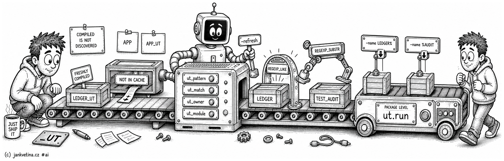

# Choosing What Runs (adtai ut)

How `ut` decides which packages are test packages, which of them a run selects, and why a suite you know exists can still be missing. Three things have a say: a per-project naming convention, the `-name` patterns, and utPLSQL's own annotation cache.

The command itself is on [ut.md](ut.md); coverage, the gate and the delta report are on [ut_coverage.md](ut_coverage.md).

 

## The naming convention is configuration

Four config values describe how a project names its test packages. All four are **Oracle regular expressions**, evaluated by Oracle inside the dictionary query, so nothing is fetched to be discarded and there is no second regex engine to disagree. Matching is case-insensitive.

| Key | Default | What it answers |
| --- | ------- | --------------- |
| `ut_pattern` | `'_UT$'` | Which packages are test packages. Nothing else is ever run. |
| `ut_match` | `'^(.+)_UT$'` | Which package a test package tests, capture group 1. |
| `ut_owner` | `''` | Which schema holds the test packages. Empty means the schema being tested. |
| `ut_module` | `'^[^_]+_([^_]+)'` | Which module a suite belongs to, capture group 1. Anchor it to nothing that has to follow the module token. Set it to `''` to print no `SUMMARY PER MODULE:` table. |

A project whose suites are `TEST_ABC` rather than `ABC_UT` configures `ut_pattern: '^TEST_'` and `ut_match: '^TEST_(.+)$'`, and everything else follows: discovery, the `COVERAGE` column's pairing, and the exclusion of test packages from the coverage listing.

**`ut_owner` is the only one that defaults empty**, since the other three ship as working values and a convention nobody can see is not a feature. **`ut_match` and `ut_pattern` are independent**: a suite the first cannot pair still runs, and simply contributes no verdicts to any coverage row.

Two more values are not regular expressions. `ut_limit_errors` (default `20`) bounds how many stanzas print, and `ut_coverage_gate` (default `80`) is the threshold a bare `-gate` uses. Neither reaches Oracle.

**Test packages can live in another schema.** `ut_owner` names it, and it scopes discovery, the annotation cache, `-refresh` and the owner-qualified path `ut.run` is given. Coverage is always measured in the schema under test, never in `ut_owner`, since conflating the two would report the coverage of the test packages themselves. The connected user then needs `SELECT` on that schema's dictionary rows and `EXECUTE` on its packages.

The naming configuration is per-project and has no flag. A convention is a property of the codebase, and one overridable per run would make two runs of the same schema disagree about which packages are tests.

 

## Name patterns are Oracle LIKE patterns

`-name` takes Oracle `LIKE` semantics, `%` for any run of characters, `_` for exactly one, `\` to escape either, through the same shared implementation `recompile -name` and `export_db -name` use.

**It selects the suites to run**, so a filtered run costs less than an unfiltered one, and the coverage figures describe whatever those suites reached.

Patterns are repeatable and space- or comma-separated, and a package matching several still runs once. No `-name` at all means every matching suite in the schema.

Matching is at package level, never at individual-test level, and deliberately: utPLSQL runs a suite's `%beforeall` and `%afterall` fixtures once per invocation, so running a subset test by test would re-run the fixtures for each one and stop measuring what the suite asserts.

 

## The annotation cache

utPLSQL discovers suites by parsing the `%suite` and `%test` annotations out of package source into a cache of its own. **A freshly compiled package is not in that cache yet**, so it is not discoverable and `ut.run` legitimately reports zero tests straight after an install, which without the zero-test rule on [ut.md](ut.md#the-exit-code-is-the-deliverable) would read as a clean pass.

`-refresh` rebuilds that cache for the connected schema before discovery. It is not the default because a rebuild re-parses the schema's source. Use it right after deploying or recompiling a test package.

It is also the first thing to reach for when a suite you know exists is missing from `-verbose`'s `UNIT TESTS SUITES:`: an unparsed package is ignored silently, so its absence from that list is the only signal there is.

The rebuild is the slowest thing this command can be asked to do. It runs under the connection block and prints no section of its own.
