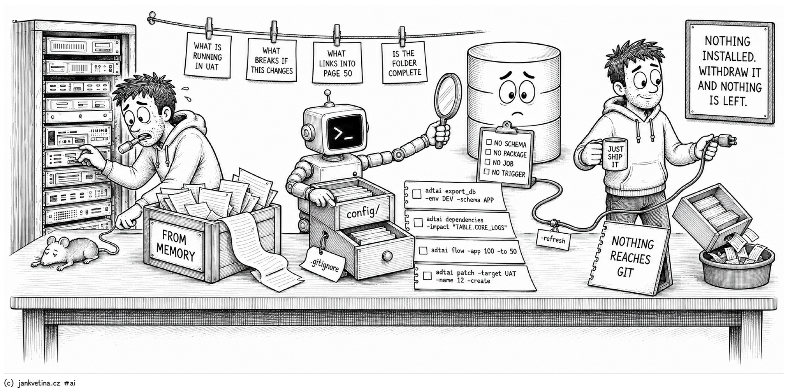

# Why ADT.ai (what it answers, and why it is safe to try)



You already answer these questions by hand: what is running in UAT, what breaks if this table changes, which pages link into that one, and whether the deployment folder someone ordered from memory is complete. ADT.ai answers them from the command line, from files a repository can hold, and most of the time without touching the database.

This page is the case for adopting it, one command group at a time. Each section says what you do by hand today, what the command does instead, and where the honest limit is. Every command has its own reference page, all of them listed in the [command index](README.md).

## Nothing is installed in your database

ADT.ai is a Python tool that runs on a developer's machine. It creates no schema, no package, no job and no trigger. It connects as an Oracle user with the privileges you grant, reads the dictionary, writes files, and runs SQL you can read first. Withdraw the credential and it stops, leaving nothing behind.

Its caches are local SQLite files and YAML under `config/`, added to `.gitignore` on first use, so nothing it learns about your schema reaches version control. There is no server, no graph database and nothing to provision.

## Export: the database becomes files, the same bytes every time

**By hand today:** a package body is a row in a dictionary view, an application is one enormous export, and the repository holds whatever somebody last remembered to save.

- [`export_db`](export_db.md) writes one normalized DDL file per object in a layout you configure, so a repeated export of an unchanged object is byte-identical and a change in version control is a real change. Take the whole schema, only the types or names you ask for, or only what moved since your last export.
- [`export_data`](export_data.md) exports the rows an application needs in order to work at all, lookup values and settings, as CSV beside a generated MERGE that replays them into the next environment. Large columns become sidecar files rather than being squeezed into a cell.
- [`export_apex`](export_apex.md) shows which workspaces and applications live in an environment before you export anything, then writes the formats you name: the full application, split components, or APEXlang source you can edit outside the builder.

```bash
adtai export_db -env DEV -schema APP
adtai export_data -name APP_%
adtai export_apex -reveal
adtai export_apex -app 100 -apexlang -files
```

## Check: prove it still works before it ships

**By hand today:** compile everything, watch the invalid count, and hope the twenty red objects share one cause.

- [`recompile`](recompile.md) recompiles what a change broke in dependency-safe passes, then separates the root causes from the knock-ons: which object is missing, which needs a grant, which cannot parse, and how many invalid objects clear once that one compiles. You start at the one object that matters.
- [`ut`](ut.md) runs the schema's utPLSQL suites, reports coverage per package and per module, and turns the result into an exit code. A failed test, a run that executed nothing, or a package under the `-gate` threshold all exit non-zero, so CI can stop on it without anyone reading the report.
- [`validate`](validate.md) compiles exported APEXlang source with no database, no credentials and no environment, so an edit made outside the builder is checked before an import can fail halfway.

```bash
adtai recompile -env DEV -schema APP
adtai ut -gate 90
adtai validate -app 100
```

## Explore: ask the questions offline, and let an agent ask them too

**By hand today:** grep the export, click through the builder, and hope.

### discovery: a SELECT-only surface you can hand to an AI agent

The objection it answers is "I am not giving an agent a database connection." [`discovery`](discovery.md) takes a SELECT and an environment, runs it, prints the table and appends the result to a Markdown report. Two controls stop everything else, and a third keeps the trail:

- A validator that accepts one `SELECT` or `WITH ... SELECT` per statement. DML, DDL, PL/SQL blocks, `FOR UPDATE`, a second statement behind a semicolon and a command hidden in a comment are refused before they reach the database.
- A read-only transaction around what survives, rolled back after every query.
- A report under `config/discovery/` for every run, so tomorrow there is a record rather than a lost terminal buffer.

The limit is stated on its page: a SELECT may call a stored function, so give the exploring account only the grants its questions need.

```bash
adtai discovery -env DEV -sql "SELECT object_type, COUNT(*) FROM user_objects GROUP BY object_type"
adtai discovery -env DEV -sql "UPDATE app_settings SET value = 1"
```

The second line is refused, with the reason printed where the table would be.

### dependencies: what breaks before you change it

`USER_DEPENDENCIES` answers in one direction and its raw dump is mostly noise: on a real schema more than half the edges point at Oracle and APEX built-ins, and the catalog stops being readable past a few hundred objects.

[`dependencies`](dependencies.md) mirrors the dictionary into a local SQLite file once, then answers offline, in both directions, transitively, across every schema you refreshed. When the APEX dictionary is mirrored too, the pages and components that use an object are listed beside its database callers, which is where the surprising callers usually are.

```bash
adtai dependencies -refresh -env DEV -schema APP
adtai dependencies -to "TABLE.CORE_LOGS"
adtai dependencies -impact "TABLE.CORE_LOGS"
adtai dependencies -tree "ORDER_ITEMS_ORDER_FK"
```

Only the refresh touches Oracle. Every query after it answers in milliseconds, which is also what makes it cheap for an agent: a fraction of the tokens a live schema crawl costs.

### flow: every link into a page, without clicking through the builder

APEX scatters navigation across branches, buttons, lists, the navigation bar and report column links, and no screen says "everything that links into page 50." [`flow`](flow.md) scrapes an application's edges once, stores them locally, and answers in either direction. Every refresh also writes Mermaid, DOT and JSON diagrams you can drop into documentation.

```bash
adtai flow -app 100 -refresh -env DEV
adtai flow -app 100 -to 50
```

### search_repo, rebuild and calendar: the history you already committed

[`rebuild`](rebuild.md) keeps a local store of commit metadata per branch. [`search_repo`](search_repo.md) reads it to find the commit that touched a database object by name, type, path, author or date, and can bring an older version of a file back beside the current one.

[`calendar`](calendar.md) draws a month of that history as a grid of tickets and commit counts. None of the three connects to Oracle.

```bash
adtai rebuild
adtai search_repo -type VIEW -name MONTHLY_REPORT_V
adtai calendar
```

## Deliver: from committed changes to a deployable release

**By hand today:** a folder of scripts somebody ordered from memory, run against UAT with a prayer.

[`patch`](patch.md) reads your git history, collects the files a set of commits touched, orders them by object type so a table lands before the view that reads it, and writes install scripts you can read and hand over.

Building and deploying are two separate runs, so what deploys is what was reviewed, and every deploy leaves a log beside the folder it came from.

```bash
adtai patch -target UAT -name 12 -create
adtai patch -target UAT -name 12 -deploy
```

## Set up: one command to check the machine, one to scaffold the project

[`doctor`](doctor.md) reports which piece of the toolchain is missing or old, and it is the only command that installs or updates anything, on an explicit flag. `-init` scaffolds a project folder with the config and ignore rules already written. [`connection`](connection.md) edits the connection file for you and asks for passwords interactively, so one never lands in shell history.

A stored password can be encrypted with a key kept elsewhere, replaced by a secret-manager command, or left out entirely in favour of SQLcl's own store or an Oracle wallet. How each option holds up, and the two things no credential store can protect against, is written for your security reviewer on [connection / security](connection_security.md).

```bash
adtai doctor
adtai doctor -init -root /path/to/project
adtai connection -set-pwd -env DEV -schema APP -encrypt -key /secure/adt.key -go
```

## Built to be run by an AI agent

Every command prints one console shape, takes the same shared flags, and turns its verdict into an exit code, which is what an agent branches on. The read-only commands are the ones an agent runs unsupervised: `discovery` cannot write, `dependencies` and `flow` answer from a local mirror, and `validate` needs no database at all.

The repository ships [skills/adt/SKILL.md](../skills/adt/SKILL.md), a lean router that sends an agent to only the page it needs, with the safety boundaries stated. Point Claude Code, Codex, Copilot or Cursor at it and the first command it types is a real one.

## Why it is safe to try this week

- **Read-only by default.** Exports write files, never the database. `discovery` validates and rolls back every statement. `dependencies` and `flow` connect only on `-refresh`. What does act on a schema, `recompile`, `ut`, a dependency refresh that compiles for PL/Scope, and a deploy, prints what it did.
- **No new infrastructure.** SQLite, YAML and Markdown from the Python standard library, plus the Oracle client you already have.
- **Nothing reaches git.** Reports, mirrors and connection files live under folders the first run adds to `.gitignore`.
- **Zero blast radius on DEV.** Refresh against a development schema with a least-privilege user, run the queries, and delete `config/` if you hate it. Nothing changed in the database.

## Try it in fifteen minutes

Install it, check the machine, and scaffold a project folder; [SETUP.md](../SETUP.md) has the detail.

```bash
adtai doctor
adtai doctor -init -root /path/to/project
```

Point it at a development schema and watch the objects come out as files.

```bash
adtai export_db -env DEV -schema APP
```

Ask the two questions nothing answers today, then watch a write get refused.

```bash
adtai dependencies -refresh -env DEV -schema APP
adtai dependencies -impact "TABLE.CORE_LOGS"
adtai discovery -env DEV -sql "SELECT COUNT(*) FROM user_objects"
adtai discovery -env DEV -sql "DELETE FROM app_settings"
```

Map your most-edited application and look at what links into your busiest page.

```bash
adtai flow -app 100 -refresh -env DEV
adtai flow -app 100 -to 50
```

The reverse edge you did not know about is the whole pitch.

## Further reading

Longer write-ups on how these commands are used in real Oracle and APEX projects:

- [Letting AI safely explore your schema with ADT.ai Discovery](https://www.oneoracledeveloper.com/2026/06/letting-ai-safely-explore-your-schema.html)
- [Mapping APEX page navigation with ADT.ai flow](https://www.oneoracledeveloper.com/2026/06/mapping-apex-page-navigation-with-adtai.html)
- [Every ADT article on One Oracle Developer](https://www.oneoracledeveloper.com/search/label/project_adt)
